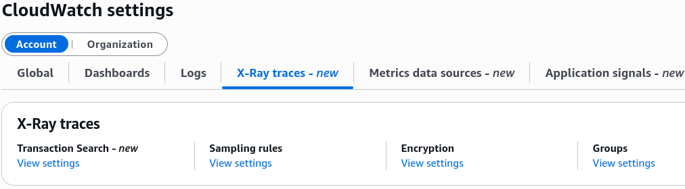
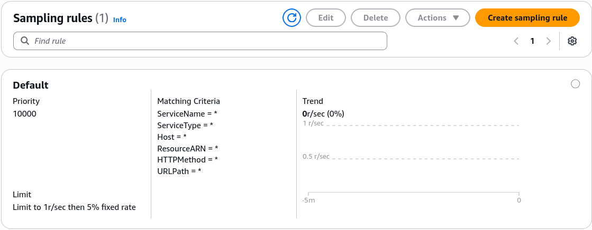
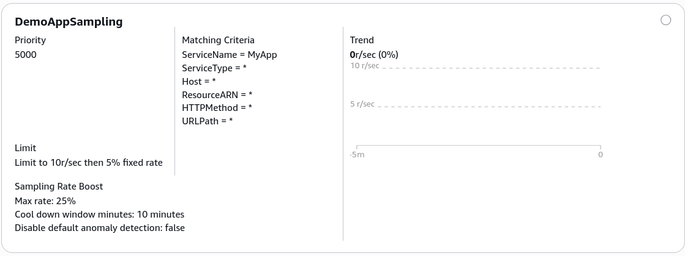

# X-Ray: Sampling Rules

## 🛠️ Step-by-Step Custom Sampling Rule From Console

- **Step 1: Locate the X-Ray Settings Hub**
  - Go to **CloudWatch** ──► scroll all the way down to **Settings** on the left-hand navigation column panel.
  - Look under _X-Ray traces_ and click **Sampling rules** to display the rule ledger grid.
    

- **Step 2: Evaluate the Default Fallback Guardrail**
  - Inspect the pre-provisioned **`Default`** baseline rule sitting at the bottom of the stack:
  - **Priority:** Locked at **`10000`** (the absolute lowest priority ceiling; all custom rules step ahead of it).
  - **Criteria:** Explicitly wildcarded (`*`) to intercept every ambient method, URL path, and service.
  - _The Adjustment Limitation:_ While you can edit the Reservoir size and Fixed Rate percent threshold values on the default rule, you **cannot modify its matching criteria parameters**, chief.
    

- **Step 3: Provision a Custom Sampling Rule**
  - Click **Create sampling rule** at the top of the pane.
  - **Rule Name:** Input your identifier string (e.g., `DemoSampling`).
  - **Rule Priority:** Assign a value between **`1` and `9999**`.
  - _The Priority Order Inversion Rule:_ **The lowest priority number carries the highest evaluation weight!** If you assign a rule a priority of `5000`, the X-Ray engine evaluates and matches it long before it ever hits the default fallback rule block.
    

---

## 🎯 Fine-Tuning Your Scoped Ingestion Criteria

Instead of blanket-sampling your whole system, you can constrain your custom rule's scope by passing explicit matching values directly into the console filter criteria forms:

- **Service Name:** Target a distinct app workspace module identifier (e.g., `MYSERVICE`).
- **HTTP Method:** Target specific operational request methods (e.g., typing **`POST`** to monitor data writes closely, while ignoring noisy polling traffic patterns).
- **URL Path:** Isolate target endpoint routes using standard wildcard pattern tags (e.g., `/api/checkout/*` ensures your high-value billing transactions are monitored closely).

---

## 📊 Evaluation Logic Flow Matrix

When requests hit your instrumented application gateway, the background client engine loops through your rule criteria paths according to this exact structural logic chain:

$$\text{Incoming API Payload Evaluation} \longrightarrow \text{Loop Rules Ascending via Priority Number }(1 \rightarrow 9999)$$

$$\text{First Pattern Match Winning Condition} = \text{Borrow from Reservoir Size} \;\lor\; \text{Apply Fixed Rate \% Threshold} \implies \text{Stop Evaluation}$$

:::tip
**The Zero-Downtime Pipeline Lock:** Once you click save on your custom rule configurations inside the console dashboard, the local **X-Ray Daemons** actively pull down the updated JSON schemas via background polling loops on the fly. No code changes, no production build restarts—the new sampling velocity applies instantly.
:::
