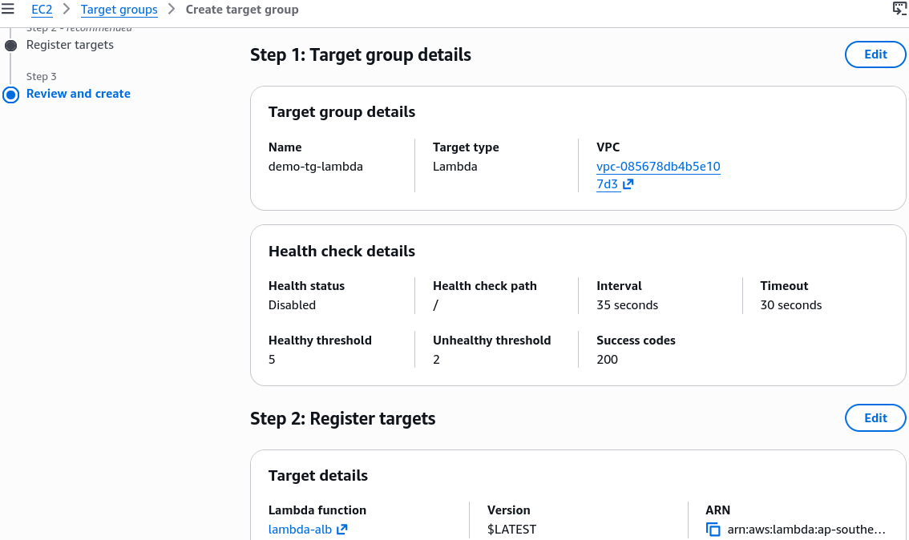
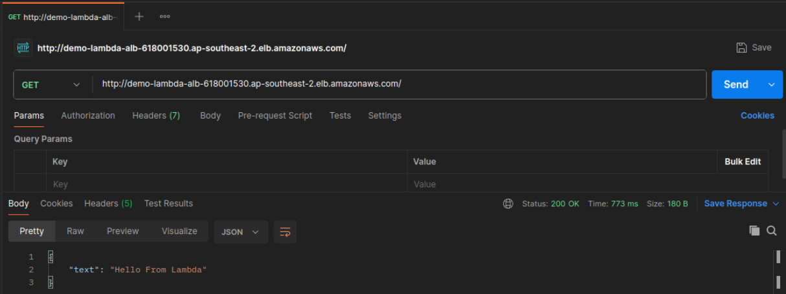
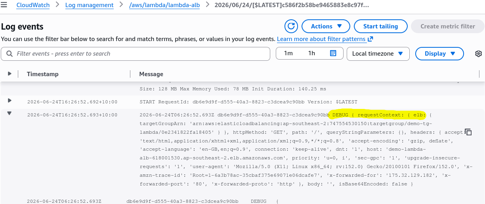
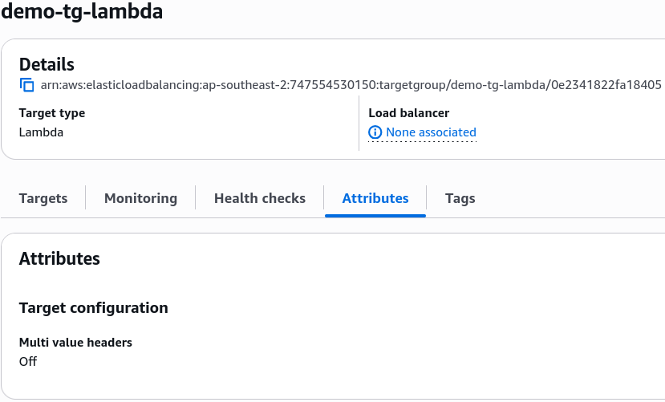

# Lambda & Application Load Balancer - Hands On

## 🛠️ Step-by-Step ALB-Lambda Integration Hands On

### 1. Wiring the Load Balancing Pipeline

- **Step 1: Create the Target Container (Lambda)**
  - Spin up a fresh function named `Lambda-alb` using the **Node.js 24.x** runtime template.

- **Step 2: Provision the Front Firewall (Security Group)**
  - Head over to the EC2 Dashboard and create a new Security Group named `DemoLambdaALBSG`.
  - Add an **Inbound Rule** authorizing standard **HTTP (Port 80)** from anywhere (`0.0.0.0/0`) so traffic can reach the cluster gateway.

- **Step 3: Establish the Serverless Target Group**
  - Under the _Load Balancing_ sidebar column, click **Target Groups** ──► **Create target group**.
  - **Target Type Selection:** Explicitly choose **`Lambda function`** and name it `demo-tg-lambda`. Click next.
  - Select your newly built `Lambda-alb` function from the dropdown asset selector list, and hit create!
    

- **Step 4: Launch the Entry Application Load Balancer**
  - Click **Load Balancers** ──► **Create Load Balancer** ──► **Application Load Balancer**.
  - Name it `demo-Lambda-alb`, bind it to 3 separate Availability Zones, assign your `DemoLambdaALBSG` firewall, and configure the HTTP Port 80 Listener to forward incoming connection requests directly to your `demo-tg-lambda` target group block.

---

### 2. Crafting the Compliant Code Vector (Node.js)

If your function returns a simple naked string payload like `"Hello from Lambda"`, the ALB fails to interpret the assets, leading the web client browser to download it as an unformatted raw data stream chunk. To tell the browser to actively render your code output as a JSON object, update your deployment blueprint to look like this:

```javascript
export const handler = async (event) => {
  console.debug(event);
  const response = {
    statusCode: 200,
    statusDescription: "200 OK",
    headers: {
      "Content-Type": "application/json",
    },
    body: JSON.stringify({ text: "Hello From Lambda" }),
    isBase64Encoded: false,
  };
  return response;
};
```

Hit **Deploy** to push the code package updates live down into the microVM runtime. Now, when you paste the ALB's raw DNS string address into your browser window, the load balancer translates the returned dictionary natively and displays a clean, formatted JSON block ready for the client to consume:



---

### 🔒 Behind the Scenes: The Security Handshake

When you registered your Lambda function into that target group layout, the platform automatically updated permissions behind the scenes so the load balancer could execute the code.

If you click into your function configuration's **Permissions** tab and scroll down to the **Resource-based policy statements** block, you'll see an explicit permission manifest rule attached automatically:

```json
{
  "Version": "2012-10-17",
  "Id": "default",
  "Statement": [
    {
      "Sid": "AWS-ALB_Invoke-targetgroup-demo-tg-lambda-0e2341822fa18405",
      "Effect": "Allow",
      "Principal": {
        "Service": "elasticloadbalancing.amazonaws.com"
      },
      "Action": "lambda:InvokeFunction",
      "Resource": "arn:aws:lambda:ap-southeast-2:747554530150:function:lambda-alb",
      "Condition": {
        "ArnLike": {
          "AWS:SourceArn": "arn:aws:elasticloadbalancing:ap-southeast-2:747554530150:targetgroup/demo-tg-lambda/0e2341822fa18405"
        }
      }
    }
  ]
}
```

This ensures that only that specific target group's routing node is authorized to execute the **`lambda:InvokeFunction`** API handshake wrapper against your function runtime, blocking external unauthorized actors completely!

---

### 📊 Operational Telemetry Checklist Reminder

- **Inspecting Raw Events:** Click your function's **Monitor** tab and jump into the CloudWatch Log Streams. Because we injected the `console.debug(event);` execution line, you can drill into the log payload to inspect exactly how the ALB serializes client information (like their User-Agent, cookies, paths, and HTTP query strings) into a standard JSON string payload block.
  
- **Target Group Attributes:** Remember, toggling **Multi-Value Headers** inside your Target Group attributes alters the request structure completely. When turned off, duplicate query metrics are overwritten and truncated; when turned on, they wrap into a structural array layout inside your log files, chief!
  

## 🧹 Cleaning Up Your Sandbox Space

To ensure no stray lingering resources run wild against your active training budget thresholds:

1. Go to the **Load Balancer Console**, select `demo-Lambda-alb`, and click **Delete**.
2. Go to **Target Groups** and erase the associated `demo-tg-lambda` layout block natively.
