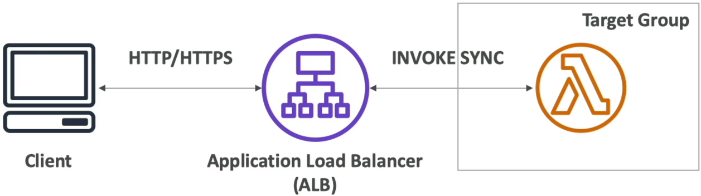
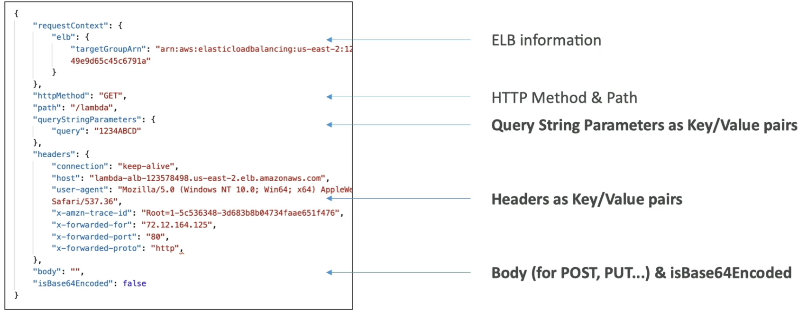
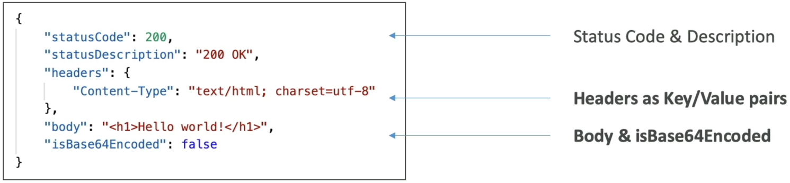
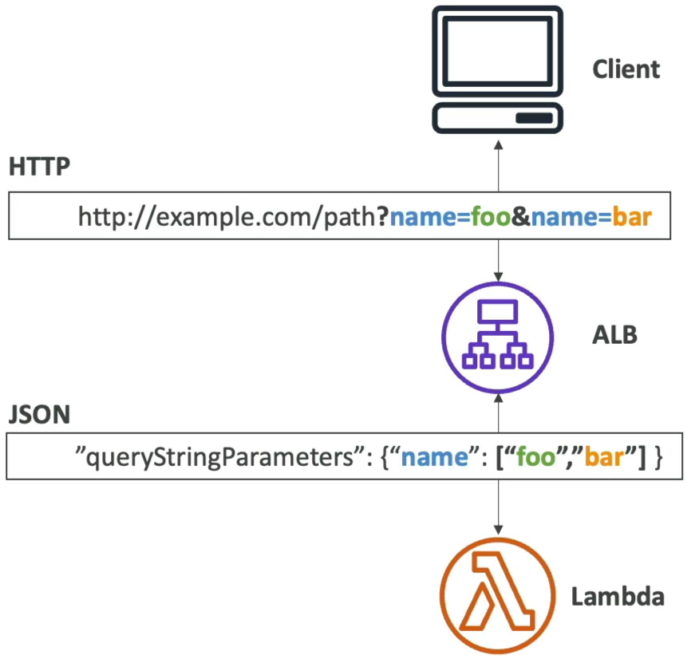

# Lambda & Application Load Balancer

Using an **Application Load Balancer (ALB)** to front your serverless infrastructure is an incredible pattern when you want a standard, high-performance HTTP/HTTPS endpoint without setting up a full API Gateway. When you hook these two up, the ALB acts as an interpreter. It handles the raw internet protocols, handles the SSL certificates, translates an incoming HTTP web request into a neat JSON map for your Lambda code, and then converts your function's JSON output back into standard HTML or web data for the user.

An Application Load Balancer can invoke AWS Lambda functions synchronously by registering the function into an ALB **Target Group**. The ALB automatically intercepts incoming HTTP/HTTPS requests, serializes the request attributes (headers, query strings, body) into a structured JSON payload, and passes it to the Lambda handler. The Lambda function must return a valid JSON document containing a status code, header dictionary, and a body string, which the ALB deserializes back into a native HTTP client response.


---

## Key Takeaways

### Request & Response Payload Anatomy

When building your code logic, you must handle the precise translation matrix the ALB enforces.

#### 📥 Request Payload (HTTP ──► JSON)

The ALB bundles the incoming request into an `event` JSON payload. The core keys you need to parse in your code are:



- **`requestContext`:** Contains background tracking metadata like the ELB target group ARN.
- **`httpMethod` & `path`:** The action and route (e.g., `"GET"` and `"/lambda"`).
- **`queryStringParameters`:** URL parameters mapped out as key-value pairs.
- **`headers`:** Request headers serialized into a flat map layout.
- **`body`:** The actual content string (for `POST` or `PUT`).
- **`isBase64Encoded`:** A boolean flag telling your code if you need to run a base64 decode sequence on the body string before manipulating it.

#### 📤 Response Payload (JSON ──► HTTP)

Your Lambda function cannot just return any random string; it **MUST** respond with this exact schema structure, or the ALB will throw an immediate **HTTP 502 Bad Gateway** error to the client:



---

### The Multi-Value Header Toggle (The Array Shift)

This is an absolute milestone concept for the DVA-C02 exam. If your web app passes multiple values using the exact same key string name, the ALB’s behavior shifts completely depending on whether **Multi-Value Headers** are toggled on or off:

#### ❌ Multi-Value Headers DISABLED (Default)

If a client passes a URL query like `?name=foo&name=bar`, or duplicate headers like `Set-Cookie`, the ALB truncates the data. It will only pass **the last value received** as a simple string inside the JSON map:

```json
"queryStringParameters": {
  "name": "bar"
}

```

#### 🟢 Multi-Value Headers ENABLED

When you flip this setting on inside your Target Group attributes, the ALB upgrades its parser map. It wraps the duplicate keys into an **explicit data array structure**, ensuring your backend logic captures every piece of traffic sent:



---

### Exam Tips

- **Fixing the HTTP 502 Breakdown:** If a scenario states: _"A developer fronts a Lambda function with an Application Load Balancer, but every single browser request results in an HTTP 502 Bad Gateway error despite the Lambda function executing flawlessly with zero exceptions in CloudWatch Logs,"_ check your response syntax. The error is happening because **the Lambda function is not returning a properly structured JSON object containing the mandatory `statusCode`, `headers`, and `body` keys.**
- **The Duplicate Cookie Query:** If a system requirement demands that an application track multi-value parameters or parse multiple standalone user login cookies matching the exact same header key structure concurrently, look for the answer choice that specifies: **Enable Multi-Value Headers on the ALB Target Group.**
