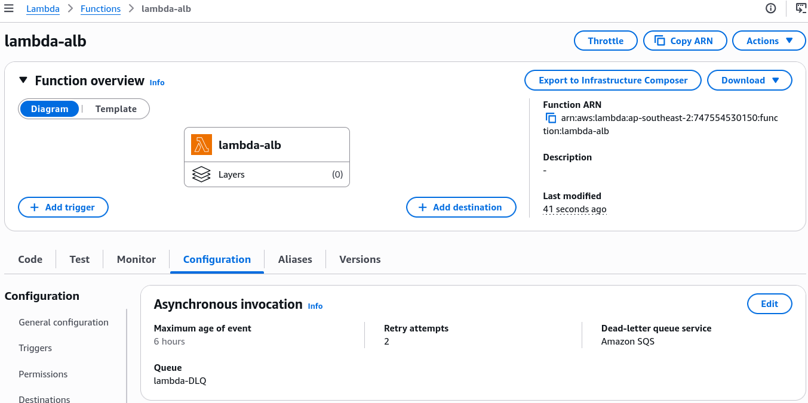
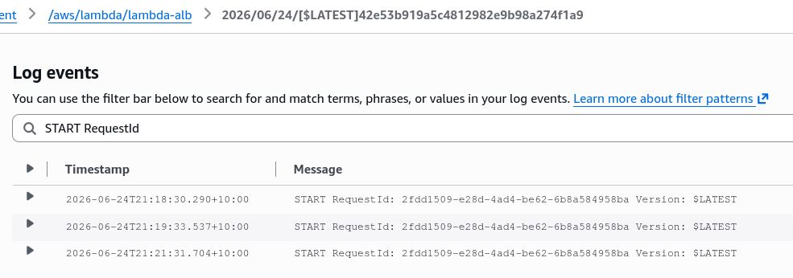
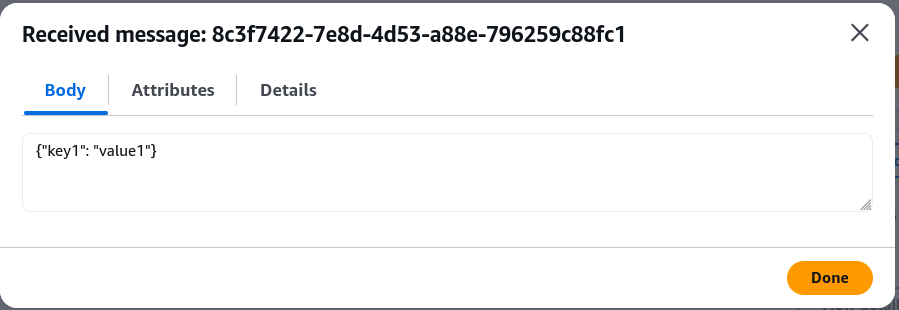
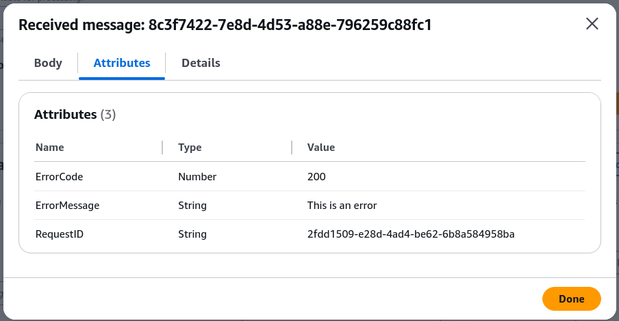

# Lambda Asynchronous Invocations Hands On

## 🛠️ Step-by-Step Async Failure & DLQ Hands On

### 1. Generating the Async Signature via CLI

- **Step 1: Execute the Fire-and-Forget Strike**
  - Jump into **AWS CloudShell** and run an asynchronous invocation by explicitly passing the `--invocation-type Event` flag block:

  ```bash
  aws lambda invoke \
    --function-name "demo-lambda" \
    --invocation-type Event \
    --cli-binary-format raw-in-base64-out \
    --payload '{"key1": "value1"}' \
    response.json
  ```

- **Step 2: Check the Return Status Packet**
  - Check your terminal output. Even if your function code is actively crashing or throwing unhandled exceptions, the CLI returns an immediate **HTTP 202 Status Code**:
  ```json
  {
    "StatusCode": 202,
    "ExecutedVersion": "$LATEST"
  }
  ```

---

### 2. Provisioning the Poison Pill Containment Unit (SQS)

- **Step 3: Spin up the Triage Buffer Queue**
  - Open **Amazon SQS** ──► click **Create queue**.
  - Choose a standard queue layout and name it **`lambda-DLQ`**. Leave all other timeout settings as default and hit create.

- **Step 4: Resolve the Core IAM Security Block**
  - If you try to bind this queue to your Lambda asynchronous configuration tab right now, **the console will throw a red permission failure error, chief!**
  - To bridge the security gap, navigate to your Lambda function's **Configuration -> Permissions** tab and click your execution role link.
  - Click **Attach policies** ──► search for and add **`AmazonSQSFullAccess`** (or write a scoped policy allowing `sqs:SendMessage` to your specific queue ARN).

- **Step 5: Bind the Dead-Letter Queue**
  - Head back to the Lambda Console under **Configuration -> Asynchronous invocation**.
  - Click Edit ──► scroll down to the Dead-letter queue wrapper selection ──► select **SQS** ──► pick your **`lambda-DLQ`** from the container index array and hit Save.
    

---

### 3. Tracking the Under-the-Hood Retry Matrix

When you force your Node.js function to crash (using `throw new Error("Something went wrong, bro!")`) and trigger it via the CLI, Lambda executes its background retry schedule.

Open **CloudWatch Logs** and inspect your log streams. You will see three identical **`RequestID`** footprints execute across a rolling 3-minute window, chief:

$$\text{Initial Run (Failure)} \xrightarrow{\text{Wait } 1\text{ Minute}} \text{Retry Attempt } 1 \text{ (Failure)} \xrightarrow{\text{Wait } 2\text{ Minutes}} \text{Retry Attempt } 2 \text{ (Failure)}$$



---

### 4. Extracting Forensic Data from the DLQ Message

- **Step 6: Poll the Poison Pill Bundle**
  - Head back over to your **SQS Dashboard** and select your `lambda-DLQ`.
  - Click **Send and receive messages** ──► click **Poll for messages**.
  - Click the intercepted payload item to analyze the structure.
    
- **Step 7: Match the Correlation Attributes**
  - Open the **Message Attributes** configuration tab. Inside the metadata fields, you'll see two explicit diagnostic items packed into the message payload: 1. **`ErrorCode` / `ErrorCause`:** Captures the high-level system code mapping why the execution environment bombed out. 2. **`RequestID`:** Matches the _exact_ string identifier footprint found inside your CloudWatch execution log blocks, allowing you to instantly isolate and track down the precise stack-trace line in seconds, bro!
    

---

## Exam Tips

- **The Permission DLQ Pitfall:** If a scenario states that a team turned on a DLQ for an asynchronous Lambda function, but failed processing payloads are vanishing into the ether instead of hitting SQS, check the IAM role. **The Lambda Function Execution Role must explicitly be granted `sqs:SendMessage` access**, otherwise it cannot dump data to the queue!
- **Matching Log Signatures:** Remember that throughout all automated retry phases, **the `RequestID` remains identical**. That's your primary anchor value when running diagnostic search filters across CloudWatch and SQS!
