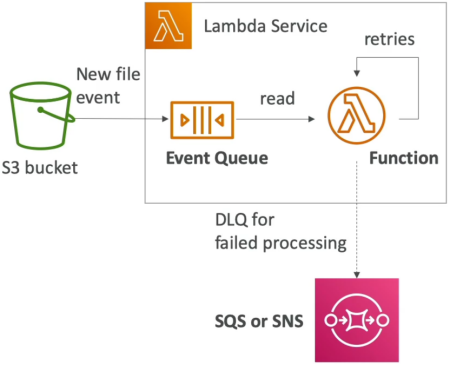

# Lambda Asynchronous Invocations & DLQ

**Asynchronous Invocations** are a massive game-changer when you want to build highly decoupled, lightning-fast processing pipelines where the upstream service doesn't care about waiting around for your code to finish. Think of it like dropping off your clothes at the dry cleaner: you drop the bundle off, get your receipt, and walk away immediately. You don't sit there staring at the washing machine for 45 minutes.

In an **Asynchronous Invocations**, the invoking service fires a request and receives an immediate HTTP 202 Accepted status code from Lambda, signaling that the event payload has been safely received. The calling service immediately breaks the connection and moves on. Under the hood, Lambda places the incoming payload into an **internal, abstract event queue managed by AWS**. The function then pulls messages off this background buffer to execute them. If an execution fails, Lambda manages an automated retry schedule before offloading permanently broken payloads to a **Dead-Letter Queue (DLQ)** or an **Event Destination**.

---

## Key Takeaways

### The Internal Retry Engine & Idempotency Rules

Because the calling client is long gone, Lambda handles processing faults entirely on its own infrastructure layer:

- **The 3-Strike Rule (Default):** If your function code crashes or throws an exception during an async pass, Lambda doesn't give up immediately. It attempts to process the event up to **3 times in total**:
  1. **Attempt 1:** The initial execution pass right when the message drops.
  2. **Attempt 2:** A retry triggered **1 minute** after the first failure.
  3. **Attempt 3:** A final retry triggered **2 minutes** after the second failure.
- **⚠️ The Idempotency Mandate:** Because network hiccups or timeouts can trigger these retries, your Lambda function **MUST be idempotent**. Idempotency means that no matter how many times your code runs with the exact same input event payload, the final state of your database or system remains completely identical.
  - _Example:_ If your code handles billing, running it 3 times due to retries should only charge the customer _once_, not three times!
- **CloudWatch Duplication:** When retries hit your stack, you will see multiple standalone execution blocks with duplicate log entries tracking across CloudWatch Logs for that single original payload signature.

---

### Handling Poison Pill Payloads: DLQs vs. Destinations

When a message completely exhausts all 3 execution attempts and still fails, it becomes a "poison pill." If you don't catch it, it vanishes into the ether. You have two native recovery architectures:

#### 🗄️ Option A: Dead-Letter Queues (DLQ)

This is the classic configuration pattern. You instruct Lambda to automatically offload failed event payloads directly down to an **Amazon SQS queue** or an **Amazon SNS topic** for offline triage or engineering debugging later.

- _Exam Note:_ The Lambda function’s execution role **must** carry the explicit permissions (`sqs:SendMessage` or `sns:Publish`) to drop payloads into the target DLQ resource!

#### 🎯 Option B: Lambda Destinations (Modern Best Practice)

The newer, preferred architecture. Instead of just catching failures, **Destinations** can route execution telemetry summaries for **both Successes and Failures** to targets like SQS, SNS, Lambda, or EventBridge. Destinations pass the complete execution context, including the stack-trace error codes, making them superior to old-school DLQs!

---

### 📊 Operational Telemetry Pipeline Notation

The structural execution loops and retry backoffs running inside managed async boundaries evaluate under these direct expressions:

$$\text{Async Client Handshake} = \text{Service Event} \longrightarrow \text{Enqueue to Internal Buffer} \implies \text{Returns HTTP 202 Lossless State}$$

$$\text{Total Async Lifespan} = \text{Attempt}_1 \xrightarrow{\Delta t = 1\text{ min}} \text{Attempt}_2 \xrightarrow{\Delta t = 2\text{ mins}} \text{Attempt}_3 \longrightarrow \text{Evict to SQS DLQ / Destination}$$

---

### The Asynchronous Service Roster (The "Fire-and-Forgetters")

Commit this specific roster to memory, chief. These services decouple from Lambda instantly upon payload handoff:

- **Amazon S3:** Fires event notifications asynchronously when files are uploaded or deleted (`ObjectCreated` / `ObjectRemoved`).
- **Amazon SNS:** Broadcasts notifications down to a Lambda subscription link.
- **Amazon EventBridge:** Executes scheduled cron ticks or routes pattern-matched infrastructure changes straight down to your function.
- **Other Pipeline Tools:** CodeCommit, CodePipeline, CloudWatch Logs subscription streams, and SES.

---

## Exam Tips

- **The HTTP Status Code Indicator:** If an exam question displays raw network response packets and asks you to identify if the invocation model was synchronous or asynchronous, scan for the HTTP status code. **A successful asynchronous call always returns HTTP `202 Accepted**`, while synchronous loops return standard `200 OK`.
- **The `Event` Invocation Type Flag:** Programmers building applications with the AWS SDK or CLI can force an explicit asynchronous invocation by passing this exact configuration header parameter string wrapper: **`--invocation-type Event`**.

### 🚀 Practice Scenario

**Scenario:** A development team has configured an Amazon S3 bucket to trigger an AWS Lambda function asynchronously whenever an external client uploads a large CSV file. Under heavy production conditions, the Lambda function occasionally errors out due to record lock timeouts on a downstream relational database. The team wants to ensure that any file metadata payloads that fail to process after all retries are completed are preserved for diagnostic analysis. What should the developer configure?

- **A.** Front the Lambda function with an Application Load Balancer and enable Multi-Value Headers in the Target Group.
- **B.** Configure an **SQS Dead-Letter Queue (DLQ)** or a **Lambda Destination for Failure** on the function, and ensure the Lambda execution role contains the appropriate `sqs:SendMessage` policy.
- **C.** Increase the function's memory configuration slider to exactly 10 GB inside multi-region CloudFormation StackSets.
- **D.** Modify the code handler parameters to process the payload via a `RequestResponse` invocation type loop string.

**Correct Answer: B.** Since the trigger source is Amazon S3, it executes **asynchronously**. To capture payloads that fail after the native retry loops run their course, implementing a **DLQ target or a Failure Destination** ensures no processing telemetry data is dropped on the floor.
