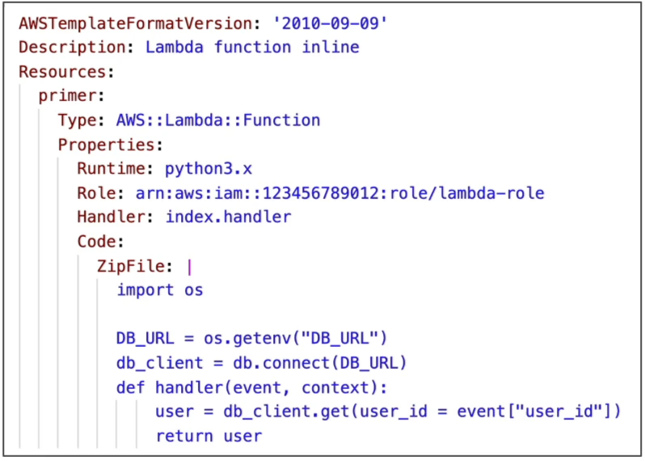
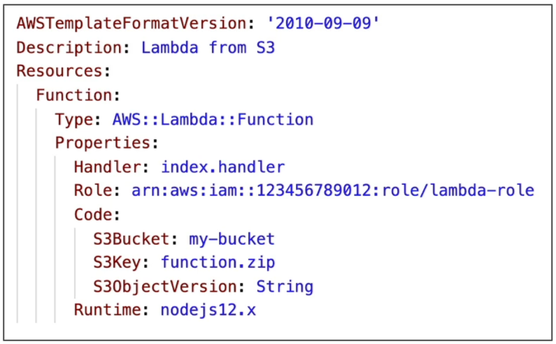
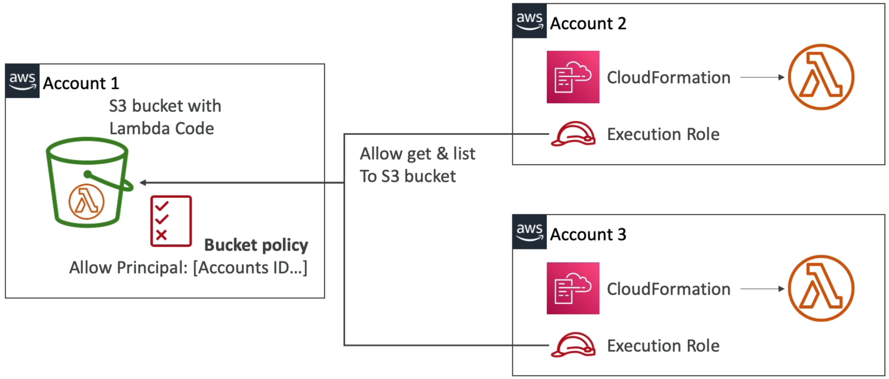

# Lambda and CloudFormation

Bridging **CloudFormation** and **AWS Lambda** is the cornerstone of true Infrastructure as Code (IaC) engineering! 📜⚡

In a mature enterprise environment, you don't manually drag-and-drop zip files into the console or execute one-off CLI scripts from your laptop. You declare your entire serverless stack inside a YAML or JSON template and let CloudFormation orchestrate the lifecycle.

---

## Key Takeaways

AWS Lambda functions can be provisioned through AWS CloudFormation using two deployment methodologies: **Inline Declarations**, which insert raw script text directly into the template file via the `Code.ZipFile` attribute for simple, dependency-free logic; and **S3-Staged Zip Archives**, which pull compiled application binaries out of an external Amazon S3 bucket. To ensure automated code stack updates during stack mutations, developers must utilize **S3 Object Versioning**.

---

### 🔀 The 2 Deployment Pathways: Inline vs. S3 Bucket

When declaring your `AWS::Lambda::Function` resource, your architecture dictates how the template grabs your source code:

#### 📝 Method A: Inline Code Declarations

You write your code block directly under the CloudFormation template text using the **`Code.ZipFile`** property.

- **The Big Constraint:** This is strictly reserved for dead-simple helper scripts. **You cannot include any external dependencies or custom packages (no `node_modules` or Python `site-packages`).**
- **The Format Trap:** It only works for specific light runtimes (like Node.js or Python) and you must ensure your text strings conform to strict indentation layout limits.

#### 📦 Method B: The S3 Archive Path (Production Standard)

You zip your application source code _alongside_ all its package dependencies locally or via a CI/CD build pipeline, upload that `.zip` file into an Amazon S3 bucket, and point CloudFormation to it using these three target parameters:

- **`S3Bucket`**: The string identifier naming your storage bucket.
- **`S3Key`**: The exact object path string to the zip asset (e.g., `builds/my-app.zip`).
- **`S3ObjectVersion`**: The unique string hash tracking a specific version mutation of that file.

## 

### ⚠️ The Crucial CloudFormation Update Trap

This is an absolute milestone, number-one favorite DVA-C02 exam trap that burns teams in production all the time. Read this carefully:

:::warning
**THE CLOUDFORMATION STACK UPDATE LAW:** If you rewrite your Lambda code, compile a new `my-app.zip` archive, overwrite the existing file inside your S3 bucket using the exact same bucket name and key path, and then trigger a CloudFormation **Stack Update**—**CloudFormation will look at your template, see that the `S3Bucket` and `S3Key` strings haven't changed, and completely skip updating your function code!** The stack deployment will finish with "No updates are to be performed," leaving your old bug active in production.
:::

#### 🔐 The Fix: S3 Object Versioning 👑

To force CloudFormation to recognize your code update, you **must** turn on **Bucket Versioning** on your deployment storage pool.

1. When your build script pushes a new zip file to S3, the bucket automatically assigns a unique string identifier token (e.g., `v_xyz123`).
2. You pass this fresh token down into your CloudFormation template's **`S3ObjectVersion`** attribute slot.
3. Because the template string parameters physically changed, CloudFormation registers the delta, reaches down into the S3 storage line to pull the exact new binary, and replaces your running function code flawlessly!

---

### 🔒 Securing the Cross-Account Delivery Pipeline

If your enterprise utilizes a secure, centralized **DevOps Build Account (Account 1)** to hold compiled assets inside an S3 bucket, and you want to deploy that identical Lambda code blueprint into **Target Account 2** and **Target Account 3**, you must establish a two-way security handshake:

1. **The Inbound Bucket Policy (Account 1):** The central S3 bucket policy must carry an explicit cross-account statement authorizing the Principal root IDs or explicit execution roles of Target Accounts 2 and 3 to execute `s3:GetObject` and `s3:GetObjectVersion` against its paths.
2. **The Outbound CloudFormation Service Role (Account 2/3):** When you execute the deployment inside your target accounts, the local CloudFormation execution role must carry an identity policy giving it authority to reach across account boundaries and pull objects out of the Account 1 bucket ARN.

Combined, this allows the target stack controller to pull the code payload securely across the global AWS backbone and spin up the local function natively inside the target region!

---

## Exam Tips

- **The Ghost Code Update Scenario:** If an exam prompt complains that a software release pipeline completed its S3 asset rewrite step and successfully triggered a CloudFormation stack update, but testing reveals the Lambda function is still running the old source code—look straight for the option that states: **The bucket does not have S3 Versioning enabled, or the template failed to update the `S3ObjectVersion` parameter**
- **The Deployment File Size Threshold:** Don't forget our general upload boundaries. If your deployment package stays under **50 MB**, direct push pipelines work fine. But if your zip payload expands past that up to the absolute **250 MB unzipped ceiling**, routing your IaC templates through an **S3 Staging Bucket** is the only way to clear the deployment gate!
