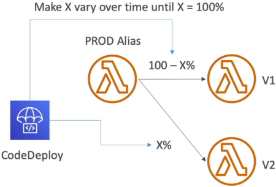

# Lambda and CodeDeploy

Automating your traffic shifts with **CodeDeploy** takes everything we just did with manual weighted aliases and scales it up to full production automation! 🤖🚀

In a real enterprise setup, you aren't sitting in the AWS Console clicking buttons to change traffic weights from 10% to 20% while staring at log streams. You let CodeDeploy handle the progression safely in the background. If your new version starts throwing errors, the system automatically catches it and rolls back instantly.

---

## Key Takeaways

**AWS CodeDeploy** integrates with AWS Lambda to automate progressive traffic routing shifts across function versions via a managed alias. Utilizing pre-defined strategies—**Linear**, **Canary**, or **AllAtOnce**—CodeDeploy shifts traffic incrementally while evaluating system health. By leveraging **Pre/Post-Traffic Validation Hooks** (helper Lambda functions) and **CloudWatch Alarms**, the platform can trigger automated rollbacks if performance regressions occur.

---

### 📊 The 3 Traffic Shifting Strategies

When CodeDeploy takes control of your Lambda alias routing, you assign it an explicit progression rule, chief:

- **Canary 🛰️:** Shift $X\%$ of traffic to the new version, wait for $N$ minutes while monitoring health, and then flip **100%** of the traffic over all at once if everything stays green.
  - _Example:_ `Canary10Percent5Minutes` ──► 10% goes to $V2$ for exactly 5 minutes. If no alarms fire, boom—100% shifts to $V2$.

- **Linear 📈:** Gradually grow the traffic on the new version by fixed percentages at steady time intervals until it hits 100%.
  - _Example:_ `Linear10PercentEvery3Minutes` ──► 10% shifts to $V2$, then 3 minutes later it bumps to 20%, then 30%, climbing steadily to 100%.

- **AllAtOnce 💥:** Immediate cutover. 100% of traffic drops straight from $V1$ to $V2$ instantly. This is the fastest method but carries the highest risk of causing an outage if a bug slipped through!

## 

### 🛠️ Safety Guardrails: Validation Hooks & Rollbacks

CodeDeploy doesn't just blind-shift packets; it runs a full security perimeter scan using two mechanisms to guarantee zero-downtime safety:

    ```text
    Deployment Lifecycle Sequence:
    [Start] ──► [PreTraffic Hook] ──► [Traffic Shifting Loops (Linear/Canary)] ──► [PostTraffic Hook] ──► [Complete]
                      │                                  │
                (If Hook Fails)                  (If Alarm Triggers)
                      ▼                                  ▼
               [Abort Deployment] ───────────────► [Automated Rollback to V1]
    ```

1. **Pre & Post-Traffic Hooks (Validation Lambdas) 🪝:** These are separate helper Lambda functions that execute integration test suites during the deployment loop:
   - **`PreTraffic` Hook:** Executes _before_ any live production traffic shifts to $V2$. It runs smoke tests against the new deployment. If it fails, CodeDeploy aborts before a single real user ever hits the new code, bro!
   - **`PostTraffic` Hook:** Executes _after_ the traffic shift completes 100% to validate final stack health.

2. **CloudWatch Alarm Monitoring 🚨:** You can bind explicit CloudWatch Alarms (like Error Rates $> 1\%$ or P99 Latency $> 500\text{ms}$) straight to your CodeDeploy deployment group. If at any microsecond during the shifting progression an alarm enters the `ALARM` state, CodeDeploy halts the deployment instantly and executes an **Automated Rollback**, slamming 100% of traffic back onto the safe, stable $V1$, chief!

---

### 📜 Deconstructing the `AppSpec.yml` Manifest

To tell CodeDeploy exactly how to handle the version migration, you pass it an **AppSpec configuration file**. This schema is a heavy favorite on the exam blueprint. Memorize these specific properties:

```yaml
version: 0.0
Resources:
  - MyLambdaFunction:
      Type: AWS::Lambda::Function
      Properties:
        Name: "production-payment-worker" # Required: The target Lambda function name
        Alias: "PROD" # 👑 Required: The named target routing alias
        CurrentVersion: "1" # Required: ❄️ The baseline stable version number
        TargetVersion: "2" # Required: 🚀 The incoming candidate version number
Hooks:
  - PreTraffic: "BeforeAllowTrafficHookLambda" # Test before shifting traffic!
  - PostTraffic: "AfterAllowTrafficHookLambda" # Test after shift completes!
```

---

## Exam Tips

- **The Blue/Green Automated Rollback Scenario:** If an exam question asks: _"A developer wants to upgrade an API Gateway-backed Lambda function using a Canary path, ensuring that if user error rates spike at any point during the 30-minute transition window, the application instantly self-heals without human intervention."_
  - **The Correct Answer:** Use **AWS CodeDeploy** linked to the function's production **Alias**, configure a `Canary` or `Linear` strategy, and attach a **CloudWatch Alarm** targeting the function's error metric to the CodeDeploy deployment group.
- **The `AppSpec` Identity Matchmaker:** If you see an AppSpec syntax question, make sure it lists **`CurrentVersion`** and **`TargetVersion`** under the `Resources` block. If the prompt mentions changing files or folders inside an EC2 instance, that's an EC2 deployment—but for Lambda, it is strictly about moving the alias pointer from the current version to the target version over time.
