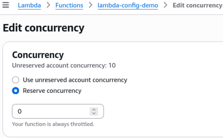
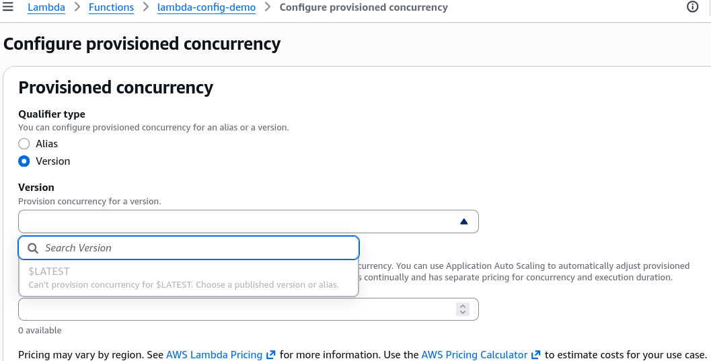

# Lambda Concurrency Hands On

Breaking your own serverless application on purpose by setting the **Reserved Concurrency to 0** is the ultimate power move to check how your client-side error handling deals with a real-world production breakdown!

Stephane’s console walk exposes two critical platform behaviors: how a hard throttle surfaces instantly when you run out of scaling headroom, and why you can't just slap Provisioned Concurrency onto a dynamic `$LATEST` code branch.

---

## 🛠️ Step-by-Step Concurrency Manipulation Playbook

### 1. Simulating a Total System Throttle (The Zero Guardrail)

- **Step 1: Locate the Concurrency Allocation Tab**
  - Inside your `lambda-config-demo` workspace, jump over to the **Configuration** tab ──► select **Concurrency** from the sidebar options list.
  - Review your regional dashboard matrix. It displays your current **Unreserved Account Concurrency** floor baseline (defaulting to `1,000` shared units across your region).
    - _Brand new accounts_ will show much lower ceilings (often around **10 to 30** instances), it automatically scales up to 1,000 as you use the account normally.

- **Step 2: Apply the Absolute Throttle Boundary**
  - Hit **Edit** ──► toggle the allocation switch from unreserved to **Reserve concurrency** ──► punch in exactly **`0`** as the value parameter, and click **Save**.  
    
- **Step 3: Audit the Synchronous Invocation Failure**
  - Jump directly to the function's **Test** tab and click the **Test** execution button.
  - **The Platform Interception:** The execution block instantly locks up and drops a hard red validation error box: **`Rate Exceeded / TooManyRequestsException (API Status 429)`** \* Because your available environment instance limit is capped at absolute zero, the data plane drops your request at the front door before a single microVM line can even spin up, bro!

---

### 2. Restoring the Pipe and Navigating the $LATEST Restriction

- **Step 4: Restore Account Pool Routing**
  - Navigate straight back to **Configuration -> Concurrency -> Edit** ──► switch the toggle back to **Use unreserved account concurrency** (or set a safe allocation boundary like `20` slots) and click Save.
  - Re-fire your manual console **Test** button. The code instantly re-engages and returns your successful `prod` environment context strings flawlessly.

- **Step 5: The Provisioned Concurrency Pre-Warming Gate**
  - Scroll down to the **Provisioned Concurrency Configurations** sub-panel.
  - Click **Add configuration**. Notice the console immediately forces you to specify either a concrete **Function Version** or a targeted **Function Alias**.
  - **The Strict Platform Trap:** The dropdown selector completely blocks you from picking the active **`$LATEST`** development branch!
  - _Why?_ Because `$LATEST` is highly mutable—you are constantly updating the source code, changing variables, and modifying layer setups. AWS cannot reliably pre-warm and allocate Firecracker microVM environments ahead of time for code that might morph every 5 seconds.  
    

---

## Exam Tips

- **The Chaos Engineering Mock Pattern:** If an exam scenario asks you how a quality assurance team can quickly mock out a sudden downstream system outage or test an internal application's graceful degradation retry logic without rewriting a single line of microservice source code—look straight for the answer that suggests **setting that targeted function's Reserved Concurrency value directly to 0 in the AWS Management Console or via the CLI**.
- **The Version Publishing Pipeline Flow:** If a deployment scenario complains that a developer's cloud automation pipeline is failing to attach a Provisioned Concurrency pre-warming rule right after updating a function's code wrapper, remember the architectural sequence: **You must execute a `lambda:PublishVersion` API call first.** You can only bind pre-warmed provisioned environments to immutable published snapshots (like `Version 1`, `Version 2`) or named tracking Aliases pointing to them!
