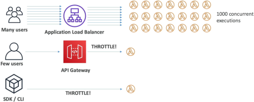

# Lambda Concurrency

When your apps are cruising at low traffic, auto-scaling feels like magic. But if a massive marketing campaign kicks off or an absolute flood of traffic hits your API gateway, your functions will scale out fast. If you don't know the exact limits, scaling rules, and pre-warming knobs, a single runaway function can completely take down your entire cloud infrastructure.

---

## Key Takeaways

**Lambda Concurrency** represents the total number of raw execution environment instances handling active, in-flight requests at any single millisecond snapshot. AWS imposes a shared, default regional ceiling limit of **1,000 concurrent executions** per account. If a function attempts to scale past its available resource pool, the platform applies a strict **Throttle**. To maintain operational stability, developers must leverage **Reserved Concurrency** as an isolation throttle guardrail, and **Provisioned Concurrency** to systematically eliminate execution Cold Starts on latency-critical paths.

---

### 🔏 The Shared Pool Risk & Reserved Concurrency Fix

By default, every single Lambda function you deploy inside a specific AWS region shares one monolithic compute pool.

#### 🚨 The Shared Pool Starvation Problem

- Imagine your account has the default pool limit of **1,000 concurrent units**.
- You have an e-commerce checkout function (`Function-A`) and a reporting function (`Function-B`).
- A massive holiday sale triggers a flood of requests to `Function-A`. It instantly scales out horizontally to handle 1,000 parallel requests.
- **The Blast Radius:** Because `Function-A` sucked up the entire unreserved regional pool, `Function-B` gets **completely starved and frozen!** Any incoming reporting requests will instantly drop an application throttle error, even though `Function-B` itself did nothing wrong!

#### 🛑 The Fix: Reserved Concurrency (The Structural Bulkhead)

To protect your functions from starving each other, you assign an explicit **Reserved Concurrency** limit value directly onto your high-value functions.

- **The Double-Edged Sword:** Setting a reserved value of **50** on a function does two major things:
  1. **Guaranteed Minimum Floor:** It cleanly carves out 50 execution slots from your account pool that belong _exclusively_ to that function. No other function can steal them!
  2. **Max Ceiling Cap (Isolation):** It acts as a hard limiter block. That function can **never** scale past 50 concurrent executions under any circumstances, preventing it from ever running wild and destroying the rest of your system!

- _Exam Rule:_ AWS always leaves a minimum of **100 unreserved concurrent units** in the public pool. This means you can only reserve a maximum total of 900 units across your entire function catalog within default account limits.

---

### 🥊 Synchronous vs. Asynchronous Throttling Behaviors

When your functions crash straight into a concurrency wall, how the client suffers depends entirely on your original invocation model:

| Invocation Style                                    | Immediate Impact Action                                                                              | Auto-Retry Remediation Logic                                                                                                                                                                                                                 |
| --------------------------------------------------- | ---------------------------------------------------------------------------------------------------- | -------------------------------------------------------------------------------------------------------------------------------------------------------------------------------------------------------------------------------------------- |
| **Synchronous** _(e.g., API Gateway / ALB)_         | Drops an immediate **HTTP 429 Too Many Requests** error back down to the user's browser, bro.        | Zero platform retries. Your client-side frontend code must handle the exception or execute its own exponential backoff loop.                                                                                                                 |
| **Asynchronous** _(e.g., Amazon S3 / SNS triggers)_ | The caller receives an HTTP 202 Accepted and leaves. The failure happens entirely in the background. | Lambda redirects the throttled event back into its internal hidden queue engine, **attempting to re-execute the payload for up to 6 hours!** The retry backoff spaces out exponentially from 1 second up to a maximum interval of 5 minutes. |

---

### 🥶 Eradicating Cold Starts: Provisioned Concurrency

Every time a scaling event forces Lambda to provision a brand-new container instance from scratch, you hit a **Cold Start**. The microVM has to download your deployment bundle, spin up the runtime (like Node.js or Python), and execute all your global top-level initialization code blocks. For user-facing APIs, this extra 500ms to 2-second delay ruins the user experience.

#### 🟢 The Solution: Provisioned Concurrency (Pre-Warmed Infrastructure)

You instruct AWS to pre-warm a designated number of execution instances _before_ traffic ever hits your system.

- **The Result:** The container initialization phase is executed completely ahead of time. When a real user request finally lands, it hits a warm, waiting environment instance, **dropping the cold-start latency down to absolute zero**
- **Dynamic Scaling Control:** You can link **Application Auto Scaling** straight to your provisioned concurrency settings. You can set it to scale up on a strict calendar cron schedule (e.g., pre-warm 200 instances every Friday morning at 8:00 AM before the weekend rush hits) or execute a Target Tracking Policy monitoring your active utilization metrics!
- _The Financial Catch:_ Unlike standard Lambda which only charges you when code runs, **you pay a continuous flat runtime fee for Provisioned Concurrency** whether requests are hitting those pre-warmed environments or not. Use it strategically on critical, low-latency client pathways!

---

## Exam Tips

- **The Database Safety Value Scenario:** If an exam scenario says: _"A high-volume streaming system processes data using a Lambda function that writes records down to an internal relational RDS database. During traffic spikes, Lambda auto-scales aggressively and exhausts the database's maximum available connection pool, crashing the database server. What should you configure?"_
  - **The Correct Answer:** Apply a strict **Reserved Concurrency** limit onto that specific Lambda function to perfectly match the maximum connection capacity of the downstream RDS database instance, locking down your scaling velocity and saving your database layer from exploding, bro!
- **The Cold Start Elimination Architecture:** If a prompt states that a company is migrating a legacy web API over to an API Gateway + AWS Lambda stack, but the product managers are rejecting the architecture because the very first web visitor after an idle period experiences an unacceptable 3-second page loading lag—look straight for **Provisioned Concurrency Configured on a specific Function Version or Alias** to wipe out that initialization cold start permanently!
