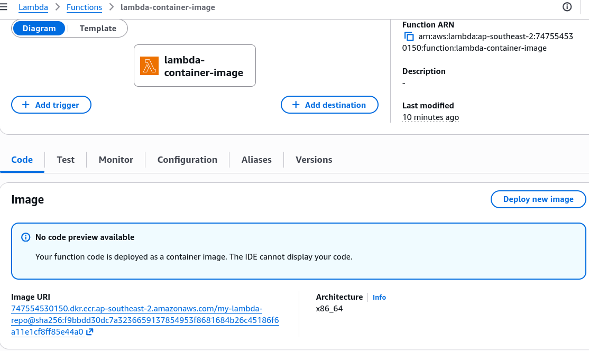

# Lambda Container Images - Hands On

This hands-on lab is something that I made for myself, the course only cover the overview of the feature, however I found it very interesting and I never use it in my previous role before. This also good time to revise our knowledge about ECR that we learn in the previous section.

Using **Amazon ECR** to house multi-gigabyte serverless runtimes completely untethers your application from the legacy deployment script hurdles.

---

## 🛠️ Step-by-Step ECR-to-Lambda Container Deployment Hands On

### 1. Hardening the Architecture Configuration

#### 1. The Application Code (index.mjs)

```javascript title="index.mjs"
export const handler = async (event, context) => {
  return {
    statusCode: 200,
    body: JSON.stringify({ message: "Hello from Lambda Container, bro!" }),
  };
};
```

#### 2. The Dockerfile

Let's optimize that Dockerfile step. To prevent Docker from constantly running slow `npm install` executions whenever you change a single string inside your business code, split your copy actions to maximize Docker’s built-in layer cache matching:

```dockerfile title="Dockerfile"
FROM public.ecr.aws/lambda/nodejs:24

# 1. Establish the platform task execution workspace root directory
WORKDIR ${LAMBDA_TASK_ROOT}

# 2. Copy ONLY the dependency manifest layers first
COPY package*.json ./

# 3. Run a clean, isolated production-only build hook
RUN npm install --only=production

# 4. Copy your actual application source code assets (Changes frequently, goes last!)
COPY index.mjs ./

# 5. Route the microVM command hook straight to your handler method
CMD [ "index.handler" ]
```

---

### 2. The Command Line Delivery Loop (CloudShell / Local Terminal)

Before building, verify you've spun up your ECR repository. Run this terminal layout loop sequentially to build, tag, and push your asset bundle down the wire:

```bash
# initiate the npm package manager and generate the package.json manifest file
npm init -y

# Step A: Provision the central image repository (Skip if already exists)
aws ecr create-repository --repository-name my-lambda-repo --region <your-region>

# Step B: Authenticate your local Docker daemon with the ECR Private Registry
aws ecr get-login-password --region <your-region> | docker login --username AWS --password-stdin <your-account-id>.dkr.ecr.<your-region>.amazonaws.com

# Step C: Compile the Docker layer blocks locally. I added the --provenance=false flag to avoid the deployment error, from my research, this is a known issue if you build your Docker image on modern Docker setup (Docker Desktop on Mac or Linux).
docker build --provenance=false -t my-lambda-container:latest .

# Step D: Apply the explicit ECR repository tag signature mapping
docker tag my-lambda-container:latest <your-account-id>.dkr.ecr.<your-region>.amazonaws.com/my-lambda-repo:latest

# Step E: Stream the binary data payload upstream to the AWS backbone
docker push <your-account-id>.dkr.ecr.<your-region>.amazonaws.com/my-lambda-repo:latest
```

---

### 3. Executing the Infrastructure Provisioning Command

Once the binary bytes land safely inside your ECR image index dashboard, fire the `create-function` command block to instantiate your container-backed runtime workspace, chief:

```bash
aws lambda create-function \
    --function-name my-container-lambda \
    --package-type Image \
    --code ImageUri=<your-account-id>.dkr.ecr.<your-region>.amazonaws.com/my-lambda-repo:latest \
    --role arn:aws:iam::<your-account-id>:role/your-lambda-execution-role

```



---

## Exam tips

- **The Silent Overwrite Pitfall (The "latest" Tag Trap):** This is an absolute milestone favorite exam trap, bro. If you rebuild your container code, push the new image to ECR overwriting the exact same `latest` tag signature, and do nothing else—**your Lambda function will continue running your old code!** The Lambda service locks down onto the explicit SHA-256 image digest hash when it initializes. To push your changes live into production, you **MUST** run the explicit **`aws lambda update-function-code`** API command to tell the platform control plane to refresh its underlying container environment pool!
- **The Non-AWS Base Image Exception:** If an exam prompt specifies that a team wants to build a Lambda container image from a base **Alpine Linux** or standard **Ubuntu** image instead of an AWS-provided one, look for the runtime requirement. You _must_ programmatically build and include the **Lambda Runtime Interface Client (RIC)** into that custom Dockerfile, or the container won't know how to talk to the Lambda orchestration backend and will drop an immediate boot error.
