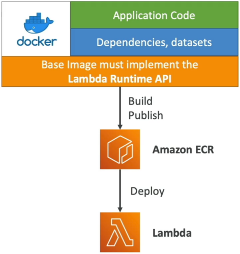

# Lambda Container Images

**Lambda Container Images** completely revolutionized the way enterprise dev teams ship cloud-native code. 🐳🚀

Before AWS dropped container support, if your serverless stack needed to pack massive machine learning weights, heavy data-science binaries, or legacy runtime dependencies, you would crash straight into the classic 250 MB unzipped deployment zip ceiling. Container support completely smashes that barrier, lifting your deployment allocation headroom all the way up to a massive **10 GB**!

---

## Key Takeaways

**AWS Lambda Container Images** enable developers to package and deploy serverless functions as Docker or OCI-compliant container images up to **10 GB** in size. Staged within **Amazon Elastic Container Registry (ECR)**, these images must inherit from a base layer that implements the standard **Lambda Runtime API**. This feature allows unified container-based development workflows and seamless native testing using the local **Lambda Runtime Interface Emulator (RIE)**.



---

### ⚙️ The Golden Rule: The Runtime API & Interface Emulator

You can't just take an erratic, generic Docker image running an Express.js server or an Nginx proxy and expect Lambda to boot it up.

#### 🔒 The Base Image Requirement

The container **must** be built on top of an image that implements the **Lambda Runtime API**. This internal platform protocol communicates directly with the Lambda service loop to fetch incoming invocation event envelopes and return downstream response payloads.

- AWS maintains a massive catalog of official pre-cached base images for standard runtimes like Node.js, Python, Java, and .NET.
- _The Polyglot Play:_ You can construct a completely custom base image from scratch (e.g., using Alpine Linux or a raw minimal distro) as long as you programmatically compile and include the open-source Runtime API client inside your image shell!

#### 💻 Local Debugging via the RIE

How do you test a 5 GB serverless container image on your local MacBook or Windows machine without deploying it to AWS? You use the **Lambda Runtime Interface Emulator (RIE)**.

- The RIE wraps your container locally, mocking the cloud infrastructure environment. It spins up a local HTTP server container port (typically `localhost:8080`), allowing you to fire standard `curl` commands directly at your Docker instance to verify your function handler's input/output schemas before pushing anything to production.

---

### 🛠️ Deconstructing the Serverless Dockerfile

Let's look at a modern, high-performance **Dockerfile** blueprint for Node.js. Pay close attention to how we structure the layers to leverage Docker's built-in caching mechanics:

```dockerfile
# 1. Pull the official, pre-cached AWS Lambda base image from ECR Public
FROM public.ecr.aws/lambda/nodejs:20

# 2. Set the working directory context inside the microVM container space
WORKDIR ${LAMBDA_TASK_ROOT}

# 3. Copy only the dependency manifest first (Maximizes Layer Cache optimization, bro!)
COPY package*.json ./

# 4. Execute a clean, production-only node module installation
RUN npm ci --only=production

# 5. Copy your active business application source files (Frequent changes go last!)
COPY app.js ./

# 6. Override the default Command to point directly to your code handler method
CMD [ "app.lambdaHandler" ]

```

#### 🧠 Critical Layer Optimization Logic:

Notice how `package.json` is copied and `npm ci` is executed _before_ copying `app.js`? This is the core strategy for building lightning-fast container pipelines:

$$\text{Stable Layer } (\text{Base Image}) \longrightarrow \text{Slow Changing Layer } (\text{Dependencies}) \longrightarrow \text{Frequently Changing Layer } (\text{Business Code})$$

If you modify a single string inside `app.js`, Docker completely bypasses the slow `npm ci` step during your next build run, reusing the cached dependency layer blocks instantly and cutting your CI/CD compile cycles down to seconds.

---

### 📊 Enterprise Best Practices & Delivery Tactics

- **Leverage Multi-Stage Builds:** Never ship your heavy test suites, linter engines, or raw compiler tooling down to the live execution space. Build your application inside a large temporary "Builder" image state, then execute a final `COPY --from=builder` step to pass strictly the compiled production artifacts into a clean, minimal AWS Lambda base image.
- **The Single-Repository Consolidation Rule:** If you are managing multiple distinct Lambda functions that share massive common layer foundations, store them all as separate tags within a **single Amazon ECR repository**. ECR features native layer deduplication; storing them together prevents your cloud workspace from re-uploading and storing duplicate multi-gigabyte layers, drastically shrinking your storage invoice footprints!

---

## Exam Tips

- **The Unified Workflow Blueprint:** If an exam prompt states that a DevOps engineering department wants to establish a single, unified deployment orchestration engine for _all_ company compute apps—regardless of whether they deploy down to Amazon ECS cluster groups or scale out as serverless microVMs—look straight for **Lambda Container Images stored in Amazon ECR**! This allows your team to use standard `docker build` and `docker push` pipelines across the entire organization.
- **The Cold Start Cache Hack:** If a scenario notes that a containerized function is experiencing massive cold start initialization latencies, verify the base image source tag. **Always prioritize official AWS-provided base images over custom distributions.** The underlying Lambda control plane actively pre-caches official AWS base layers across its physical hardware nodes ahead of time, ensuring that pulling your custom 4 GB image layer takes a fraction of the time.
