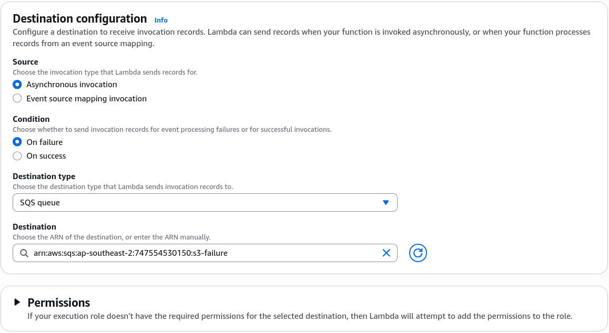
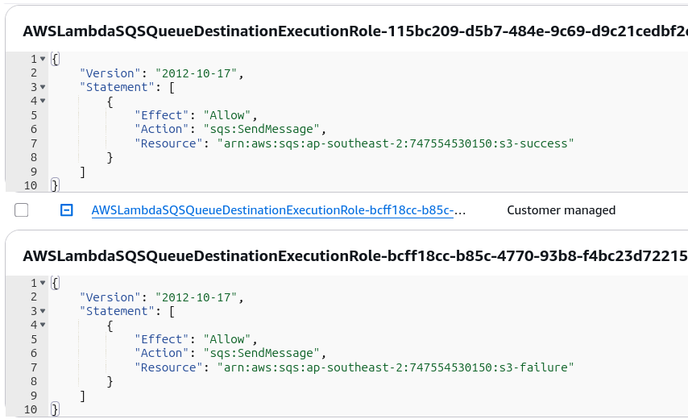

# Lambda Destinations Hands On

One of the slickest features of the modern AWS Lambda Console UI is that **when you wire up a Destination via the console, AWS automatically updates your IAM execution role behind the scenes** with the required policy variables (like `sqs:SendMessage`). This keeps you moving fast without manually jumping back and forth into IAM.

---

## 🛠️ Step-by-Step Lambda Destinations Hands On

### 1. Provisioning the Downstream Storage Queues

- **Step 1: Create the Success Channel Container**
  - Jump into the **Amazon SQS Console** ──► click **Create queue**.
  - Select a standard queue layout, name it **`s3-success`**, and hit create.

- **Step 2: Create the Failure Triage Container**
  - Click **Create queue** a second time.
  - Select a standard queue, name it **`s3-failure`**, and hit create.

---

### 2. Linking the Infrastructure Destinations Map

- **Step 3: Bind the Failure Route**
  - Open your `Lambda-S3` function ──► navigate to the **Configuration** tab ──► select **Destinations**.
  - Click **Add destination** ──► Source type: **Asynchronous invocation** ──► Condition: **On failure**.
  - Destination type: **SQS queue** ──► Destination target: **`S3-failure`**. Click Save.
    

- **Step 4: Bind the Success Route**
- Click **Add destination** again ──► Source type: **Asynchronous invocation** ──► Condition: **On success**.
- Destination type: **SQS queue** ──► Destination target: **`S3-success`**. Click Save.
- _Behind-the-Scenes Check:_ If you jump out to your IAM console, you'll see a policy named `AmazonLambdaMSKExecutionRole` or a custom inline block auto-appended with targeted permissions pointing directly to both your queue ARNs!



---

### 📥 Verification & Live Trace Payload Analysis

To test both pathways, we'll alter our Python handler behavior and drop new object mutations straight into our S3 integration bucket:

#### 🟢 Test Case 1: Pure Success Route (`beach.jpg`)

- **The Action:** Ensure your Lambda function is set to return clean without crashes, then upload `beach.jpg` into S3.
- **The Result:** Head to the SQS Dashboard. Your `S3-success` queue instantly catches 1 message available.
- **The Telemetry Envelope:** When you poll the message inside your queue, notice how insanely loaded the metadata is compared to a classic DLQ. It bundles everything into a single layout map:

```json
{
  "version": "1.0",
  "timestamp": "2026-06-25T10:57:39.305Z",
  "requestContext": {
    "requestId": "288b9d30-f5a7-46cf-9c5f-5d4652a65d86",
    "functionArn": "arn:aws:lambda:ap-southeast-2:747554530150:function:Lambda-S3:$LATEST",
    "condition": "Success",
    "approximateInvokeCount": 1
  },
  "requestPayload": {
    "Records": [
      {
        "eventVersion": "2.4",
        "eventSource": "aws:s3",
        "awsRegion": "ap-southeast-2",
        "eventTime": "2026-06-25T10:57:37.839Z",
        "eventName": "ObjectCreated:Put",
        "userIdentity": { "principalId": "AWS:AIDA24DNY4NTLSCBFI4WZ" },
        "requestParameters": { "sourceIPAddress": "175.32.129.182" },
        "responseElements": {
          "x-amz-request-id": "GZ2Z2Z8N59HDNTW0",
          "x-amz-id-2": "6Wt0nI1VZ8n5dpWH1uUzC1U5fc75PHG+jfLQEKdf5CgMFMZDRpUrAgAYoUR2SPS2L6F26MbM7MqdYKk3ZynFttJ9MN5ItOIwIfZ+uUcTHbk="
        },
        "s3": {
          "s3SchemaVersion": "1.0",
          "configurationId": "invoke-Lambda",
          "bucket": {
            "name": "demo-s3-event-rendy",
            "ownerIdentity": { "principalId": "A18QSH59Y8EC17" },
            "arn": "arn:aws:s3:::demo-s3-event-rendy"
          },
          "object": {
            "key": "beach.jpg",
            "size": 87853,
            "eTag": "1c6defc638f71abd065d8dd2f450b207",
            "sequencer": "006A3D09A1C9B02D97"
          }
        }
      }
    ]
  },
  "responseContext": { "statusCode": 200, "executedVersion": "$LATEST" },
  "responsePayload": { "statusCode": 200, "body": "\"Hello from Lambda!\"" }
}
```

---

#### ❌ Test Case 2: The Poison Pill Retry Loop (`index.html`)

- **The Action:** Go to your code editor panel, comment out your return map, and append this exception-throwing line::

```javascript
throw new Error("Error Occurred Bro!");
```

- Deploy the code updates and drop `index.html` straight into your S3 bucket lanes.
- **The Retry Engine Interception:** If you refresh your SQS console page immediately, **the failure message will not show up right away, chief!** Because this is an asynchronous invocation model, the background Lambda engine forces the message through its strict 3-strike execution timeline:

$$\text{Initial Crash (Attempt 1)} \xrightarrow{\Delta t = 1\text{ min}} \text{Retry Crash (Attempt 2)} \xrightarrow{\Delta t = 2\text{ mins}} \text{Final Retry Crash (Attempt 3)} \longrightarrow \text{Evict to S3-failure Destination}$$

- **The Forensic Failure Payload:** Once 3 minutes elapse and retries exhaust, look inside the body of your `S3-failure` message queue item. It explicitly notes `"condition": "RetriesExhausted"`, captures an `"approximateInvokeCount": 3`, and injects the raw **`stackTrace` error strings (`"errorMessage": "Error Occurred Bro!"`)** straight into the message object, completely saving you from hunting for errors inside CloudWatch, bro!

---

## Exam Tips

- **The Console Test Button Trap:** This is a classic exam favorite. If you click the **"Test"** button inside the Lambda console UI to check your success/failure destinations, **the destinations will never fire.**  
  _Why?_ Because clicking "Test" executes a **Synchronous Invocation (`RequestResponse`)**. Destinations **only** trigger for _Asynchronous Invocations (`Event`)_ or stream-based _Event Source Mappings_! To test a destination live, you must trigger it via the real external service (like S3) or issue an explicit `aws lambda invoke --invocation-type Event` CLI call.
