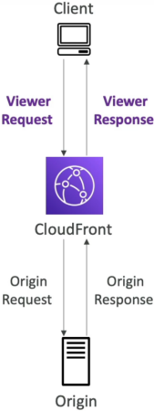
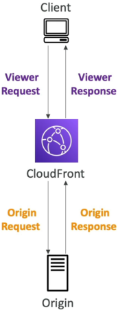

# Lambda@Edge & CloudFront Functions

breaking down the difference between **CloudFront Functions** and **Lambda@Edge** is the absolute peak of edge architecture engineering! 🌐⚡

The DVA-C02 exam _loves_ to test you on this exact choice. It all comes down to a classic architectural trade-off: **raw, blistering speed and massive scale** versus **heavy compute power and deep system integrations**.

---

## Key Takeaways

**Edge Functions** allow developers to execute decentralized serverless code directly at AWS Edge Locations to minimize network latency. CloudFront provides two distinct tiers:

- **CloudFront Functions**, which are highly optimized, sub-millisecond JavaScript blocks built for massive viewer request/response scale
- **Lambda@Edge**, which provides full Node.js or Python environments capable of long execution limits, network access, and direct data origin interceptions.

---

### 🔄 The 4 Operational Interception Hooks

To know _where_ and _when_ code fires, you have to visualize the 4 lifecycle hooks of an HTTP request traversing a Content Delivery Network (CDN) line:

1. **Viewer Request:** Right after CloudFront catches the incoming request from the user's browser, before any caching logic is checked.
2. **Origin Request:** _Only fires on a cache miss._ This occurs right before CloudFront forwards the request back to your backend hosting origin (like an S3 bucket or an EC2 Auto Scaling group).
3. **Origin Response:** _Only fires on a cache miss._ This triggers right after CloudFront receives the response payload back from your backend origin, before saving it into the local cache storage.
4. **Viewer Response:** Right before CloudFront drops the final cached or raw response back down to the user's client terminal.

---

### 🥊 The Ultimate Edge Showdown: CloudFront Functions vs. Lambda@Edge

This comparison matrix is pure exam gold, chief. Lock these distinct operational limits into your memory pool:

| Structural Property       | CloudFront Functions ⚡                       | Lambda@Edge 👑                               |
| ------------------------- | --------------------------------------------- | -------------------------------------------- |
| **Supported Runtimes**    | **JavaScript** (ECMAScript 5.1 compliant)     | **Node.js** and **Python**                   |
| **Scale & Throughput**    | **Millions** of requests per second           | **Thousands** of requests per second         |
| **Lifecycle Hooks**       | Viewer Request & Viewer Response **only**     | **All 4 Hooks** (Viewer + Origin paths)      |
| **Max Execution Time**    | **< 1 Millisecond** (Insanely fast!)          | 5 Seconds (Viewer) / 10 Seconds (Origin)     |
| **Max Memory Allocation** | 2 MB                                          | Up to 10 GB (Adjustable CPU)                 |
| **Network & Disk Access** | **No** external network or file system access | **Yes** (Full internet access + `/tmp` disk) |
| **Request Body Access**   | No                                            | Yes (Can read and mutate POST body payloads) |
| **Authoring Domain**      | Managed directly inside CloudFront control    | Authored in `us-east-1` ──► auto-replicated  |

---

### 🎯 Mapping Real-World Use Cases

When an enterprise needs to deploy logic out to the edge locations, the specific problem statement dictates which tool runs the play:

#### ⚡ Use CloudFront Functions For (The Sub-1ms Quick Hacks):

- **Cache Key Normalization:** Stripping out or alphabetizing erratic query strings or lowercasing header keys to boost your CDN cache-hit ratios.
- **URL Rewrites & Deep-Linking Redirects:** Instantly routing an old path (`/past-promo`) to a new destination (`/current-promo`) right at the edge without querying your web server.
- **Header Manipulation:** Injecting security headers like `X-Frame-Options` or `Content-Security-Policy` right into the viewer response package.
- **Lightweight Auth:** Validating simple JWT signature tokens to immediately allow or drop incoming connections.

#### 🧠 Use Lambda@Edge For (The Heavy Lifters):

- **A/B Testing Experiments:** Intercepting the **Origin Request** hook to transparently redirect 50% of traffic to a different S3 static bucket hosting a brand-new UI layout without changing the URL on the client browser!
- **Global Server-Side Rendering (SSR):** Generating completely custom HTML payloads on the fly closer to the user using microservice data layers.
- **Dynamic Image Optimization:** Accessing a third-party library to resize, crop, or compress images based on user device headers before caching them.
- **External Database Lookup:** Calling an external authorization API or checking an Amazon DynamoDB table to verify a user's subscription access tier.  
  

---

## Exam Tips

- **The Global Deployment Trap:** If an exam scenario asks you why a developer cannot deploy a Lambda@Edge function inside the `ap-southeast-2` (Sydney) region, remember the rule: **Lambda@Edge functions must be explicitly authored inside the `us-east-1` (N. Virginia) region.** Once you publish a version there, the AWS global backbone automatically clones and replicates that function code footprint to every Edge Location across the entire planet!
- **The External API Call Pitfall:** If a scenario states that an edge script needs to make an HTTP call out to a third-party billing gateway to validate a user cookie, and asks if a CloudFront Function can do it—**reject it immediately, bro.** CloudFront Functions have zero network access. For any external API calling, database querying, or third-party SDK dependencies, **Lambda@Edge is the only answer.**
