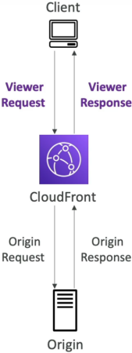
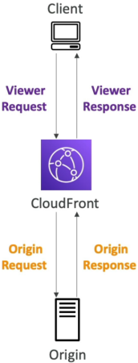
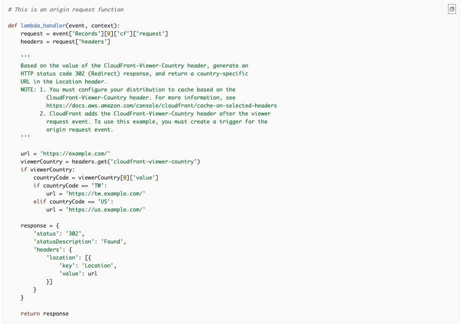
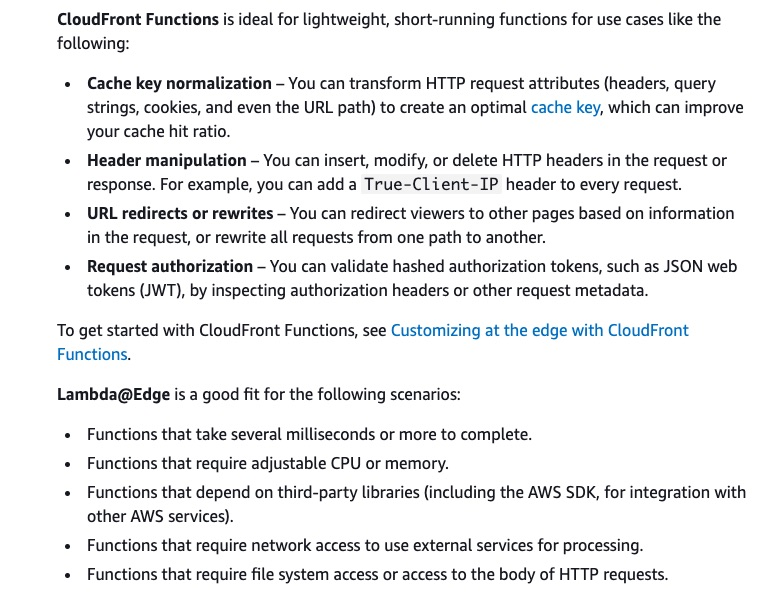

# Lambda@Edge & CloudFront Functions

Breaking down the difference between **CloudFront Functions** and **Lambda@Edge** is the absolute peak of edge architecture engineering! 🌐⚡

The DVA-C02 exam _loves_ to test you on this exact choice. It all comes down to a classic architectural trade-off: **raw, blistering speed and massive scale** versus **heavy compute power and deep system integrations**.

---

## Key Takeaways

**Edge Functions** allow developers to execute decentralized serverless code directly at AWS Edge Locations to minimize network latency. CloudFront provides two distinct tiers:

- **CloudFront Functions**, which are highly optimized, sub-millisecond JavaScript blocks built for massive viewer request/response scale
- **Lambda@Edge**, which provides full Node.js or Python environments capable of long execution limits, network access, and direct data origin interceptions.

---

### 🔄 The 4 Operational Interception Hooks

To know _where_ and _when_ code fires, you have to visualize the 4 lifecycle hooks of an HTTP request traversing a Content Delivery Network (CDN) line:

1. **Viewer Request:** Right after CloudFront catches the incoming request from the user's browser, before any caching logic is checked.
2. **Origin Request:** _Only fires on a cache miss._ This occurs right before CloudFront forwards the request back to your backend hosting origin (like an S3 bucket or an EC2 Auto Scaling group).
3. **Origin Response:** _Only fires on a cache miss._ This triggers right after CloudFront receives the response payload back from your backend origin, before saving it into the local cache storage.
4. **Viewer Response:** Right before CloudFront drops the final cached or raw response back down to the user's client terminal.

---

### 🥊 The Ultimate Edge Showdown: CloudFront Functions vs. Lambda@Edge

This comparison matrix is pure exam gold, chief. Lock these distinct operational limits into your memory pool:

| Structural Property       | CloudFront Functions ⚡                       | Lambda@Edge 👑                               |
| ------------------------- | --------------------------------------------- | -------------------------------------------- |
| **Supported Runtimes**    | **JavaScript** (ECMAScript 5.1 compliant)     | **Node.js** and **Python**                   |
| **Scale & Throughput**    | **Millions** of requests per second           | **Thousands** of requests per second         |
| **Lifecycle Hooks**       | Viewer Request & Viewer Response **only**     | **All 4 Hooks** (Viewer + Origin paths)      |
| **Max Execution Time**    | **< 1 Millisecond** (Insanely fast!)          | 5 Seconds (Viewer) / 10 Seconds (Origin)     |
| **Max Memory Allocation** | 2 MB                                          | Up to 10 GB (Adjustable CPU)                 |
| **Network & Disk Access** | **No** external network or file system access | **Yes** (Full internet access + `/tmp` disk) |
| **Request Body Access**   | No                                            | Yes (Can read and mutate POST body payloads) |
| **Authoring Domain**      | Managed directly inside CloudFront control    | Authored in `us-east-1` ──► auto-replicated  |

---

### 🎯 Mapping Real-World Use Cases

When an enterprise needs to deploy logic out to the edge locations, the specific problem statement dictates which tool runs the play:

#### ⚡ Use CloudFront Functions For (The Sub-1ms Quick Hacks):

- **Cache Key Normalization:** Stripping out or alphabetizing erratic query strings or lowercasing header keys to boost your CDN cache-hit ratios.
- **URL Rewrites & Deep-Linking Redirects:** Instantly routing an old path (`/past-promo`) to a new destination (`/current-promo`) right at the edge without querying your web server.
- **Header Manipulation:** Injecting security headers like `X-Frame-Options` or `Content-Security-Policy` right into the viewer response package.
- **Lightweight Auth:** Validating simple JWT signature tokens to immediately allow or drop incoming connections.

#### 🧠 Use Lambda@Edge For (The Heavy Lifters):

- **A/B Testing Experiments:** Intercepting the **Origin Request** hook to transparently redirect 50% of traffic to a different S3 static bucket hosting a brand-new UI layout without changing the URL on the client browser!
- **Global Server-Side Rendering (SSR):** Generating completely custom HTML payloads on the fly closer to the user using microservice data layers.
- **Dynamic Image Optimization:** Accessing a third-party library to resize, crop, or compress images based on user device headers before caching them.
- **External Database Lookup:** Calling an external authorization API or checking an Amazon DynamoDB table to verify a user's subscription access tier.  
  

---

## Exam Tips

- **The Global Deployment Trap:** If an exam scenario asks you why a developer cannot deploy a Lambda@Edge function inside the `ap-southeast-2` (Sydney) region, remember the rule: **Lambda@Edge functions must be explicitly authored inside the `us-east-1` (N. Virginia) region.** Once you publish a version there, the AWS global backbone automatically clones and replicates that function code footprint to every Edge Location across the entire planet!
- **The External API Call Pitfall:** If a scenario states that an edge script needs to make an HTTP call out to a third-party billing gateway to validate a user cookie, and asks if a CloudFront Function can do it—**reject it immediately, bro.** CloudFront Functions have zero network access. For any external API calling, database querying, or third-party SDK dependencies, **Lambda@Edge is the only answer.**

### Practice Test

**Question**: A media application uses Amazon CloudFront distribution to distribute static content configured on an Amazon S3 bucket. The application is used across different countries and various AWS Regions. Some regions have been experiencing latency when there is a cache miss on CloudFront.

Which of the following configuration changes will you suggest to decrease latency and improve user performance by redirecting requests on cache misses to the S3 bucket in the Region that is nearest to the user's country?

- [ ] Redirect requests on cache misses to the S3 bucket nearest to the user country. Create a CloudFront function to redirect requests based on the value of the CloudFront-Viewer-Country header. Associate the CloudFront function with the distribution's viewer request event
- [ ] Redirect requests on cache misses to the S3 bucket nearest to the user country. Create a CloudFront function to redirect requests based on the value of the CloudFront-Viewer-Country header. Associate the CloudFront function with the distribution's origin request event
- [ ] Redirect requests on cache misses to the S3 bucket nearest to the user country. Create a Lambda@Edge function to redirect requests based on the value of the CloudFront-Viewer-Country header. Associate the Lambda@Edge function with the distribution's viewer request event
- [ ] Redirect requests on cache misses to the S3 bucket nearest to the user country. Create a Lambda@Edge function to redirect requests based on the value of the CloudFront-Viewer-Country header. Associate the Lambda@Edge function with the distribution's origin request event

Correct Answer

- [ ] Redirect requests on cache misses to the S3 bucket nearest to the user country. Create a CloudFront function to redirect requests based on the value of the CloudFront-Viewer-Country header. Associate the CloudFront function with the distribution's viewer request event
  - **Explanation**: If you use the viewer request event, the function would be triggered on all user requests rather than only when you have a cache miss. Additionally, CloudFront Functions only support viewer request and viewer response events. So, this option is incorrect.

- [ ] Redirect requests on cache misses to the S3 bucket nearest to the user country. Create a CloudFront function to redirect requests based on the value of the CloudFront-Viewer-Country header. Associate the CloudFront function with the distribution's origin request event
  - **Explanation**: You can invoke CloudFront functions for only two events: viewer request and viewer response. Origin request and origin response events are not supported for CloudFront Functions.

- [ ] Redirect requests on cache misses to the S3 bucket nearest to the user country. Create a Lambda@Edge function to redirect requests based on the value of the CloudFront-Viewer-Country header. Associate the Lambda@Edge function with the distribution's viewer request event
  - **Explanation**: The viewer request event executes when CloudFront receives a request from a viewer before checking whether the requested object is in the CloudFront cache. If you use the viewer request event, the function would be triggered on all user requests rather than only on a cache miss.

- [x] Redirect requests on cache misses to the S3 bucket nearest to the user country. Create a Lambda@Edge function to redirect requests based on the value of the CloudFront-Viewer-Country header. Associate the Lambda@Edge function with the distribution's origin request event
  - **Explanation**: When a viewer request to CloudFront results in a cache miss (the requested object is not cached at the edge location), CloudFront sends a request to the origin to retrieve the object. This is called an origin request. The origin request always includes the following information from the viewer request:

    The URL path (the path only, without URL query strings or the domain name)

    The request body (if there is one)

    The HTTP headers that CloudFront automatically includes in every origin request, including Host, User-Agent, and X-Amz-Cf-Id

    The example below shows a Lambda@Edge function with a handler that is used to change response based on user country:  
     

    Choosing between CloudFront Functions and Lambda@Edge:  
     

    We use the value of the CloudFront-Viewer-Country header to update the S3 bucket domain name to a bucket in a Region that is closer to the viewer. This can be useful in several ways:
    1. It reduces latencies when the Region specified is nearer to the viewer's country.
    2. It provides data sovereignty by making sure that data is served from an origin that's in the same country that the request came from.

    So, for the given use case, we need to leverage the origin request event (to address the cache miss) and trigger the Lambda@Edge function to redirect the requests on cache miss to the S3 bucket nearest to the user country.

