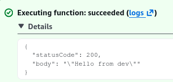
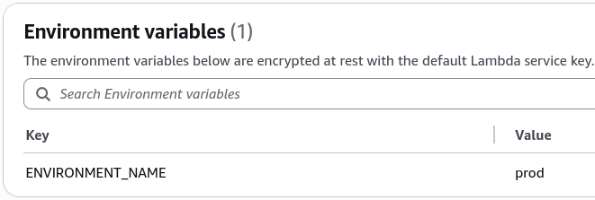

# Lambda Environment Variables - Hands On

You write your core business logic **once**, and you let the infrastructure layer change how that code behaves depending on its landing pad.

---

## 🛠️ Step-by-Step Environment Variables Hands On

### 1. Hardening the Code Logic (Node.js Bindings)

- **Step 1: Core Packaging Ingestion**
  - Boot up a fresh function from scratch named `lambda-config-demo` using the **Node.js** runtime environment.

- **Step 2: Inject the OS Module**
  - Open your code editor and update your handler function to this clean snippet:

```javascript
export const handler = async (event) => {
  const targetEnvironment = process.env.ENVIRONMENT_NAME || "local-sandbox";
  const response = {
    statusCode: 200,
    body: JSON.stringify(`Hello from ${targetEnvironment}`),
  };
  return response;
};
```

- Hit **Deploy** to push your source code alterations live into the microVM memory stack.

---

### 2. Mutating the Environmental State

- **Step 3: Establish the First Config State (`dev`)**
  - Click the **Configuration** tab inside your function workspace ──► select **Environment variables** from the sidebar list matrix.
  - Hit **Edit** ──► click **Add environment variable**.
  - Input **Key:** `ENVIRONMENT_NAME` and **Value:** `dev`. Hit Save.

- **Step 4: Execute a Test Run**
  - Jump back to the **Test** tab, generate a generic mock JSON event array template, and hit **Test**. The console returns your clean success string:  
    

---

### 3. The Power Play: Upgrading to Production Live

- **Step 5: Toggle the Variable Without Code Re-builds** - Go right back to **Configuration -> Environment variables**, click Edit, and change the `dev` value string parameter to read **`prod`**. Hit Save.  
  
- **Step 6: Re-test the Core Invocation**
  - Hit the **Test** button once more. Notice how **the source code did not change or re-compile**, yet the execution response payload instantly updates to output: `"Hello from prod"`.

---

## Exam Tips

- **The Local Cache Bug Trap:** Always remember, environment variables are read and bound during the **Cold Start/Init Phase** of a Lambda instance. If you update your environment variables via the AWS CLI or CloudFormation under heavy production loads, **warm containers already sitting in the scaling pool won't read the new string instantly.** AWS must cycle them down and boot fresh microVM platforms to fully apply the updated variables across your entire scaling tier.
