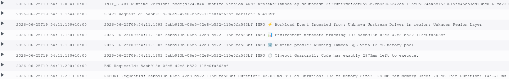

# Lambda Event & Context Objects

When you are writing code inside an AWS Lambda handler, your function receives two completely separate arguments passed down by the microVM architecture: the **Event Object** and the **Context Object**.

---

## Key Takeaways

### ⚖️ The Core Breakdown: Event vs. Context

The easiest way to keep these distinct in your head is to look at their operational ownership: **The Event is about _WHAT_ caused the execution, while the Context is about _HOW_ the environment is running.**

#### 📥 1. The Event Object (The Target Workload)

- **What it is:** A dynamic JSON-formatted document packed filled with the actual payload data your code is supposed to process.
- **Who generates it?** The upstream invoking service (like an S3 upload record, an SQS message array, an API Gateway HTTP request signature, or an EventBridge cron tick).
- **Language Polymorphism:** The Lambda execution engine automatically serializes this raw JSON string into a native data structure based on your runtime environment:
  - In **Python**, it unboxes straight into a standard dictionary (`dict`).
  - In **Node.js/JavaScript**, it arrives as an Object (`obj`).
  - In **Java/Go**, it gets unmarshalled into a strongly-typed struct or class instantiation block.

- **Key Contents:** File sizes, bucket paths, message bodies, query parameters, HTTP headers, or custom business logic variables.

#### 🛠️ 2. The Context Object (The Runtime Metadata)

- **What it is:** A static system-level object containing operational metadata tracking the execution health, system limits, and identity constraints of that specific execution environment.
- **Who generates it?** The underlying managed AWS Lambda runtime engine itself!
- **Key Contents:** Platform boundaries that stay the same regardless of what user or file triggered the actual event payload:
  - **`function_name` / `function_version`:** Tells your code exactly what version state (`$LATEST`, `v2`, etc.) it is executing in.
  - **`aws_request_id`:** The holy grail string tracking identifier used to cross-reference errors in CloudWatch Logs.
  - **`memory_limit_in_mb`:** The hard compute ceiling allocated to the function shell.
  - **`log_group_name` / `log_stream_name`:** The precise path locations where your `print()` or `console.log()` statements are dumping inside CloudWatch.
- **Time Tracking Methods:** Special functions (like `context.get_remaining_time_in_millis()`) that let your code check how many milliseconds are left before AWS hits the kill switch and drops a hard timeout error on your head!

---

### 🐍 A Javascript Developer Look: Inside the Handler Code

Here is how you actually reference these two properties inside a standard serverless Node.js script:

```javascript
// index.mjs - ES Module syntax (Node.js 18+)
import { Buffer } from "buffer";

/**
 * Modern Node.js Lambda Handler Hook
 * @param {Object} event - The upstream JSON payload object (S3, SQS, API Gateway, etc.)
 * @param {Object} context - The AWS system-managed runtime environment object
 */
export const handler = async (event, context) => {
  // 1. Inspecting the EVENT OBJECT (Service Workload Data)
  // The keys depend entirely on WHO or WHAT triggered this pipeline layer
  const eventSource = event.source || "Unknown Upstream Driver";
  const eventRegion = event.region || "Unknown Region Layer";

  console.log(
    `⚡ Workload Event Ingested from: ${eventSource} in region: ${eventRegion}`,
  );

  // 2. Extracting the CONTEXT OBJECT (System Environment Metadata)
  // These keys stay completely stable regardless of the triggering source
  const requestId = context.awsRequestId;
  const funcName = context.functionName;
  const allocatedMemory = context.memoryLimitInMB;

  // Node.js method to check how many milliseconds are left before a hard timeout kill switch drops
  const msRemaining = context.getRemainingTimeInMillis();

  console.log(`📊 Environment metadata tracking ID: ${requestId}`);
  console.log(
    `⚙️ Runtime profile: Running ${funcName} with ${allocatedMemory}MB memory pool.`,
  );
  console.log(
    `⏱️ Timeout Guardrail: Code has exactly ${msRemaining}ms left to execute.`,
  );

  // 3. Crafting a compliant structural response mapping
  return {
    statusCode: 200,
    headers: {
      "Content-Type": "application/json",
    },
    body: JSON.stringify({
      message: "Execution metrics processed successfully inside Node.js, bro!",
      correlationId: requestId,
    }),
  };
};
```

## 

## Exam Tips

- **The Timeout Interception Scenario:** Imagine a question states: _"A developer has a batch-processing Lambda function that occasionally times out after 5 minutes. The developer wants to gracefully stop loops, checkpoint the current progress to DynamoDB, and exit clean before the platform drops a hard failure state. Where can they find how much execution time is remaining?"_
- **The Correct Answer:** They must query the **`Context Object`** by executing the `getRemainingTimeInMillis()` system method call! Looking inside the Event Object will give you absolute zero visibility into the remaining execution clock.
- **The Log Routing Bug Tracker:** If an exam prompt describes an engineering team building a custom tracking dashboard and they need to map every execution stack-trace to its matching CloudWatch log grouping block dynamically, tell them to extract the properties straight out of the **`Context Object` variables (`logGroupName` & `logStreamName`)**.
