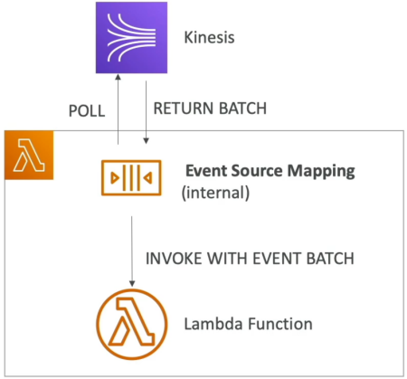
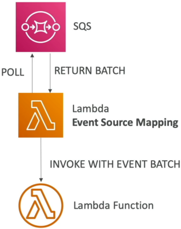
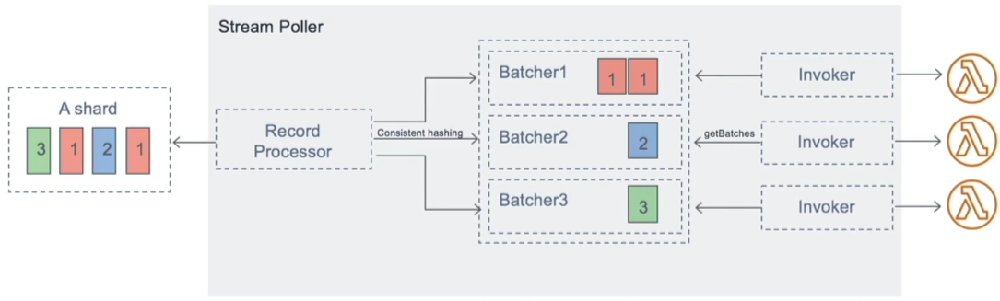

# Lambda Event Source Mapping

Welcome to the third and final foundational category of serverless execution models, bro: **Lambda Event Source Mapping (ESM)**. If synchronous is a telephone call and asynchronous is a fire-and-forget text message, then Event Source Mapping is a **pull-model engine**.

Instead of an external system pushing events straight into Lambda, an internal AWS component—the **Event Source Mapper**—continuously polls your data source for blocks of records. Once it snags a batch, it bundles them up and hands them down to your Lambda function code by invoking it **synchronously**.

---

## Key Takeaways

An **Event Source Mapping (ESM)** is an AWS-managed resource that acts as an internal consumer, polling pull-based AWS services (such as Amazon Kinesis Streams, Amazon DynamoDB Streams, and Amazon SQS) for message payloads. The ESM groups these records together based on configurable batch constraints and passes them down to a target Lambda function via a **Synchronous Invocation**. If an engineering exception hits an ESM pipeline, retry backoffs, batch splittings, or queue visibility parameters shift dramatically depending on whether the underlying driver is a _Stream_ or a _Queue_.

## 

### 📊 Stream ESM Processing (Kinesis & DynamoDB)

When you configure an ESM to tail an active data stream (like Kinesis Data Streams or DynamoDB Streams), it maps one dedicated internal ESM poller loop per stream **Shard**.

#### ⚙️ Operational Mechanics

- **Ordered Execution:** Messages inside a shard are processed sequentially in strict chronological order based on their ingestion timestamp.
- **Non-Destructive Ingestion:** When your function processes a batch from a stream, **the data is NOT removed or deleted from the stream.** It stays inside the shard matrix until its global retention expiration window (e.g., 24 hours to 7 days) elapses. This means other systems can read the exact same data without conflict!
- **The High-Throughput Slider (Parallelization Factor):** If a single shard is getting hammered with high-velocity traffic and a single Lambda function can't process it fast enough, you can set the `ParallelizationFactor` configuration from **1 up to 10**. This spawns up to 10 concurrent Lambda invocations _per shard_ simultaneously. To keep order, it processes items using strict serialization at the **Partition Key** level.

#### 🛑 Stream Error Recovery Options (How to Fix Shard Blocking)

By default, if your code returns a failure on a stream batch, the ESM freezes the shard processing loop and tries to process that exact same batch over and over again until it either succeeds or the records expire. To prevent a single bad message (a "poison pill") from blocking your entire pipeline, configure these ESM attributes:

- **Split Batch on Error:** If a batch fails due to a code timeout, the ESM automatically cuts the batch size in half and retries them as two independent blocks.
- **Maximum Record Age:** Drops records out of the execution loop if they sit in the stream longer than a defined threshold.
- **Maximum Retry Attempts:** Sets a firm ceiling on how many times a failed batch is allowed to re-execute before eviction.
- **On-Failure Destination:** Tosses the dropped record data metadata out to an S3 bucket or SQS queue once the retry ceiling is hit so the shard can unfreeze!

---

### 📥 Queue ESM Processing (Amazon SQS Standard & FIFO)

When an ESM handles standard message queues, the internal poller reads data out of your queues using highly efficient **SQS Long Polling** hooks.

#### ⚙️ Operational Mechanics

- **Destructive Ingestion:** Unlike streams, once your Lambda function successfully executes a batch from an SQS queue without throwing an error, **Lambda automatically calls `sqs:DeleteMessage` under the hood** to wipe those items out of the queue permanently.
- **The Multi-Value Sizing Matrix:** You can tune the ESM poller to grab anywhere from 1 message up to 10 messages per synchronous batch loop, or set a **Batch Window** (up to 300 seconds) to let payloads accumulate before firing.

#### 🛑 SQS Error Recovery & The Dead-Letter Queue (DLQ) Rule

This is an absolute milestone concept for the DVA-C02 exam:

> ⚠️ **THE PLATFORM RULE:** If your Event Source Mapper fails to process an SQS message, you **MUST configure the Dead-Letter Queue (DLQ) directly on the source SQS Queue itself, NOT inside the AWS Lambda function settings!**  
> _Why?_ Because Lambda DLQs only execute for _Asynchronous Invocations_. Since the internal Event Source Mapper invokes your function _Synchronously_, the Lambda function level DLQ engine is completely bypassed. When a failure hits, the message rolls back into the raw SQS queue, relying on the SQS queue's **Redrive Policy** to push it to a DLQ!

- **The Visibility Timeout Formula:** To ensure another parallel poller instance doesn't accidentally grab a message that your current Lambda function is actively working on, configure your SQS Queue parameters to follow this textbook guideline:

$$\text{SQS Queue Visibility Timeout} \ge 6 \times \text{Configured Lambda Function Timeout}$$

---

### 📊 The Scale-Out Velocity Reference

Keep this quick architectural scaling guide locked down for instant lookup:

| Event Source Ingest            | Scaling Behavior & Concurrency Profiles                                                                                                                                                                                    |
| ------------------------------ | -------------------------------------------------------------------------------------------------------------------------------------------------------------------------------------------------------------------------- |
| **Kinesis / DynamoDB Streams** | Scales strictly based on the number of active Shards (**1 Shard=1 Lambda Function**). Can scale up to 10x higher if `ParallelizationFactor` handles concurrent processing.                                                 |
| **Amazon SQS Standard**        | Scales horizontally as fast as possible to drain the queue workspace. It adds **60 instances per minute** to its concurrent execution pool up to a maximum ceiling of **1,000 concurrent batches** processing in parallel. |
| **Amazon SQS FIFO**            | Concurrency scales out to exactly match the number of active, isolated **Message Groups** (defined by the `MessageGroupId` string). Messages within the same group ID always execute sequentially in order.                |

## 

## Exam Tips

- **The Frozen Shard Remediation:** If a question describes a stream processing pipeline where data has ground to a complete halt because a specific payload is throwing an unhandled code exception, choose the choice that enables **Split Batch on Error** or sets a finite **Maximum Retry Attempts** ceiling paired with an **On-Failure Destination**.
- **Fixing SQS DLQ Leakage:** Look out for scenarios where a developer complains that failing SQS-to-Lambda messages are rolling back and looping infinitely without ever hitting a Dead-Letter Queue, despite a DLQ being attached to the Lambda function. The fix is immediately to **remove the DLQ settings from the Lambda function and instead attach a Redrive Policy and DLQ directly onto the source SQS Queue definition.**
