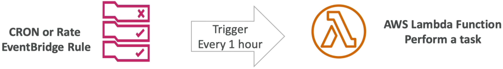
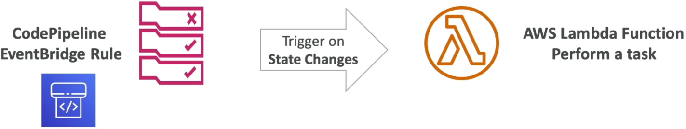

# Lambda & EventBridge

Bridging **EventBridge** and **AWS Lambda** together is the absolute bedrock of building an event-driven, hyper-automated cloud environment. Whether you want to clean out a database cache table on a strict interval or build an active watchdog that fires whenever your deployment pipeline changes state, EventBridge operates as your centralized nerve center.

Because EventBridge shifts data without holding an open network pipe, **all EventBridge invocations against AWS Lambda are strictly Asynchronous**. That means you automatically get those native 3-strike retry backoffs and DLQ capabilities we just mastered.

## Key Takeaways

### ⏱️ Pattern 1: The Serverless Cron or Rate Schedule

- **The Concept:** Instead of paying for a dedicated EC2 instance to run a Linux background system cron tab, you let EventBridge act as your managed alarm clock.
- **The Velocity Option:** You can define execution intervals using two distinct syntactic styles:
  - **Rate Expressions:** Best for simple periodic heartbeats (e.g., `rate(5 minutes)` or `rate(1 hour)`).
  - **Cron Expressions:** Required for highly precise calendar milestones (e.g., `cron(0 10 ? * MON *)` to fire exactly every Monday morning at 10:00 AM UTC).



### 🚦 Pattern 2: Event-Driven Infrastructure Watchdogs

- **The Concept:** You configure EventBridge to actively listen to the default account event bus for real-time state changes radiating from other AWS tools.
- **The Real-World Use Case:** Imagine your **AWS CodePipeline** deployment stack moves from `IN_PROGRESS` to `FAILED`. The pipeline drops a state-change signature onto the event bus. EventBridge instantly snags the signature match, bundles the pipeline payload data, and shoots it down to your Lambda function to ping your team on Slack or halt downstream database operations!



---

### 🛠️ Step-by-Step Automation Hook Playbook

- **Step 1: Build the Target Target Function**
  - Make sure you have your target Lambda function (e.g., `demo-lambda`) ready to receive incoming triggers.

- **Step 2: Provision the EventBridge Rule Layer**
  - Open the **Amazon EventBridge Console** ──► click **Rules** ──► hit **Create rule**.
  - Define your execution logic type:
  - Choose **Schedule** if you are wiring up a periodic runtime cron job.
  - Choose **Rule with an event pattern** if you want to catch real-time state deviations (like CodePipeline execution changes).

- **Step 3: Point straight to the Compute Target**
  - Scroll down to the _Select targets_ panel.
  - Choose **AWS service** ──► select **Lambda function** from the dropdown ──► pick your target `demo-lambda` from your function inventory. Hit Create!

---

### 🔒 Behind the Scenes: The Automatic Security Handshake

When you click create on that EventBridge rule setup, the AWS management console automatically handles the infrastructure security clearing behind the scenes. It attaches an explicit **Resource-Based Policy** straight onto your Lambda function.

If you navigate to your function's **Configuration -> Permissions** block, you will see a statement granting execution clearance looking like this:

```json
{
  "Sid": "awsevents-demo-cron-rule-execution-access",
  "Effect": "Allow",
  "Principal": {
    "Service": "events.amazonaws.com"
  },
  "Action": "lambda:InvokeFunction",
  "Resource": "arn:aws:lambda:ap-southeast-2:111122223333:function:demo-lambda",
  "Condition": {
    "ArnLike": {
      "aws:SourceArn": "arn:aws:events:ap-southeast-2:111122223333:rule/demo-cron-rule"
    }
  }
}
```

This resource-based guardrail guarantees that only your specific, validated EventBridge rule ARN can invoke your function code, keeping the runtime completely locked down against rogue actors!

---

## Exam Tips

- **Identifying the Invocation Model:** Always remember that EventBridge routes payloads **Asynchronously**. If a question describes an EventBridge cron job triggering a failing Lambda function, look for the answer choices that apply **Asynchronous troubleshooting paths** (like checking the identical `RequestID` across 3 automated retry blocks in CloudWatch or checking an attached SQS DLQ/Destination).
- **Fixing Blank Streams:** If an EventBridge rule fires on schedule but the Lambda function never runs, first check the Lambda function's **Resource-Based Policy**. If someone stripped away the `events.amazonaws.com` Principal permission statement, EventBridge will be hit with an Access Denied block and fail to execute the invocation!
