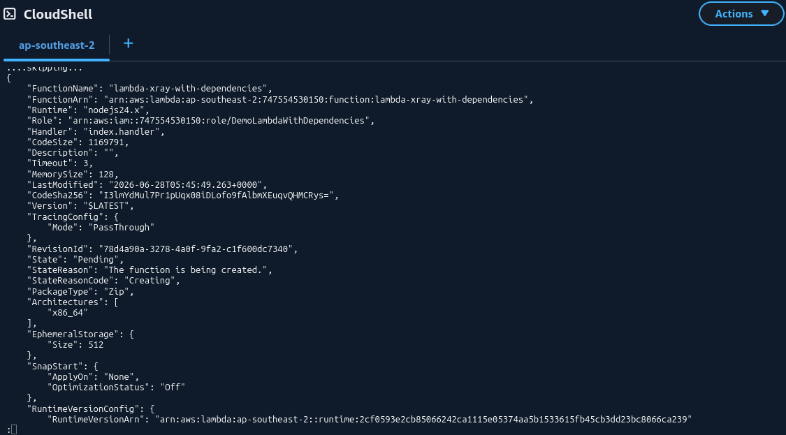
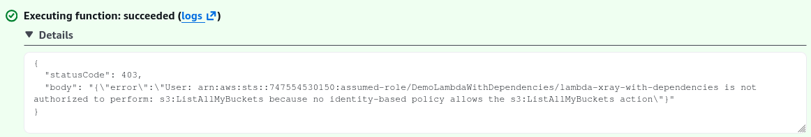
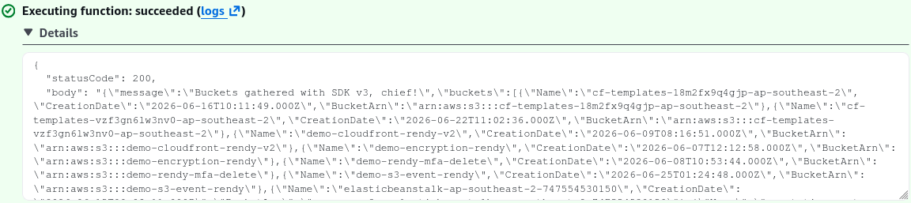
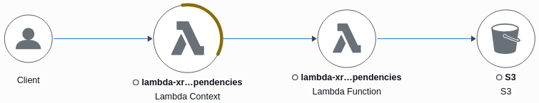

# Lambda External Dependencies - Hands On

Stephane's lab beautifully knits together every single thread of local asset packaging, CLI delivery mechanics, programmatic X-Ray tracing instrumentation, and IAM security triage. Watching those service nodes map out inside the X-Ray console after fixing the S3 IAM gaps is pure cloud engineering validation.

---

## 🛠️ Step-by-Step CLI Dependency Deployment Hands On

### 1. Ingesting Dependencies Natively (AWS CloudShell)

- **Step 1: Provision the Working Namespace**
  - Boot up **AWS CloudShell** from your top console navigation bar.
  - Initialize an isolated folder and drop a text-editor tool right inside your environment wrapper:
    ```bash
    mkdir Lambda && cd Lambda
    sudo yum install -y nano
    nano index.js
    ```

- **Step 2: Code the Instrumentated Handler File**
  - Paste the Node.js SDK V2 tracking module snippet directly into `index.js`. Notice how we wrap the entire default AWS SDK module inside an **X-Ray Capture Method** to intercept downstream HTTP calls:

    ```javascript
    // index.mjs - Modular AWS SDK v3 + X-Ray Middleware Pattern
    import { S3Client, ListBucketsCommand } from "@aws-sdk/client-s3";
    import AWSXRay from "aws-xray-sdk-core";

    // 1. Initialize the base modular S3 Client wrapper
    const baseS3Client = new S3Client({});

    // 👑 The Modern Magic Hook: Instrument the specific client instance via the X-Ray SDK middleware
    const s3Client = AWSXRay.captureAWSv3Client(baseS3Client);

    export const handler = async (event) => {
      try {
        // 2. Instantiate the isolated, tree-shakable command bundle
        const command = new ListBucketsCommand({});

        // 3. Execute the payload down the wire
        const data = await s3Client.send(command);

        return {
          statusCode: 200,
          body: JSON.stringify({
            message: "Buckets gathered with SDK v3",
            buckets: data.Buckets,
          }),
        };
      } catch (err) {
        return {
          statusCode: err.$metadata?.httpStatusCode || 500,
          body: JSON.stringify({ error: err.message }),
        };
      }
    };
    ```

- **Step 3: Ingest the Package Modules**
  - Execute `npm install` directly inside your flat project directory root:

  ```bash
  npm install @aws-sdk/client-s3 aws-xray-sdk-core
  ```

  - _The File Audit Check:_ Run a local directory scan (`ls -l`). You will see an active **`node_modules/`** folder containing the X-Ray binary trees alongside your flat `index.js` file.

---

### 2. Packaging the Archive and Executing CLI Provisioning

- **Step 4: Compress into a Flat ZIP Archive**
  - Zip your code and modules together. Make sure you run the compression hook right from the inner root directory path so your assets aren't nested inside an unneeded parent envelope:

  ```bash
  chmod -R 755 .
  zip -r functions.zip .
  ```

- **Step 5: Direct API Pipeline Deployment**
  - Fetch your newly provisioned Lambda IAM Execution Role ARN from your security dashboard and fire the **`create-function`** CLI command block:
  ```bash
  aws lambda create-function \
    --function-name lambda-xray-with-dependencies \
    --runtime nodejs24.x \
    --handler index.handler \
    --zip-file fileb://functions.zip \
    --role arn:aws:iam::111122223333:role/demo-lambda-with-dependencies
  ```

## 

### 🔍 3. Post-Deployment Security & Observability Triage

Once the script pushes successfully, running an initial test trigger drops a hard execution error due to missing IAM clearance. Here is the exact two-step triage playbook to resolve it:



#### 🔒 Gate A: Fixing the Identity Authorization Gap

1. Go to your Lambda function's **Configuration -> Permissions** panel and hop into the IAM Role dashboard.
2. Under **Attach policies**, seek out and add **`AmazonS3ReadOnlyAccess`**. This updates your function’s outbound clearance, authorizing it to execute the downstream `s3:ListBuckets` action.  
   

#### 🕸️ Gate B: Activating the Infrastructure Tracking Daemon

1. Navigate to **Configuration -> Monitoring and organization tools**, click Edit, and toggle **Enhanced monitoring via AWS X-Ray** to _Enabled_.
2. Re-fire your console **Test** trigger. The function instantly shifts to a green success block, fetching your global bucket listings flawlessly!  
   

---

## Exam Tips

- **The Binary Protocol Prefix Rule:** When deploying zip payloads via the AWS CLI using the `--zip-file` flag, never pass the file path raw! You **must** prefix the argument string with **`fileb://`** (e.g., `fileb://functions.zip`). The `b` instructs the AWS CLI processor to parse the asset as raw binary data stream bytes instead of trying to read it as a standard text string.
