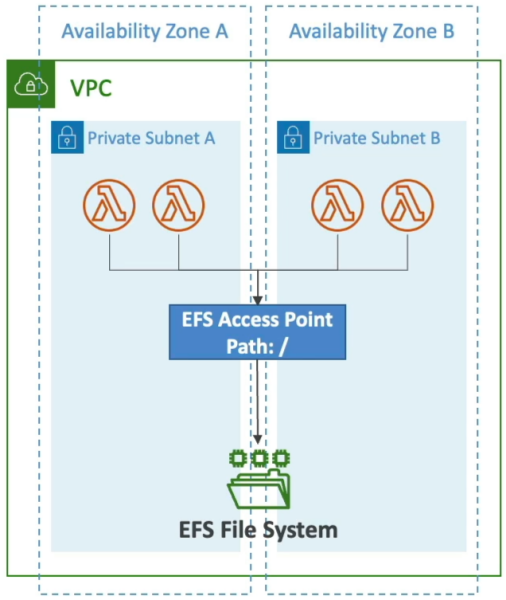

# Lambda File Systems Mounting

Before AWS integrated EFS with Lambda, sharing massive file structures or state across horizontally scaling concurrent containers required heavy coding workarounds, like constantly pushing and pulling chunks down from Amazon S3 over network sockets. EFS brings a true **Network File System (NFSv4)** straight to your serverless code layer.

---

## Key Takeaways

AWS Lambda functions can natively mount an **Amazon EFS** file system directory to a local directory path during the initialization cold start phase. To establish this bridge, the function must be configured inside a **VPC Private Subnet** with route connectivity pointing to the EFS Mount Targets, leveraging an **EFS Access Point** to enforce POSIX application user identities.

---

### ⚙️ Mechanics & Scaling Connection Walls

When you wire up an EFS file system to your function, keep these strict structural rules locked down for the DVA-C02 exam workspace:

- **The VPC Requirement:** EFS is a network-bound file system. Therefore, your Lambda function **cannot** operate in its default non-VPC cloud shell. It must carry the `AWSLambdaVPCAccessExecutionRole` policy and be bound to your private subnets to route traffic straight to your EFS mount targets.
- **The Access Point Enforcer:** You don't just point Lambda to a raw EFS volume ARN. You **must** utilize an **EFS Access Point**. The access point acts as a security gateway, specifying a dedicated root directory path and locking down the exact POSIX User ID / Group ID (UID/GID) permissions. This ensures your Lambda function can read and write files without messing with other OS permissions on the disk array.
- **⚠️ The Connection Burst Ceiling:** Every single concurrent Lambda microVM environment instance that boots up opens up its own persistent network tunnel back to your EFS storage layer.
  - If you experience a sudden traffic surge and your function bursts out to 1,000 parallel instances, you open **1,000 active concurrent connections** straight into EFS.
  - You must actively audit your **EFS Connection and Throughput Burst Limits** to ensure your serverless scale doesn't crash the storage interface!

---

### 📊 The Definitive Lambda Storage Comparison Matrix

This master matrix is pure exam gold. When a scenario asks you where to drop an active workload file, look straight at this layout:

| Storage Vector         | Max Size Ceiling                                                  | Persistence Level                           | Content Type                           | Storage Interface Mode                          | Shared Across Invocations?                                     | Relative Speed Performance                       |
| ---------------------- | ----------------------------------------------------------------- | ------------------------------------------- | -------------------------------------- | ----------------------------------------------- | -------------------------------------------------------------- | ------------------------------------------------ |
| **Ephemeral (`/tmp`)** | **10 GB** (Configurable)                                          | **Ephemeral** (Wiped when container dies)   | **Dynamic** (Read/Write)               | **Local File System** (POSIX commands)          | **No** (Isolated per individual runtime container)             | 🏎️ **Fastest** (Direct disk block mapping)       |
| **Lambda Layers**      | **5 layers** per function up to **250 MB** (Unzipped limit total) | **Durable** (Built into deployment package) | **Static** (Immutable archive)         | **Mounted Folder (`/opt`)**                     | **Yes** (All warm instances share the exact same asset)        | 🏎️ **Fastest** (Injected at boot)                |
| **Amazon S3**          | **Elastic** (Virtually infinite)                                  | **Durable** (99.999999999% reliability)     | **Dynamic** (Full create/delete loops) | **Object Storage** (Must use AWS SDK API hooks) | **Yes** (Centralized globally across your cloud)               | 🛰️ **Fast** (Dependent on network API calls)     |
| **Amazon EFS**         | **Elastic** (Grows/Shrinks automatically)                         | **Durable** (Multi-AZ replication)          | **Dynamic** (Supports file appends!)   | **Network File System** (POSIX mount directory) | **Yes** (All concurrent containers read/write simultaneously!) | ⚡ **Very Fast** (Dedicated VPC local bandwidth) |

---

### 🎯 Mapping Real-World Use Cases

When you are assessing an architecture prompt, the problem signature will dictate exactly which storage tier you deploy:

- **Use `/tmp` When:** You are downloading a temporary 2 GB machine learning weights file from S3 to perform local inference, or you need to unzip an audio bundle, process the track variations, upload the final track, and dump the scratch files immediately.
- **Use Layers When:** You need to share a heavy common runtime package (like the Pandas library or custom database driver wheels) across 15 separate Lambda functions inside your microservice array.
- **Use Amazon S3 When:** You need long-term, low-cost durable persistence for massive raw media uploads, data lake analytics, or static website images.
- **Use Amazon EFS When:** You need to process files larger than 10 GB, **or you need to append logs/metrics dynamically into a single shared log file** across hundreds of concurrent compute containers running at the exact same time!

---

## Exam Tips

- **The File Appending Trap:** If an exam question says: _"A developer needs a Lambda function to continuously parse real-time data chunks and append rows directly to an existing shared master ledger document that other functions can also modify on the fly. Which storage tier should be selected?"_
  - **The Correct Answer:** **Amazon EFS**. You _cannot_ run localized file system appends natively inside Amazon S3 (S3 requires you to download the whole object, modify it, and overwrite the whole file via a PUT request). And `/tmp` storage isn't shared across different concurrent instances. EFS is the only option that handles standard shared file locking and append mutations, chief!
- **The Local Scratchpad Pricing Trap:** Remember that `/tmp` storage is completely free for the first **512 MB**. If your configuration slides the ephemeral storage block past 512 MB up to that 10 GB limit, your account will incur a lightweight active storage charge based on the exact millisecond duration of your invocations.
