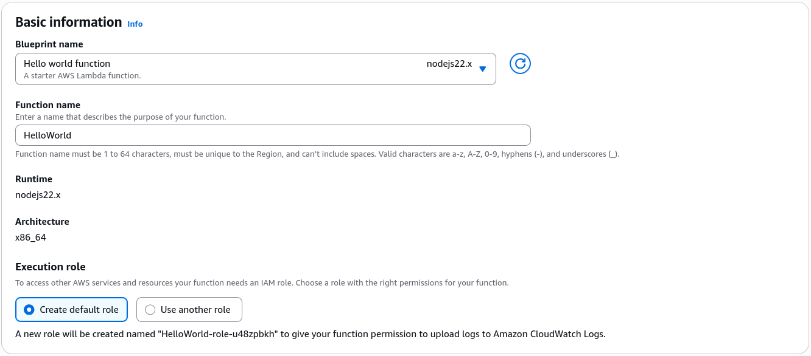
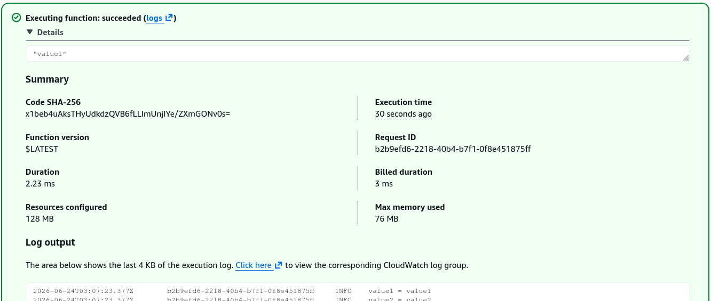

# AWS Lambda - First Hands On

## 🛠️ The First Lambda Deployment Hands On

### 1. Provisioning via Blueprints

- **Step 1: Bootstrap from a Template**
  - Navigate to the **AWS Lambda Console** ──► click **Create function**.
  - Select **Use a blueprint** ──► search and select the **`hello-world`** Node.js blueprint.
  - **Function Name:** Input `HelloWorld`.

- **Step 2: Establishment of the Security Profile**
  - Under _Execution role_, choose **Create a new role with basic Lambda permissions**.
  - _The Under-the-Hood Security Guard:_ This commands AWS to auto-generate an IAM execution role carrying the **`AWSLambdaBasicExecutionRole`** policy layout. This gives your function runtime the explicit authorization it needs to write logging vectors down into CloudWatch Logs. Hit create!
    

### 2. Dissecting the Code Handler & Triggering Failures

- **Step 3: Analyze the Handler Entrypoint**
  - Look at your fresh workspace editor panel. The runtime looks for a specific method execution bridge called the **Handler** (e.g., `handler(event, context)`).
  - The **`event`** parameter is a structured JSON document array containing the incoming trigger payload variables, while **`context`** holds runtime execution metadata.

- **Step 4: Executing a Test Simulation (Success vs. Exception)**
  - Click the **Test** drop-down button to configure a test event template (`HelloWorld`).
  - Use the default key-value map bundle:

  ```json
  {
    "key1": "value1",
    "key2": "value2",
    "key3": "value3"
  }
  ```

  - Hit **Test**. The console returns an execution success block returning `"value1"`.
    

---

## 📊 Telemetry, Configurations, and Resource Limits

- **Monitoring Integration:** Click the **Monitor** tab inside your function workspace to view real-time execution statistics (Invocations, Duration, Error Count). Click **View CloudWatch Logs** to jump straight into the log stream directory. Here you can inspect your code's exact print history alongside stack-trace crash lines to debug microVM issues in seconds.
- **Tuning the Engine (Configuration Tab):**
  - **Memory (RAM):** Configurable from **128 MB up to 10 GB**. Cranking this up injects raw compute horsepower and network throughput proportionally!
  - **Timeout Limit:** The amount of time the function can run before being forcefully terminated. You can set this up to a hard maximum limit of **15 minutes (900 seconds)**.
  - **Ephemeral Storage (`/tmp`):** A high-speed scratchpad disk space allocating from **512 MB up to 10 GB** to pull and parse files locally during execution.
