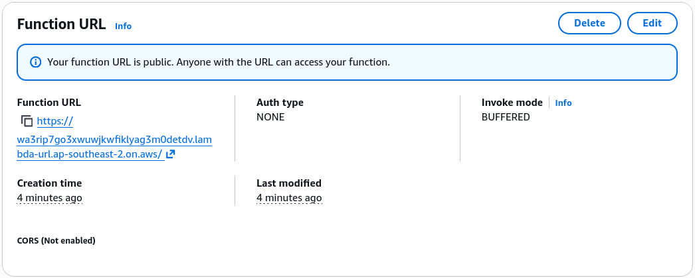

# Lambda Function URL - Hands On

This hands-on run locks down the exact mechanics of how the AWS control plane maps public network pathways to your serverless code.

---

## 🛠️ Step-by-Step Function URL Provisioning Hands On

### 1. Preparing the Code and Baseline Version

- **Step 1: Bootstrap the Core Handler**
  - Spin up a new function from scratch named `lambda-demo-url` using the **Node.js 24.x** runtime tier.
  - Ensure the handler returns a standardized HTTP-compliant object block structure:

    ```javascript
    export const handler = async (event, context) => {
      return {
        statusCode: 200,
        body: JSON.stringify("Hello from the public container URL"),
      };
    };
    ```

- **Step 2: Establish the Immutable Release Snapshot**
  - Click **Deploy** ──► head to the **Versions** sub-tab ──► click **Publish new version** and tag it as `Version 1`.

- **Step 3: Create the Routing Target Alias**
  - Navigate to **Aliases** ──► click **Create alias**.
  - Name it **`dev`**, set the pointer target to **`Version 1`**, and click Save.

---

### 2. Attaching the Public HTTPS Entrypoint

Now that your routing target is live, let's provision the physical network lane directly onto the alias namespace, bro:

- **Step 4: Generate the URL Enclosure**
  - From your `dev` alias view dashboard, scroll down to the **Function URL** sub-drawer (or click it on the left-hand configuration panel sidebar) ──► click **Create Function URL**.
  - **The Security Selection Levers:** Toggle the **Auth type** selection block explicitly to **`NONE`**.
  - **The Automated Guardrail Check:** Notice the platform automatically renders a warning check box indicating it will inject an open public statement into your resource-based policy, assigning wildcard (`*`) access to the `lambda:InvokeFunctionUrl` API action, chief. Check the box to accept.
  - Leave the advanced **CORS** configurations switched off for this run and click **Save**.

---

### 🔍 3. Live Endpoint Verification and Architecture Limits

The console will instantly display a permanent, globally accessible HTTPS string signature mapped directly to your alias footprint, following this layout model:
`https://<random-string>.lambda-url.<region>.on.aws/`



- **Step 5: Hit the Public Backbone Line**
  - Click the link or use your terminal console to fire an explicit `curl` command down the wire, bro:

```bash
curl https://wa3rip7go3xwuwjkwfiklyag3m0detdv.lambda-url.ap-southeast-2.on.aws/
# Returns: "Hello from the public container URL"
```

### 🛑 The Absolute Platform Structural Rule (Exam High-Priority):

If you drop down the configuration dashboard and try to attach a Function URL directly while viewing **`Version 1`**, the console will slap you with a hard system error notice block, chief:

> ⛔ **THE QUALIFIER LIMIT LAW:** You can **ONLY** provision and attach an AWS Lambda Function URL to the volatile, unpublished **`$LATEST`** branch context or to a named, mutable **Function Alias** (like `dev` or `prod`). **You are strictly blocked from attaching a Function URL directly to a raw hardcoded version number (like :1 or :2)!**

---

## Exam Tips

- **The Alias Separation Strategy:** In a production pipeline layout, you should **never** attach your Function URL to the `$LATEST` branch directly, chief. If a teammate saves a broken code draft to `$LATEST`, your live web endpoint will crash instantly. Instead, always follow Stephane's design pattern: create an alias like `prod` or `dev`, point it to a frozen, immutable version number, and attach the Function URL safely to that alias wrapper.
