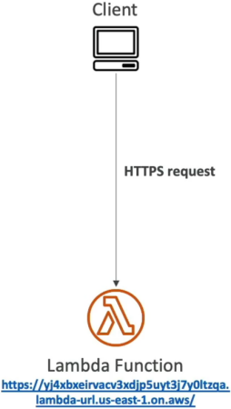
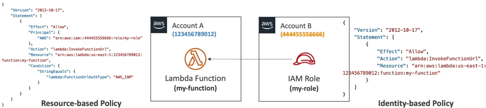
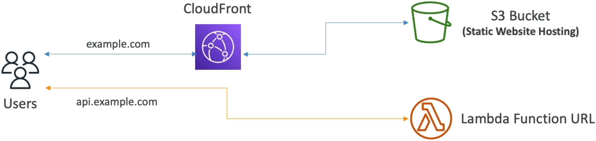

# Lambda Function URL

**Lambda Function URLs** are an absolute game-changer when you want to bypass the complexity (and extra cost) of spinning up an API Gateway or an Application Load Balancer just to expose a single HTTP endpoint! 🌐⚡

If you’re building simple webhooks, form handlers, single-page app backends, or microservices that just need a clean public HTTPS address out of the box, Function URLs give you a dedicated endpoint that supports both IPv4 and IPv6 right away.

---

## Key Takeaways

An **AWS Lambda Function URL** is a built-in HTTPS endpoint dedicated to a specific Lambda function or alias. Operating strictly over the public internet, Function URLs support simple configuration levers for Cross-Origin Resource Sharing (CORS) and offer two distinct authentication pathways: public anonymous access (`AuthType: NONE`) or cryptographically signed requests (`AuthType: AWS_IAM`) managed via resource-based and identity-based policies.

---

### 🌐 The Core Network & Deployment Boundaries

When you switch on a Function URL, the AWS control plane generates a permanent, unique string endpoint that follows this strict structural signature:
`https://<url-id>.lambda-url.<region>.on.aws/`



#### 🔒 Operational Rules to Memorize:

- **Public Internet Only 📡:** Function URLs live on the public web. You **cannot** route traffic to them inside an isolated VPC private subnet line without jumping through the internet. If you require absolute private network containment, you must use a private VPC Endpoint hooked to an API Gateway instead.
- **Target Mapping Realities:** You can bind a Function URL straight to the volatile **`$LATEST`** branch or map it down to a specific **Function Alias** (like `prod` or `dev`). However, **you cannot assign a Function URL to a raw, hardcoded version number** (like `:1` or `:2`)!
- **Scale and Throttling Control:** Function URLs don't carry native rate-limiting knobs like API Gateway usage plans do. If you want to clamp down on a runaway client or protect a downstream database from an influx of requests, you must enforce a **Reserved Concurrency** ceiling limit directly on the function itself to throttle the incoming invocation stream!

---

### 🛡️ Managing Access: The Two Auth Types

When configuring the URL's security framework, you must select one of two primary `AuthType` values:

#### 🟢 Path A: `AuthType NONE` (Public Anonymous Access)

This opens the doors wide to the entire internet, making it ideal for public webhooks or open asset endpoints.

- **The Resource-Based Policy Requirement:** For this to execute, your function's underlying resource-based policy must explicitly grant public invocation rights using wildcard signatures:

```json
{
  "Version": "2012-10-17",
  "Statement": [
    {
      "Sid": "AllowPublicURLInvocation",
      "Effect": "Allow",
      "Principal": "*",
      "Action": "lambda:InvokeFunctionUrl",
      "Resource": "arn:aws:lambda:us-east-1:123456789012:function:my-public-worker",
      "Condition": {
        "StringEquals": { "lambda:FunctionUrlAuthType": "NONE" }
      }
    }
  ]
}
```

#### 🔐 Path B: `AuthType AWS_IAM` (Secured Identity Access)

This setting locks down your endpoint. Every incoming request **must be cryptographically signed using AWS Signature Version 4 (SigV4)** protocols. The platform evaluates your permissions using standard S3-style verification mechanics:

- **Same-Account Invocations:** Requests clear the gate if _either_ the caller's Identity-Based Policy OR the function's Resource-Based Policy explicitly allows the `lambda:InvokeFunctionUrl` action.
- **Cross-Account Invocations (Account A & B Handshake) 🤝:** This requires an explicit two-way policy match to succeed:
  1. **Account A (The Owner):** The function's Resource-Based Policy must list Account B's explicit IAM Role ARN as the trusted `Principal`.
  2. **Account B (The Caller):** The calling client's Identity-Based Policy must explicitly allow `lambda:InvokeFunctionUrl` targeting Account A's unique function resource ARN.



---

### 🔏 Cross-Origin Resource Sharing (CORS)

If your frontend web application is hosted inside an Amazon S3 static bucket fronted by CloudFront at **`https://example.com`**, and your backend code is running on a Lambda Function URL at **`https://api.example.com`**, the browser's native security engine will block the JavaScript fetch requests due to same-origin security policies!

To fix this, you don't need to inject custom header strings manually inside your runtime code file. You simply toggle the **CORS configuration block** directly on the Function URL configuration wrapper:

- **Allowed Origins:** Set to `https://example.com` (or `*` for broad access).
- **Allowed Methods:** Explicitly whitelist the incoming request verbs (e.g., `GET`, `POST`, `OPTIONS`).
- **Allowed Headers:** Include core headers like `Content-Type` and `Authorization` to let pre-flight pre-check loops pass successfully, chief!

## 

## Exam Tips

- **The Cross-Account Authorization Denial:** If an exam prompt states that a developer set up a cross-account microservice using `AuthType: AWS_IAM` on a Function URL in Account A, and despite adding Account B's role to the function's resource policy, the client application keeps dropping an `HTTP 403 Forbidden` error—look straight for the identity gap. **The calling role inside Account B is missing an Identity-Based Policy authorizing it to point outward and invoke the external URL ARN!**
- **The Feature Selection Trade-Off:** If a question forces you to choose between API Gateway and a Function URL for a new serverless app, look at the required features. If the app needs **request validation, custom API keys, built-in cognito authorizers, or native caching tiers**, choose API Gateway. If the prompt explicitly emphasizes **low cost, zero management overhead, large file payloads, or super simple single-endpoint access**, choose a Lambda Function URL every single time!
