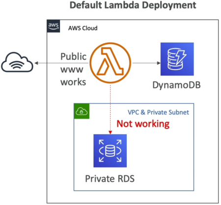
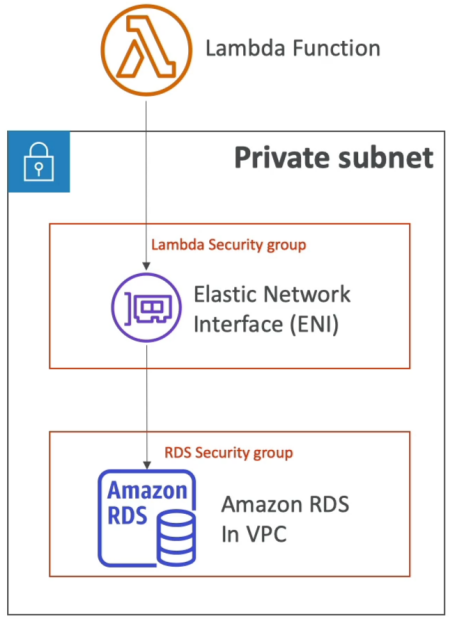
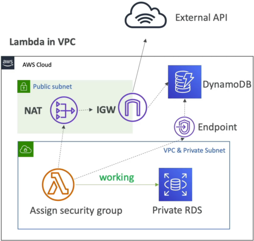

# Lambda in VPC

Setting up **Lambda in a VPC** is where real-world enterprise backend integration gets real.

If you want to plug your function code directly into a private **Amazon RDS database**, an internal cache like **ElastiCache**, or microservices hiding behind an internal Load Balancer, the default configuration won't cut it.

---

## Key Takeaways

By default, AWS Lambda functions run in a secured, system-managed service network wrapper with direct access to the public internet but zero visibility into your account's private infrastructure. Activating **VPC Mode** maps your function's runtime to a specialized cross-account **AWS Hyperplane Elastic Network Interface (ENI)**. This links your compute microVM into your custom subnets, forcing all traffic to follow your strict route tables and security group rules.

---

## Key Takeaways

### 🛠️ The Step-by-Step VPC Integration & Routing Playbook

- **Step 1: Grant the Outbound Security Clearance (IAM)**
  - Your function's IAM Execution Role **must** be granted the **`AWSLambdaVPCAccessExecutionRole`** managed policy.
  - _Why?_ This gives the background Lambda service platform authority to manage network interfaces (`ec2:CreateNetworkInterface`, `ec2:DeleteNetworkInterface`) directly inside your subnets. Without it, attaching the VPC configuration will throw a hard permission violation crash!

- **Step 2: Bind the Network Topology Settings**
  - Under the Lambda function's **Configuration -> VPC** panel, select your target **VPC ID**, specify at least two distinct **Private Subnets** (spanning separate Availability Zones for high availability), and assign a **Lambda Security Group**.

- **Step 3: Establish the Database Handshake**
  - To let your code talk to your private RDS instance, you must configure your **RDS Database Security Group Rules**:

$$\text{RDS Inbound Rule} = \text{Allow Port 3306/5432} \longleftarrow \text{Source} \equiv \text{Lambda Security Group ID}$$

---

### ⚠️ The Grand Illusion: Public Subnets & Internet Routing

This is an absolute milestone, favorite exam trap that catches almost everyone, bro. Read this carefully:

:::warning

**THE PLATFORM LAW:** Deploying an AWS Lambda function inside a **Public Subnet** does **NOT** grant it a public IP address or direct access to the public internet!

- _Why?_ EC2 instances in a public subnet get a public IP mapped to their interface. Lambda functions do not. If you attach an ESM or function to a public subnet, your outbound internet traffic tries to hit the Internet Gateway directly without a public IP signature, causing all requests to time out completely!
  :::

#### 🗺️ The Only 2 Ways to Give a VPC Lambda Internet Access:

1. **The IPv4 Route (NAT Gateway) 🛰️:** You **must** attach your Lambda function to **Private Subnets**. Those private subnets must have a route (`0.0.0.0/0`) directing outbound traffic to a **NAT Gateway** (or NAT Instance) sitting inside a completely separate _Public Subnet_. The NAT Gateway then maps its own Elastic IP signature to your packets and passes them to the Internet Gateway.
2. **The Modern Dual-Stack Route (IPv6) 🌐:** If your enterprise network uses modern dual-stack architecture, you can enable IPv6 outbound traffic (`Ipv6AllowedForDualStack=true`). This allows your VPC Lambda to bypass NAT costs completely by routing outbound IPv6 traffic (`::/0`) natively straight through an **Egress-Only Internet Gateway**!

---

### 🔀 Bypassing the Internet: VPC Endpoints

If your function needs to update a private database cell AND write logs or metadata to **Amazon DynamoDB** or **Amazon S3**, you don't need to spin up an expensive NAT Gateway just for that, chief! You use **VPC Endpoints**:

- **Gateway Endpoints (Free):** You provision a Gateway Endpoint for **S3** or **DynamoDB** inside your VPC. This alters your subnet's route table, allowing your Lambda function to securely jump across an internal AWS backbone lane straight to those storage tiers, completely bypassing the internet!
- **Interface Endpoints (PrivateLink):** For other services (like SQS, Secrets Manager, or the Lambda API itself), you provision an Interface Endpoint, which drops a private IP right inside your subnet using an Elastic Network Interface.

## 🎯 Exam Tips

- **The Shared Hyperplane Scaling Advantage:** Older AWS architecture used to spawn a fresh ENI per concurrent execution environment, leading to massive cold starts (~15 seconds) and draining your subnet's IP pool. **Modern Lambda uses AWS Hyperplane ENIs.** The network interface is generated _once_ when you update your VPC settings (taking up to 90 seconds). Functions sharing the exact same **Subnet + Security Group combination** share the exact same network tunnel footprint! This means your function can scale out to thousands of concurrent executions instantly without running out of subnet IP allocations.
- **The CloudWatch Logs Immunity:** If an exam scenario says: _"A developer deployed a Lambda function inside a completely locked down private subnet with no NAT Gateway, no Internet Gateway, and no VPC Endpoints. The function can still write its error print statements successfully to CloudWatch Logs. Why?"_
  - **The Correct Answer:** **CloudWatch Logs routing is natively handled by the underlying Lambda platform virtualization layer, completely independent of your custom VPC routing tables**
