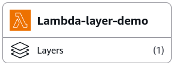
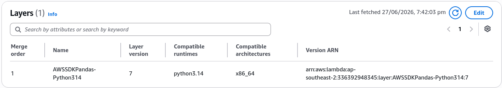

# Lambda Layers - Hands On

Stephane’s hands-on lab exposes a massive real-world performance trap: data science libraries like **Pandas** and **NumPy** are notoriously heavy and complex to compile directly inside local zip files. Leveraging the pre-built **AWS-Managed Layers** lets you skip the packaging headache entirely.



---

## 🛠️ Step-by-Step Lambda Layers Hands On

### 1. Replicating the Broken Dependency State

- **Step 1: Bootstrap the Consumer Workspace**
  - Spin up a new function from scratch named `Lambda-layer-demo` using the **Python 3.14** runtime environment.

- **Step 2: Inject the Data Science Code**
  - Drop a sample Pandas data manipulation snippet into your code editor panel:

    ```python
    import json
    import pandas as pd  # ⚠️ This will hard-crash during cold start initializations!

    def lambda_handler(event, context):
        # 1. Generate a raw dictionary matrix
        raw_data = {
            'Name': ['Luffy', 'Zoro', 'Nami', 'Sanji'],
            'Age': [19, 21, 20, 21],
            'Role': ['Captain', 'Swordsman', 'Navigator', 'Cook']
        }

        # 2. Parse the payload utilizing the Pandas DataFrame engine
        df = pd.DataFrame(raw_data)
        adults_df = df[df['Age'] >= 21]

        return {
            'statusCode': 200,
            'body': adults_df.to_json(orient='records')
        }
    ```

- **Step 3: Trigger the Code Violation Crash**
  - Hit **Deploy**, head over to the **Test** tab, and execute a mock invocation run.
  - **The Crash State:** The microVM drops a hard environment exception: **`Runtime.ImportModuleError: Unable to import module 'lambda_function': No module named 'pandas'`**.

---

### 2. Mounting the Pre-Compiled AWS Layer

- **Step 4: Bind the Centralized Data Layer**
  - Scroll to the absolute bottom of the function visualization diagram panel ──► look for the **Layers** subsection summary.
  - Click **Edit** and **Add a layer**.
  - **Layer Source Selection:** Toggle the radio option for **AWS layers**.
  - **The Managed Target Index:** From the dropdown selector array, choose **`AWSSDKPandas-Python314`** (or the version matching your runtime target environment). Choose the latest iteration and hit **Add** and then **Save**.
    

---

### 3. Verification and Runtime Path Ingestion

Head right back to your function's **Test** tab and click the execution button a second time.

The invocation transitions to a flawless green success box, clearing the data stream effortlessly, bro:

```json
{
  "statusCode": 200,
  "body": "[{\"Name\":\"Zoro\",\"Age\":21,\"Role\":\"Swordsman\"},{\"Name\":\"Sanji\",\"Age\":21,\"Role\":\"Cook\"}]"
}
```

### 🔍 Behind-the-Scenes Container Telemetry Analysis:

When you click Add on that managed layer, AWS pulls down the pre-compiled Pandas zip bundle behind the scenes and mounts it directly into the function container's **`/opt`** root runtime system.

Because AWS manages the underlying system variables, the Python runtime environment natively appends `/opt/python` into its global module loading array list:

$$\text{Lambda Container Provision} \implies \text{Mount Layer Zip to } \mathbf{/opt} \longrightarrow \text{Auto-Append to } \mathbf{sys.path} \implies \text{Successful In-Memory Import}$$

---

## Exam Tips

- **The Internal Layer Folder Hierarchy Rule:** If the exam asks you how to package your _own_ custom shared libraries into a layer instead of using an AWS-managed one, pay close attention to the **exact directory folder naming matrix**. If you don't unzip files into the precise structural sub-folders the platform expects, the runtime engine will fail to locate your libraries:
  - For **Node.js layers**, your node modules _must_ be nested inside a path structured exactly as **`nodejs/node_modules/`**.
  - For **Python layers**, your wheels and packages _must_ be compressed inside a directory path structured as **`python/`** or **`python/lib/python3.x/site-packages/`**.
