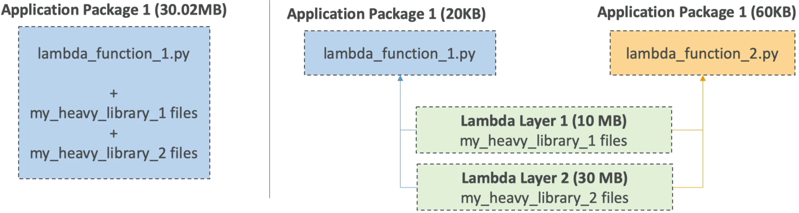

# Lambda Layers

Yo, **Lambda Layers** are an absolute godsend when you are trying to lean out your deployment workflows and stop uploading the exact same bulky node modules or heavy Python wheels over and over again, bro! 📦🚀

When you're building serverless microservices at an enterprise scale, it doesn’t make sense to bundle 50 MB of third-party libraries inside every single microscopic 20 KB code patch you push down the pipeline. Layers allow you to decouple your infrastructure dependencies completely.

---

## Key Takeaways

**AWS Lambda Layers** are a centralized archiving mechanism that allows developers to externalize dependencies, heavy third-party libraries, or custom configuration files from a primary function code package. By referencing a layer, the underlying dependencies are extracted directly into the function’s container runtime environment at boot time. This keeps the core deployment package size tiny, slashes code upload latencies, and enables powerful cross-function resource reuse.

---

### 🏗️ The Architecture Shift: Slimming the Stack

Let's look at how your deployment footprint transforms when you migrate your dependencies into isolated layers:

#### ❌ The Bloated Monolithic Way (No Layers)

Every time you want to fix a single typo or change an `if` statement inside your `handler.mjs` file, your build server has to repackage your code _along with_ heavy libraries like the AWS SDK, Axios, or data-parsing engines.

- **The Tax:** Your deployment zip is **50 MB**. Every single push requires long network upload wait times, slowing down your CI/CD pipelines.

#### 🟢 The Lean, Modern Layer Way

You extract your slow-changing, heavy dependencies out into a separate zip file and publish it as an independent **Lambda Layer**.

- **The Payoff:** Your primary application package drops from 50 MB down to **20 KB**!
- Your deployments finish in less than a second because you are only pushing your pure business logic. Your other standalone functions inside the account can instantly hook into the exact same layer to share code seamlessly.

---

### 💡 The 2 Core Use Cases

#### Use Case A: Dependency Externalization & Reuse (Most Common)

You pull out large, heavy utilities or proprietary shared business logic. You can stack **up to 5 independent layers** onto a single Lambda function!

- _How it maps inside the container:_ When your microVM boots up, Lambda unzips your layers and drops the content straight into the **`/opt`** directory matrix. The runtime engine natively adds `/opt` to your language's default import search path.
- _Example:_ If you create a layer for Python, you package your libraries under a folder structured as `python/lib/python3.11/site-packages/`. When the function executes, you just write `import requests` exactly like normal—your code has no idea the dependency is actually living in an external layer asset!

#### Use Case B: Custom Runtimes (The Polyglot Move)

AWS natively supports major runtimes like Node.js, Python, Java, and .NET. But what if your engineering team writes high-performance trading software in **Rust** or low-latency systems in **C++**?

- **The Layer Fix:** You compile a custom binary called `bootstrap` and drop it into a Lambda Layer configured with the `provided` runtime setting. This bootstrap binary acts as an internal loop that polls the Lambda Runtime Runtime API directly to snatch payloads and return execution blocks. The serverless community uses layers to unlock languages that AWS never natively shipped on the platform!

---

### 📊 Operational Telemetry Deployment Constraints

The uncompressed payload limitations and layering ceiling variables enforce these clear system logic rules:

$$\text{Maximum Layer Ceiling per Function} = 5 \text{ Active Layers Specified}$$

$$\text{Total Unzipped Size Limit} = \text{Size}(\text{Code Zip}) + \sum_{i=1}^{n} \text{Size}(\text{Layer}_i) \le 250\text{ MB}$$

---

## Exam Tips

- **The Strict 250 MB Storage Trap:** This is a classic exam trick question. A developer thinks that because they moved their heavy libraries out to Lambda Layers, they can bypass the hard platform size limits. **Wrong!** Even if your main code is only 20 KB, the combined **total uncompressed size** of your function code _plus_ all attached layers **cannot exceed 250 MB**. If your layers unzip to 260 MB, the AWS control plane will drop a deployment violation error and halt the pipeline!
- **The In-Console Code Editing Rule:** If your primary function code package size stays **under 3 MB**, the AWS Lambda Console keeps its built-in inline browser code editor fully active, allowing you to run fast code checks live. Moving your libraries into layers ensures your main code package stays well below that 3 MB threshold, saving you from having to look at a raw terminal box just to change a line of code.
