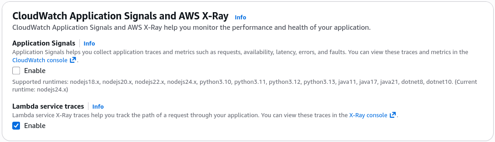
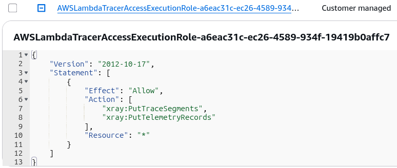
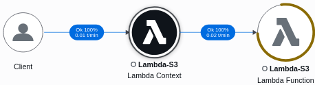

# Lambda Monitoring & X-Ray Tracing - Hands On

Stephane’s hands-on lab covers two massive pillars of real-world production triage: reading the **CloudWatch Log REPORT line** to check your financial and environmental efficiency, and analyzing the **X-Ray Service Map** to see how data actually jumps across infrastructure boundaries.

---

## 🛠️ Step-by-Step Observability and Tracing Hands On

### 1. Activating X-Ray Active Tracing Natively

- **Step 1: Toggle the Infrastructure Daemon Sidecar**
  - Open your `Lambda-S3` function workspace ──► head over to the **Configuration** tab ──► select **Monitoring and organization tools** from the sidebar list.
  - Click **Edit** ──► toggle the switch for **Lambda service traces** to _Enabled_. Hit Save.  
    
- **Step 2: Verify the Automatic Security Provisioning**
  - _Behind-the-Scenes Check:_ Click the **Permissions** tab and look at the role summary. The console automatically updates your function's IAM Execution Role, appendant with targeted permissions to execute **`xray:PutTraceSegments`** and **`xray:PutTelemetryRecords`** natively. This ensures the background daemon container sidecar can push trace packages to the AWS security boundary.  
    

---

### 2. Dissecting the CloudWatch Logs Forensic "REPORT" Line

Go to your **CloudWatch Log Streams** and look at the absolute end of any execution cycle. Every single Lambda run outputs a highly precise execution summary line labeled **`REPORT`**. It looks exactly like this, bro:

```text
REPORT RequestId: abc123de-4567-890f-abcd-ef1234567890
Duration: 48.67 ms Billed Duration: 186 ms Memory Size: 128 MB Max Memory Used: 77 MB Init Duration: 136.54 ms
```

#### 🧠 Core Financial & Compute Performance Metrics to Audit:

- **`Duration` vs. `Billed Duration`:** `Duration` is the raw millisecond lifespan your code handler took to process. Lambda rounds this up to the nearest millisecond to calculate your precise `Billed Duration` block, ensuring you never pay for an extra microsecond of idle compute time!
- **`Memory Size` vs. `Max Memory Used`:** If your `Memory Size` slider is locked to 128 MB, but your logs reveal your code maxed out at `Max Memory Used: 77 MB`, your code is perfectly sized. But if `Max Memory Used` hits 128 MB, your function will hard-crash with an _Out of Memory_ exception. Up the slider immediately.
- **`Init Duration` (The Cold Start Clock):** This tracks exactly how long it took the AWS container engine to download your code package, spin up the runtime environment shell, and execute your global outer initialization scripts _before_ hitting your actual handler function. If this metric is missing, it means you hit a warm container (a fast **Warm Start**)!

---

### 🕸️ Analyzing the AWS X-Ray Service Map Visuals

After restoring your code return block to a success state, dropping fresh object uploads into your S3 integration bucket, and opening up the **AWS X-Ray Console**, the platform generates a live visual transaction graph:  


#### 🔍 How to Read the Node Topology:

- **The Client Node (The Trigger):** Shows the initial asynchronous entry path where Amazon S3 detected the object creation state and handed off the transaction envelope.
- **The Lambda Context Node:** Represents the internal AWS Lambda front-desk orchestration engine receiving the payload.
- **The Lambda Function Node:** Represents your actual custom code handler block running inside the container microVM space.
- **Color-Coded Status Rings:**
  - 🟤 **Brown Blocks:** Client Errors (4xx Error).
  - 🔴 **Red Blocks:** Server Errors (5xx Error).

---

### 📊 Operational Telemetry Metric Formulations

The execution duration costs and cold-start boundary metrics verified during this console run evaluate under these clear expressions:

$$\text{Total Invoice Billable Clock} = \text{Billed Duration (ms)} \times \text{Allocated Memory Size (GB)}$$

$$\text{First Execution Ingest} = \text{Cold Start} \implies \text{Total Latency} = \text{Init Duration} + \text{Execution Handler Duration}$$

---

## Exam Tips

- **The Memory Sizing Audit Scenario:** If an exam question asks you how to audit a massive library of 200 distinct company Lambda functions to verify which ones are over-provisioned (wasting budget by allocating too much RAM) or under-provisioned (running dangerously close to breaking memory boundaries), look for the option that tells you to **parse and analyze the `REPORT` lines inside CloudWatch Logs** (or use tools like AWS Compute Optimizer).
- **Tracing Distributed Breakdowns:** If an architectural design scenario describes a distributed pipeline where an S3 upload triggers a Lambda function, which writes to an SQS queue, which then triggers a secondary Lambda function to write cells down into DynamoDB, and developers need to track down exactly which step in this long chain is introducing an intermittent 4-second latency delay—**look for AWS X-Ray Active Tracing on the Service Map immediately!**
