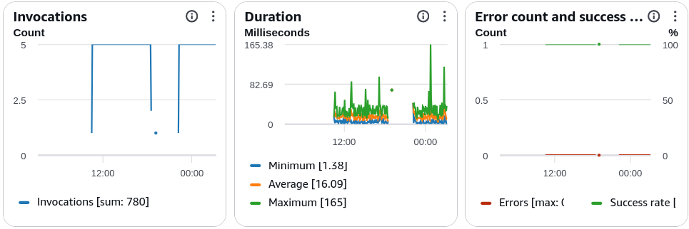

# Lambda Monitoring & X-Ray Tracing

Mapping out your observability matrix using **CloudWatch** and **AWS X-Ray** is how you transform a blind, chaotic serverless environment into a perfectly auditable enterprise machine, bro! 🧠📊

When you shift from traditional servers to a microVM architecture, you can't just SSH into a box to run a thread dump or tail a local log file. You are completely dependent on cloud telemetry.

---

## Key Takeaways

AWS Lambda telemetry breaks down into three distinct operational planes: **CloudWatch Logs** houses text-based stderr/stdout diagnostic print statements; **CloudWatch Metrics** records structural time-series performance data (like invocation counts, throttles, and stream lags); and **AWS X-Ray Active Tracing** utilizes an internal daemon container sidecar loop to profile end-to-end transaction paths, computing localized subsegment latency graphs across distributed microservice resources.

---

### 📊 The CloudWatch Metrics Inventory

AWS Lambda streams performance metrics directly into CloudWatch. When you are analyzing system bottlenecks, these are the high-value indicators you must monitor:

- **Invocations:** The raw count of how many times your function code handler is executed.
- **Duration:** The exact millisecond lifespan it takes for your code to execute from start to finish.
- **Errors:** Captures any invocation that returns an application-level unhandled exception or runtime crash block.
  
- **Throttles:** Tracks requests blocked because your scaling footprint crashed straight into your account's **Concurrency Limits**.
- **IteratorAge (For Streams):** Absolute milestone exam metric! When reading from **Kinesis or DynamoDB Streams via an Event Source Mapper**, this measures the millisecond delay between when a record is written to the stream and when Lambda actually reads it. If `IteratorAge` is spiking, it means your Lambda function is running too slow to handle the incoming traffic velocity, causing a data backlog!

---

### 🕸️ AWS X-Ray Active Tracing Architecture

To trace transactions across a complex microservice landscape, you enable **Active Tracing** inside your function configuration panels.

#### ⚙️ Operational Mechanics

1. **The Daemon Sidecar:** When activated, Lambda automatically runs an internal **AWS X-Ray Daemon** worker inside your isolated microVM environment container shell.
2. **Outbound IAM Clearance:** Your function’s IAM Execution Role **MUST** be granted the **`AWSXrayDaemonWriteAccess`** managed policy (or carry the targeted `xray:PutTraceSegments` / `xray:PutTelemetryRecords` API clearance) so the daemon can ship metrics upstream.
3. **The Software SDK:** You wrap your application import libraries (like the AWS SDK or database client) inside the X-Ray SDK wrapper code.

#### 🔑 The 3 System-Injected X-Ray Environment Variables

The Lambda engine automatically populates three explicit system environment variables inside your container shell to guide the X-Ray SDK tracker. Memorize these indicators for the exam workspace:

- **`_X_AMZN_TRACE_ID`:** Houses the active payload tracking sampling header string. The SDK reads this to correlate different downstream service operations to one single master transaction tree.
- **`AWS_XRAY_CONTEXT_MISSING`:** Instructs the SDK what to do if an execution happens but the master trace ID is missing (e.g., throw an exception or log a warning).
- **`AWS_XRAY_DAEMON_ADDRESS`:** Contains the precise network coordinate string (IP address and UDP Port number, typically `127.0.0.1:2000`) where the internal background X-Ray daemon is listening for telemetry dumps from your application code.

---

### 📊 Operational Telemetry Tracking Notation

The latency profiling boundaries and stream delay metrics evaluated by the monitoring plane align with these direct expressions:

$$\text{Stream Processing Lag Metric} = \text{Ingestion Timestamp}_{\text{ESM Read}} - \text{Creation Timestamp}_{\text{Stream Write}} \equiv \text{IteratorAge (ms)}$$

$$\text{Observability Pipeline Handshake} = \text{Code Telemetry Data} \xrightarrow{\text{UDP Port :2000}} \text{X-Ray Daemon Address} \implies \text{Publish Trace Spans}$$

---

## Exam Tips

- **The Spiking IteratorAge Remediation:** If an exam scenario says: _"An Event Source Mapping reads data from an Amazon Kinesis shard, but CloudWatch metrics indicate that `IteratorAge` is continuously increasing, causing severe downstream data delays. What should the developer configure to optimize throughput?"_ Look for options that tell you to **increase the function's memory slider allocation** (to make individual invocations faster) or **increase the `ParallelizationFactor` attribute** on the Event Source Mapping to process multiple concurrent batches per shard in parallel.
- **The Missing Traces Authorization Pitfall:** If a question states that a developer toggled "Active Tracing" on inside the Lambda console configuration page and wrapped their Node.js/Python code with the X-Ray SDK, but **absolutely zero visual trace graphs are generating inside the AWS X-Ray console**, look for the security option. The breakdown is happening because **the Lambda function's IAM Execution Role is missing the `AWSXrayDaemonWriteAccess` policy**, blocking the daemon from authenticating its data uploads to the AWS security boundary!
