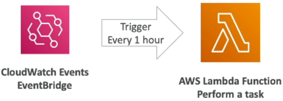

# AWS Lambda Overview

When you transition from an EC2 instance to a Lambda function, you are moving from an architecture where you pay for **idle time** to an architecture where you pay strictly for **execution time**. No servers to patch, no scaling rules to fine-tune, and if your code isn't running, your bill is literally a clean $0.

## Key Takeaways

- **The 15-Minute Hard Ceiling:** This is a classic exam check, bro. Lambda functions are designed for short, event-driven compute bursts. **A single execution invocation cannot run longer than 15 minutes (900 seconds).** If your background job takes 45 minutes to process big data files, Lambda will timeout—you need to shift that payload over to AWS Batch or ECS Fargate instead.
- **The Memory-to-CPU Scaling Law:** You do not get independent sliders to adjust your CPU or network throughput, chief. Lambda gives you a single slider for **Memory (RAM) from 128 MB up to 10 GB**.
  - _The Under-the-Hood Secret:_ When you scale up the allocated RAM, **AWS automatically scales up your vCPU allocation and network capacity proportionally.** If your code is running slow because it's handling heavy math calculations, don't look for a CPU setting—just crank up the RAM slider!
- **Ephemeral Local Disks (`/tmp`):** Need a scratchpad directory to temporarily download an image zip file from S3, extract it, and process it? Every Lambda function comes with its own ephemeral `/tmp` storage space that can scale from **512 MB up to 10 GB**. Just remember: this folder is wiped clean once the execution environment terminates!

---

### 📂 Multi-Language Runtime Ecosystem

Lambda supports a massive array of native development environments:

- **Natively Supported:** Node.js (JavaScript/TypeScript), Python, Java, C# (.NET Core), and Ruby.
- **Custom Runtimes (Runtime API):** Want to run ultra-high-performance compiled code like **Rust or Go**? You can use the Lambda Runtime API to pack a custom binary executable.
- **Docker Container Images:** You _can_ pack a Lambda function inside a Docker container image (up to 10 GB in size), provided it implements the Lambda Runtime API. _Exam Trap Alert:_ If the question describes running a traditional enterprise multi-port web server layout inside a Docker container, **do not choose Lambda**. Choose **ECS or Fargate** every single time!

---

### ⚡ The Event-Driven Architecture Blueprints

Let’s review the two ultimate real-world use cases Stephane mapped out:

#### 📸 Pattern 1: Reactive S3 Thumbnail Processor

```text
  ┌────────────────────────┐       ┌────────────────────────┐       ┌────────────────────────┐
  │  1. Ingestion Image    │ ──►   │ 2. S3 Event Trigger    │ ──►   │  3. Serverless Compute │
  │    (User puts raw .jpg)│       │   (ObjectCreated)      │       │    (Lambda Handler)    │
  └────────────────────────┘       └────────────────────────┘       └────────────────────────┘
                                                                                 │
                                          ┌──────────────────────────────────────┴──────────────────────────────────────┐
                                          ▼ (Generates scaled copy)                                                     ▼ (Logs data attributes)
                               ┌────────────────────────┐                                                    ┌────────────────────────┐
                               │ 4. Output Target       │                                                    │ 5. Analytics Registry  │
                               │  (Drops into Thumb S3) │                                                    │   (Pushes to DynamoDB) │
                               └────────────────────────┘                                                    └────────────────────────┘

```

#### ⏱️ Pattern 2: Serverless Cron Job Scheduler



- **The Waste Problem:** Running a Linux cron background bash script on an EC2 instance that only runs for 30 seconds once every hour means you are paying for 59 minutes and 30 seconds of completely wasted idle runtime per hour.
- **The Serverless Play:** You wire an **Amazon EventBridge Schedule Rule** to tick precisely every hour. The rule emits an async trigger payload straight to your **Lambda function**. Lambda boots up in milliseconds, runs your database cleanup script, fires a completion record, and immediately shuts down. Total monthly compute cost? Pennies.

---

## 📊 Decoupled Billing Math Notation

Lambda’s pricing matrix is computed directly using two simple metrics: **Request Volume Count** and **Gigabyte-Seconds ($GB\cdot s$) Duration**:

$$\text{Compute Metric Allocation } (GB\cdot s) = \text{Allocated Function RAM (GB)} \times \text{Code Run Duration (seconds)}$$

$$\text{Monthly Operational Bill} = \left( \text{Total Invocations} \times \$0.0000002 \right) + \left( \text{Total } GB\cdot s \times \text{Per-ms Tier Rate} \right)$$

The AWS Free Tier treats you like royalty here, bro—you get **1 million requests and 400,000 $GB\cdot s$ completely free every single month**, rolling over indefinitely!

---

## Exam Tips

- **The Compute Core Allocation Trade-off:** If an exam scenario says: _"A developer has written a heavy image-processing Python function on Lambda that handles file matrix math, but the execution logs show it's taking 12 seconds to complete and occasionally hitting a timeout error. What is the most effective way to optimize performance?"_ Look for the answer that states: **Increase the function's memory configuration parameter.** This automatically injects more raw vCPU power to crunch the math faster.
- **The Execution Window Boundary:** If a question asks how to migrate a backend task that processes large archival data tables and takes approximately 22 minutes to execute, and lists Lambda as an option—**skip it**. Lambda’s absolute hard stop limit is **15 minutes**.
