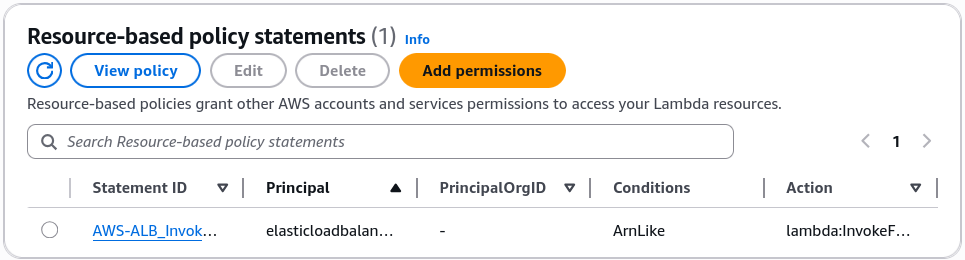
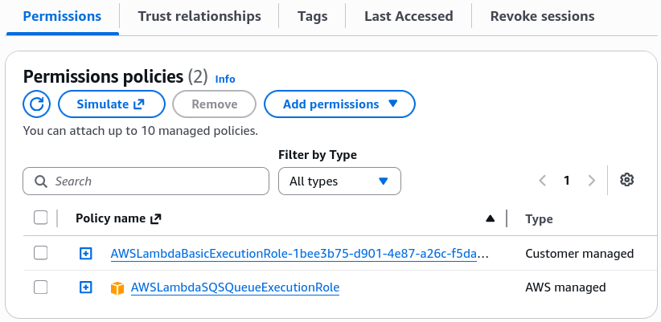

# Lambda Permissions - IAM Roles & Resource Policies - Hands On

Stephane’s lab gives you the exact diagnostic blueprint you need for the DVA-C02 exam. When you look at the **Permissions** tab of your function, the presence or absence of a **Resource-Based Policy Statement** tells you exactly whether you're dealing with an inbound **Push Model** or an outbound **Pull Model**.

---

## 🔍 The Live Security Audit Dashboard

When troubleshooting permissions in a real enterprise environment or on the exam, you can immediately categorize your architecture by looking at the function’s layout map:

### 📥 Case 1: Inbound Push Triggers (Amazon S3 & ALB)

When an external service pushes an event notification down to your function, it **must** pass through a **Resource-Based Policy Guardrail**.

- **Where to find it:** Lambda Console ──► **Configuration** ──► **Permissions** ──► Scroll down to **Resource-based policy statements**.
- **The Forensic Payload Structure:** Clicking _View Policy Document_ unboxes a strict JSON IAM block containing an explicit **`Principal`** (e.g., `s3.amazonaws.com` or `elasticloadbalancing.amazonaws.com`) paired with an explicit **`Condition.ArnLike.aws:SourceArn`** locking down the exact bucket or ALB ARN that is allowed to invoke your function.

:::note
The new EventBridge Scheduler does not use a Resource-Based Policy. Instead, it creates an IAM service role assumed by `scheduler.amazonaws.com` that carries the `lambda:InvokeFunction` permission. This is a key distinction between the classic EventBridge rules and the modern scheduler.
:::

### 📤 Case 2: Outbound Pull Triggers (Amazon SQS Event Source Mapping)

When you check the permissions tab for your SQS-triggered Lambda function, **the Resource-Based Policy section is completely empty, chief!**

- **Why?** Because SQS never logs into or forces an invocation call against Lambda. Instead, Lambda’s internal Event Source Mapper acts as a background consumer daemon, actively calling the SQS API to pull messages out.
- **The Security Gate:** Since the traffic moves from Lambda _out_ to SQS, the clearance must live inside the function's **IAM Execution Role**. Expanding the role dropdown reveals the **`AWSLambdaSQSQueueExecutionRole`** policy array, authorizing `ReceiveMessage`, `DeleteMessage`, and `GetQueueAttributes` natively.

---

## 📊 Operational Telemetry Configuration Profiles

The distinct permission pathways verified during this console walk evaluate under these clean security constraints:

$$\text{Push Model Validation } (\text{S3/ALB}) \implies \text{Resource Policy Allow}(\text{Principal} \equiv \text{Service} \;\land\; \text{SourceArn} \equiv \text{Trigger ARN})$$

$$\text{Pull Model Validation } (\text{SQS ESM}) \implies \text{Execution Role Attached}(\text{Action} \supseteq \{\text{sqs:ReceiveMessage}, \text{sqs:DeleteMessage}\})$$

---

## Exam Tips

- **The Missing Inbound Trigger Error:** If an exam question states: _"A developer uses a CloudFormation script to link an S3 bucket event notification to a Lambda function. The deployment completes successfully, but dropping files into the bucket never invokes the code,"_ look for the security option. The bug is happening because **the CloudFormation script forgot to deploy an `AWS::Lambda::Permission` resource definition**, leaving the function's Resource-Based Policy blank and blocking S3's inbound push calls!
- **The Principle of Least Privilege Audit:** If you are tasked with securing a multi-tenant environment, never allow a single shared generic IAM role to back your entire serverless catalog. Code that pulls from SQS should never carry policies allowing it to read from Kinesis streams or update DynamoDB cells. **One function, one dedicated IAM execution role, always.**
