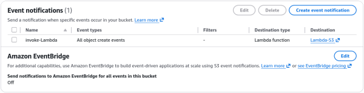

# Lambda & S3 Event Notifications - Hands On

This hands-on lab reinforces how AWS utilizes **Resource-Based Policies** to authorize asynchronous push-model event streams like Amazon S3 notifications without requiring you to embed explicit execution credentials inside the storage layer itself.

---

## 🛠️ Step-by-Step S3 Reactive Ingestion Hands On

### 1. Provisioning the Code & Storage Buckets

- **Step 1: Bootstrap the Core Lambda Target**
  - Spin up a new function named `Lambda-S3` utilizing the **Node.js** runtime environment.

- **Step 2: Create a Regionally Co-located Bucket**
  - Open the **Amazon S3 Console** ──► click **Create bucket**.
  - Name the bucket (e.g., `demo-s3-event-rendy`). **CRITICAL RULE:** Ensure the S3 bucket is provisioned in the **exact same AWS region** as your Lambda function to prevent cross-region latency blocks and complex deployment mappings.

---

### 2. Configuring the Push Event Notification System

- **Step 3: Setup the S3 Event Blueprint**
  - Navigate to your newly created S3 bucket ──► click the **Properties** tab ──► scroll down to the **Event notifications** module.
  - Click **Create event notification** ──► Name it `invoke-Lambda`.
  - Leave Prefix and Suffix blank to capture all file streams, or scope it down to target explicit folders.
  - Under **Event types**, check the box for **`All object create events`** (`s3:ObjectCreated:*`).

- **Step 4: Bind the Compute Target Route** - Scroll down to the Destination panel, select **Lambda function**, choose your `Lambda-S3` function from the dropdown, and hit **Save changes**.  
  

---

### 3. Verification & Live Trace Analysis

Update your Lambda function code template to print the incoming data dictionary so you can inspect the serialization variables:

```javascript
export const handler = async (event) => {
  console.log(JSON.stringify(event, null, 2));
  const response = {
    statusCode: 200,
    body: JSON.stringify("Hello from Lambda!"),
  };
  return response;
};
```

Hit **Deploy**. Head back to your S3 bucket, upload a sample photo file (e.g., `coffee.jpg`), and jump over to the Lambda function's **Monitor -> View CloudWatch Logs** panel.

---

### 📥 Deconstructing the Ingested S3 Event Schema Payload

When you drill into the newly populated CloudWatch log stream, you will find an explicit `Records` array containing the structural telemetry details emitted by the storage plane:

```json
{
  "Records": [
    {
      "eventVersion": "2.4",
      "eventSource": "aws:s3",
      "awsRegion": "ap-southeast-2",
      "eventTime": "2026-06-25T01:32:15.252Z",
      "eventName": "ObjectCreated:Put",
      "userIdentity": {
        "principalId": "AWS:AIDA24DNY4NTLSCBFI4WZ"
      },
      "requestParameters": {
        "sourceIPAddress": "my-ip-address"
      },
      "responseElements": {
        "x-amz-request-id": "AXES3THZ66BAG331",
        "x-amz-id-2": "VhnsiPGFaT0nTbCQLkit2v8rXNXJOVrrESMP3o2Q4zU8YkK7v/bYP1F6hldKqdFtCfPK8OLZjLVMYOLTsAw8rU9uTgDx+3jZ"
      },
      "s3": {
        "s3SchemaVersion": "1.0",
        "configurationId": "invoke-Lambda",
        "bucket": {
          "name": "demo-s3-event-rendy",
          "ownerIdentity": {
            "principalId": "A18QSH59Y8EC17"
          },
          "arn": "arn:aws:s3:::demo-s3-event-rendy"
        },
        "object": {
          "key": "coffee.jpg",
          "size": 110985,
          "eTag": "b3b29d095d73d905171d1f5498e1e578",
          "sequencer": "006A3C851F365153ED"
        }
      }
    }
  ]
}
```

#### 🧠 Core Schema Extraction Points for Developers:

- **`eventSource` & `eventName`:** Identifies the telemetry provider (`aws:s3`) and the explicit action state code (`ObjectCreated:Put`) that kicked off the invocation loop.
- **`s3.bucket.name` & `s3.object.key`:** The exact path coordinates (`demo-s3-event-rendy` and `coffee.jpg`). Your core code logic uses these variables to execute an upstream `s3.get_object()` call back to S3 to pull the file content chunks into memory for heavy processing.

---

### 📊 Operational Telemetry Pipeline Notation

The asynchronous event processing metrics across your decoupling limits map according to these clear expressions:

$$\text{Storage State Mutation} = \text{S3 Upload}(\text{coffee.jpeg}) \longrightarrow \text{Emit S3 Record Payload} \xrightarrow{\text{Resource-Based Policy}} \text{Lambda Invocation}$$

$$\text{Downstream Processing Flow} = \text{Extract}(\text{bucket.name} \;\land\; \text{object.key}) \longrightarrow \text{Execute: } \text{s3:GetObject} \implies \text{Compute In-Memory Logic}$$
