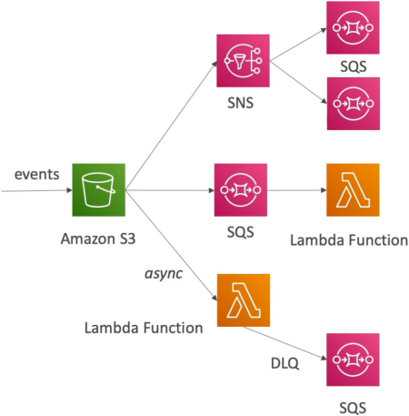
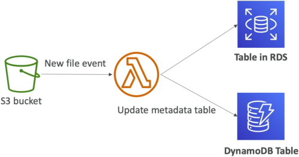

# Lambda & S3 Event Notifications

**Amazon S3 Event Notifications** allow developers to trigger automated workflows whenever a specific mutation occurs inside an object storage bucket (such as `ObjectCreated`, `ObjectRemoved`, or `ObjectRestore`). S3 natively handles these event dispatches **Asynchronously**, dropping the event payload directly into Lambda's managed background event queue. To optimize performance and prevent infinite execution loops, workflows can be scoped using granular **Prefix** (folder path) and **Suffix** (file extension) rule matching filters.

---

## Key Takeaways

### The 3 Native Routing Topologies

When an event fires inside S3, you aren't forced to throw it straight at a compute core. S3 natively supports exactly three architectural target destinations, chief:

- **Route 1: Direct Async Lambda Invocation (Our Focus)**
  - S3 fires a notification payload directly down to your Lambda function. Because this is an **Asynchronous Invocation**, Lambda handles the 3-strike retry engine, and you can attach an SQS DLQ or Lambda Destination to catch poison pills.
- **Route 2: Fan-Out Broadcast (S3 ──► SNS ──► Multiple SQS/Lambda)**
  - Essential if multiple distinct engineering teams or applications need to react to the exact same file upload simultaneously (e.g., Team A processes raw metrics while Team B updates a security audit ledger).
- **Route 3: The Persistent Buffer Queue (S3 ──► SQS ──► Lambda)**
  - Used when you want an explicit structural architectural bulkhead. SQS acts as a durable shock absorber, storing messages safely until your Lambda function has the concurrency capacity to poll and clear them out.

## 

### ⚠️ The Documentation "Fine Print" & Architectural Traps

AWS _loves_ building exam trick questions out of these obscure edge cases. Lock these down right now:

- **The Parallel Overwrite Race Condition:** If an S3 bucket does **not** have _Bucket Versioning_ enabled, and two separate web clients upload/overwrite the exact same object filename at the precise same millisecond, **S3 might only emit a single event notification payload instead of two.** If your system requires absolute 100% telemetry tracking accuracy for every single file mutation, **you must turn on S3 Bucket Versioning!**
- **The Infinite Recursion Loop (The Ultimate Budget Killer) 💀:** Imagine your Lambda function triggers when an image lands in `my-bucket`. Your code resizes the image and saves the output thumbnail _right back into that exact same bucket_. What happens?
  - The new thumbnail fires a _new_ upload event ──► which triggers the Lambda function again ──► which creates a smaller thumbnail ──► which triggers a new event...
  - Within minutes, your function executes millions of times in a recursive spiral, screaming through your budget constraints.
  - _The Fix:_ **Always use separate buckets for your inputs and outputs, or apply strict Prefix/Suffix matching filters** (e.g., only trigger if the file lands inside the `/uploads/` prefix folder, and save outputs inside the `/processed/` prefix folder).

---

### 📊 Operational Telemetry Pipeline Notation

The execution latency loops and delivery states running inside managed reactive storage boundaries evaluate under these expressions:

$$\text{S3 Object Event Action} = \text{s3:ObjectCreated:Put} \longrightarrow \text{Emit Ingestion Telemetry} \xrightarrow{\text{Async Delivery}} \text{HTTP 202 Handshake}$$

$$\text{System Safety State} = \text{Target Ingestion Bucket} \neq \text{Egress Destination Bucket} \implies \text{Infinite Execution Loop Prevented}$$

---

## Exam Tips

- **Scoping the Trigger Rules:** If an exam prompt states that a company only wants a Lambda function to fire when `.jpg` or `.png` graphic assets are dropped into an S3 imagery bucket, look for the answer that configures **S3 Event Notification Suffix Filters matching `.jpg` and `.png`**.
- **Remediating Database Timeouts:** If your asynchronous S3-to-Lambda pipeline starts throwing connection errors because too many files are hitting the bucket at once and overloading a downstream relational RDS database, look for the choice that inserts an **SQS queue between S3 and Lambda** to buffer the spikes and enforce controlled batch processing.  
  
