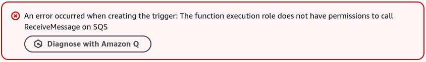
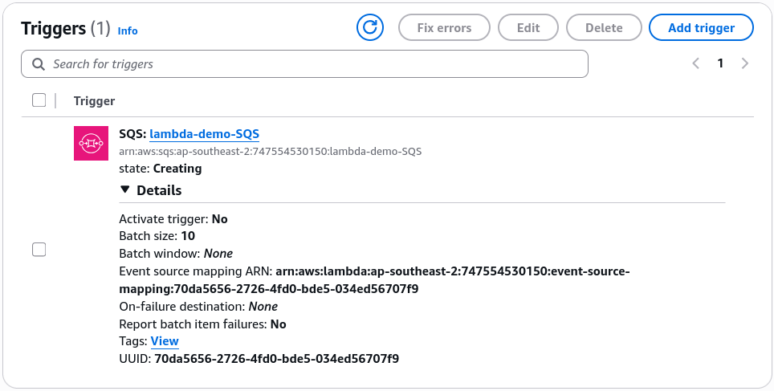

# Lambda Event Source Mapping Hands On (SQS)

Stephane’s lab hits the absolute baseline execution flow for a queue-based **Event Source Mapping (ESM)**. There is a super common exam trap hidden inside this configuration, especially regarding the exact IAM policy identity required to allow the internal Lambda poller loop to communicate with your queue layers.

## Hands On

### 🛠️ Step-by-Step SQS Event Source Mapping Playbook

#### 1. Provisioning the Core Assets

- **Step 1: Bootstrap the Consumer Code Hub**
  - Spin up a new function from scratch named `lambda-SQS` using the **Node.js** runtime environment.

- **Step 2: Initialize the Buffer Queue**
  - Go to the **Amazon SQS Console** ──► click **Create queue**.
  - Keep it as a standard queue, name it **`lambda-demo-SQS`**, scroll to the bottom, and hit **Create queue**.

---

#### 2. ⚠️ The Ultimate Exam Permission Pitfall: Resolving the Trigger Wall

If you try to link your new queue to the Lambda function straight out of the box using the **Add trigger** button, **the console will throw a hard permission wall blocking you** Because Lambda handles the heavy lifting of running background long-polling API calls, your function's background security wrapper needs explicit clearance to fetch and delete data from your queue.


- **Step 3: Attach the Dedicated Managed Execution Profile**
  - Navigate to your function's **Configuration -> Permissions** tab and click your active Execution role link to jump into the IAM Console.
  - Click **Add permissions** ──► **Attach policies**.
  - Search for the highly precise AWS-managed policy named **`AWSLambdaSQSQueueExecutionRole`**.
    - _Why this policy?_ It packages the exact bare-minimum permission array needed for an ESM to safely interface with an SQS queue resource wrapper:
      - `sqs:ReceiveMessage` (To extract message payload arrays from the queue via long polling).
      - `sqs:DeleteMessage` (To permanently evict and wipe the message after your code finishes executing flawlessly).
      - `sqs:GetQueueAttributes` (To monitor the current health metrics of the queue).

- **Step 4: Establish the ESM Trigger Link**
  - Head back to the Lambda console, hit **Add trigger**, select **SQS**, pick your `lambda-demo-SQS` queue ARN, set your target batch sizes, check **Enable trigger**, and click **Add**. With the IAM policy active, it saves successfully!
    

---

### 📥 Deconstructing the Ingested SQS Batch Payload Schema

Once you edit your Node.js code to `console.log(JSON.stringify(event, null, 2))`, hit **Deploy**, and drop a test string like `"hello world"` (with a custom message attribute key `foo: bar`) into the SQS console's **Send and receive messages** block, the ESM will pull it and invoke your code.

When you drill into the newly populated CloudWatch log stream, you will find an explicit `Records` array containing the structural JSON envelope passed down by the pull engine, chief:

```json
{
  "Records": [
    {
      "messageId": "ab0faaaa-268a-4856-8f17-ce82dbf0fd82",
      "receiptHandle": "AQEBXnRm7Yy9g4qM+Cf939MyqcohettSd/tNQE4Dk5k+WRNjQqeNsabWRBLf0B8YsCN1SIkzOJkihVRFXeDt5Ap+tN8+agpDV3IDfgFgHBzo5f1Wj62u5y2WUX2QzepszEVF4yGxB81EOXe4ErpXI+3lEQUgbTyWhblWUpB46+KfxSY2bw5vZ5d0g/kDycoIRKLAENaGKVxTBLPBl2zW0TAD6sEK/6Ut/QDU2JN7L7LcPf8/z8bkVNTx1enlqgFHIyjNPcIPj16UufDWXao8GV+Xt6H/saN6jUPl5B7NW6hycXIWFLt8WZe03N3xDdPSSWL3UOhY3PS9YCIc6ezP7befWENNw3u+kabkEnH55kETWE/6schNZZUlRq/qcFxkmFD464gBAek9FSe7Uo3gJYI5Og==",
      "body": "Hello World, Bro!",
      "attributes": {
        "ApproximateReceiveCount": "1",
        "SentTimestamp": "1782378729417",
        "SenderId": "AIDA24DNY4NTLSCBFI4WZ",
        "ApproximateFirstReceiveTimestamp": "1782378729425"
      },
      "messageAttributes": {
        "foo": {
          "stringValue": "bar",
          "stringListValues": [],
          "binaryListValues": [],
          "dataType": "String"
        }
      },
      "md5OfMessageAttributes": "d8062e30406ad939a86bacea477e5a26",
      "md5OfBody": "a67f40a35491bed375855d12773e367f",
      "eventSource": "aws:sqs",
      "eventSourceARN": "arn:aws:sqs:ap-southeast-2:747554530150:lambda-demo-SQS",
      "awsRegion": "ap-southeast-2"
    }
  ]
}
```

#### 🧠 Core Schema Extraction Points for Developers:

- **`Records` (The Array Structure):** Because the ESM can grab a batch of messages at once (based on your configuration values), **`event['Records']` is always an array matrix.** Even if the queue only had 1 message to give, your code must iterate through or grab the first index element (`event['Records'][0]`) to extract the contents.
- **`body` & `messageAttributes`:** Holds your raw workload string data (`"hello world"`) and any custom metadata headers (`foo: bar`) passed through the messaging lanes.
- **Destructive Polling Invalidation:** If you jump back into your SQS console panel right now, you'll see **0 Messages Available**. Because your function returned a clean `StatusCode: 200` success block, the Event Source Mapper automatically triggered a background `DeleteMessage` cleanup command, ensuring that message is never seen by another consumer again!

---

### 📊 Stream vs. Queue Processing Reference Matrix

As Stephane outlined when checking the Kinesis dropdown triggers, the capabilities of an Event Source Mapper shift dramatically depending on the underlying data engine parameters:

| Performance Property   | Queue ESM Engine (SQS)                                                                                            | Stream ESM Engine (Kinesis / DynamoDB)                                                                                               |
| ---------------------- | ----------------------------------------------------------------------------------------------------------------- | ------------------------------------------------------------------------------------------------------------------------------------ |
| **Ingestion Behavior** | **Destructive.** Messages are deleted from the queue explicitly upon a successful code return path.               | **Non-Destructive.** Items stay inside the stream shards until their time-to-live retention window expires.                          |
| **Processing Order**   | **Non-ordered** by default (Standard SQS). Moves to strict chronological order if you deploy SQS **FIFO** queues. | **Strictly Ordered** at the shard level natively.                                                                                    |
| **Starting Positions** | N/A (Always grabs whatever message is sitting at the current head of the queue pipeline).                         | Configurable! Can choose **Latest**, **Earliest**, or pick a precise historical **Timestamp** window to process.                     |
| **Error Isolation**    | Bad messages roll back to the queue to trigger a standard SQS **Redrive Policy / DLQ**.                           | Freezes the shard loop completely by default! Requires **Split Batch on Error** or **On-Failure Destinations** to clear bottlenecks. |
