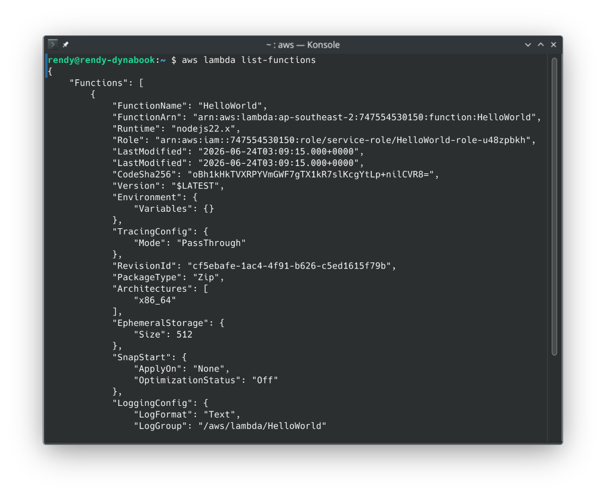
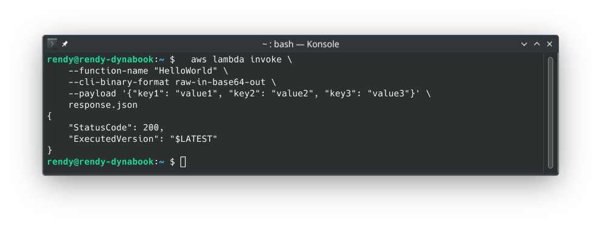

# Lambda Synchronous Invocations Hands On

Yo, dropping into CloudShell to fire off a synchronous API request directly against your microVM execution pipeline is pure engineering power, bro! 💻⚡

When you hit that enter key, you are forcing your terminal to hang open and wait on the network line until the Lambda function completely crunches your input JSON map and outputs the results. Let's map out Stephane's terminal walkthrough into a razor-sharp, step-by-step developer playbook for your records.

---

## 🛠️ Step-by-Step CLI Synchronous Invocation Hands On

- **Step 1: Spin up Your Cloud Shell Environment**
  - Open **AWS CloudShell** from the top console bar (or fire up your local terminal workspace).
  - Verify your toolset versions by typing:

  ```bash
  aws --version

  ```

- **Step 2: Inspect the Local Function Inventory**
  - Run a lookup script to confirm your function’s exact naming identifier configuration inside your active region:

  ```bash
  aws lambda list-functions

  ```

  - Locate your target function configuration map block and copy the `FunctionName` parameter (e.g., `HelloWorld`).
    

- **Step 3: Issue the Synchronous Network Handshake**
  - Under the modern **AWS CLI v2** engine rules, raw JSON payload strings must be wrapped cleanly inside a base64 encoding pass. Run this exact payload command sequence:

  ```bash
  aws lambda invoke \
    --function-name "HelloWorld" \
    --cli-binary-format raw-in-base64-out \
    --payload '{"key1": "value1", "key2": "value2", "key3": "value3"}' \
    response.json

  ```

- **Step 4: Decode the Response Metrics**
  - Check your terminal output. The control plane returns an instantaneous status block indicating a successful execution cycle:

  ```json
  {
    "StatusCode": 200,
    "ExecutedVersion": "$LATEST"
  }
  ```

  

- **Step 5: Inspect the Output JSON File Payload**
  - Because you commanded the CLI to write its response stream straight into a localized file named `response.json`, extract the results to see your code output:

  ```bash
  cat response.json

  ```

  - The terminal prints out your targeted returned key string payload natively (e.g., `"value1"`), proving your synchronous loop functioned flawlessly!

---

## 📊 The CLI Request-Response Architecture

This structural flow outlines how your terminal thread stays completely blocked while waiting on the AWS cloud boundary execution loop:

```text
 TERMINAL ENVIRONMENT (CloudShell / Local CLI)
   ┌────────────────────────────────────────────────────────┐
   │ 📦 aws lambda invoke --function-name "HelloWorld"      │
   └──────────┬─────────────────────────────────────────────┘
              │
              ▼ (Connection Kept OPEN - Blocking Network Call)
  ============│=======================================================================
              │ (InvocationType: RequestResponse default header)
              ▼
 AWS CLOUD COMPUTE ENVIRONMENT (Target Region Subsystem)
   ┌────────────────────────────────────────────────────────┐
   │ ⚡ AWS Lambda MicroVM Runtime Instance                 │ ──► Parses incoming base64
   │                                                        │     payload into code variables
   └──────────┬─────────────────────────────────────────────┘
              │
              ▼ (Code completes processing loop and executes 'return')
   ┌────────────────────────────────────────────────────────┐
   │ 📥 Immediate Sync Return (HTTP 200 Payload Matrix)     │
   └──────────┬─────────────────────────────────────────────┘
              │
  ============│=======================================================================
              │ (Payload drops out of network pipe)
              ▼
 TERMINAL ENVIRONMENT
   ┌────────────────────────────────────────────────────────┐
   │ 💾 response.json saved -> Prints text output           │ ──► Thread unblocks instantly!
   └────────────────────────────────────────────────────────┘

```
