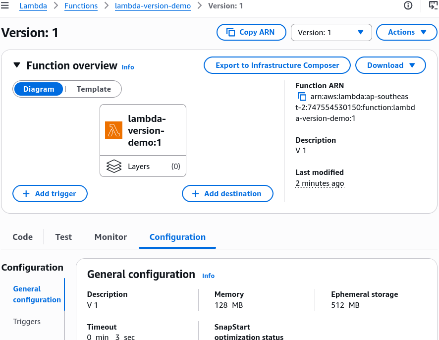
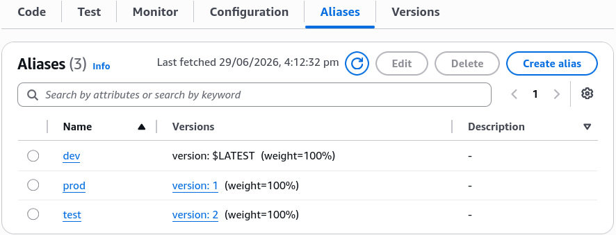
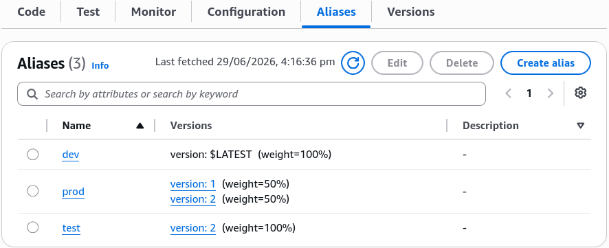

# Lambda Versions and Aliases - Hands On

Stephane’s hands-on run perfectly demonstrates how the AWS control plane handles the transition from **highly volatile execution branches to immutable milestones**, and then maps a dynamic routing layer over them.

---

## 🛠️ Step-by-Step Versioning & Alias Routing Hands On

### 1. Freezing the Milestones (The Immutable Snapshot)

- **Step 1: Bootstrap the Volatile Environment**
  - Provision a function named `lambda-version-demo`.
  - Drop a basic string return block inside your handler, hit **Deploy**, and trigger a quick console mock test run:

    ```javascript
    export const handler = async (event) => {
      return "This is version 1";
    };
    ```

- **Step 2: Cut Version 1**
  - Click the **Versions** sub-tab or the top **Actions** dropdown menu ──► hit **Publish new version**.
  - Add a description note (e.g., `Stable baseline iteration`) and click Publish.
  - _The Status Read:_ The console locks up the inline code panel and appends a clear **`:1`** qualifier indicator token right onto your function name string header. The configuration state is now frozen forever.
    

- **Step 3: Cut Version 2**
  - Drop down the version selection filter panel and select **`Qualifier:<your-function-name>`** (the only place where mutations are authorized).
  - Swap out the payload string output to reflect your secondary code patch iteration:

    ```javascript
    export const handler = async (event) => {
      return "This is version 2";
    };
    ```

  - Hit **Deploy**, click **Actions -> Publish new version**, tag it as your upgrade milestone, and publish to generate immutable **`Version 2`**.

---

### 2. Setting Up the Structural Routing Layers (Aliases)

Now that you have isolated snapshots baking in the account background, switch to the **Aliases** sub-tab and provision your deployment targets:

1. **The `dev` Alias:** Click **Create alias** ──► Name it `dev` ──► Target the dropdown pointer directly to the volatile **`$LATEST`** branch. (This lets your team keep pushing code live without breaking formal release versions!)
2. **The `test` Alias:** Create a new alias named `test` ──► Point the targeting selector to the newly published **`Version 2`**.
3. **The `prod` Alias:** Create your primary gate alias named `prod` ──► Point the initial target parameter down to the secure, bulletproof **`Version 1`**.



---

### 3. Executing the Weighted Canary Split Lab

This is where the real architecture magic happens. Let's replicate Stephane's live traffic experiment:

- **Step 4: Shift the Weighted Proportions**
  - Open your **`prod`** alias dashboard panel ──► click **Edit**.
  - Expand the **Weighted alias routing** configuration sub-drawer.
  - Under **Additional version**, choose **`2`** from the selector block.
  - Set the weight parameter box exactly to **`50%`** (This signals the routing layer to enforce a clean 50% split balance between your old base and new candidate code streams!). Click **Save**.
    

- **Step 5: Blast the Invocation Engine**
  - Keep clicking the **Test** button back-to-back inside the `prod` alias context view.
  - **The Telemetry Alternation Loop:** The execution return logs alternate beautifully on every hit:
  - _Click 1:_ `"This is version 2"` (Lands on Canary `Version 2`)
  - _Click 2:_ `"This is version 1"` (Lands on Stable `Version 1`)

---

### 🔍 Completing the Promotion (The Zero-Downtime Cutover)

Once your tracking metrics show that `Version 2` is holding up perfectly under traffic load with zero error spikes, go back to **Aliases -> prod -> Edit**:

1. Flip the primary target version parameter directly from `1` over to **`2`**.
2. Remove the additional weighted version row configuration block completely and click **Save**.

$$\text{Canary Testing Phase} \implies \text{Prod Alias} = \{\text{Version 1} : 50\%, \; \text{Version 2} : 50\%\}$$

$$\text{Post-Promotion State} \implies \text{Prod Alias} = \{\text{Version 2} : 100\%\} \quad (\text{Version 1 Traffic} \equiv 0\%)$$

---

## Exam Tips

- **The Immutable Environment Variables Trap:** Remember this for the exam scenario. If a function version is published, its environment variable strings (like database passwords or API keys) are **locked down just as tightly as the source code files**. If a database password changes in production, you cannot edit the variables on `Version 1`. You must update them on `$LATEST`, publish `Version 2`, and shift your `prod` alias pointer over to the new version!
