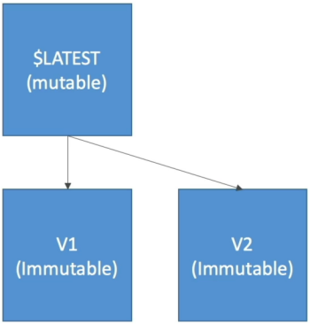
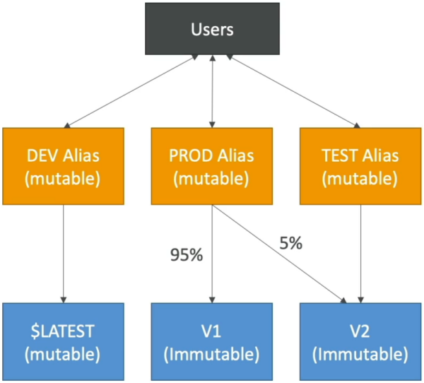

# Lambda Versions and Aliases

When you're running high-velocity microservices, you can't just push raw updates directly to the running production environment and pray it doesn't crash your backend. This course covers the core architectural concepts for establishing stable release channels, zero-downtime traffic switches, and automated rollbacks.

---

## Key Takeaways

**AWS Lambda Versions** are numbered, immutable snapshots that freeze a function’s code and runtime configuration settings at a specific moment in time. Conversely, **Lambda Aliases** are mutable, named pointers (e.g., `PROD`, `STAGING`) that resolve down to specific function version sequences. By decoupling event source triggers via an alias namespace, developers can implement weighted **Canary Deployments** to split live traffic proportionally across separate code snapshots.

---

### ❄️ Lambda Versions: The Law of Immutability

Up until now, you've been testing against the default **`$LATEST`** pointer, chief. `$LATEST` is highly volatile—any time you edit code, swap environment strings, or change timeout sliders, `$LATEST` updates instantly, affecting any user hitting your function right then.

When you achieve a stable milestone branch, you fire the `Publish` command to cut a formal **Version** (e.g., `Version 1`, `Version 2`).

- **The Immutability Shield 🛑:** The moment a version number is assigned, **it is frozen forever!** You cannot modify the code, inject different environment variables, map new VPC paths, or alter memory allocations. If you need a change, you must modify `$LATEST` and publish a completely fresh version number down the chain.
- **Unique Identification:** Every version operates as a completely independent resource item with its own distinct **Amazon Resource Name (ARN)**:

$$\text{Version Target ARN} = \text{arn:aws:lambda:us-east-1:123456789012:function:my-api:2}$$



---

### 🔀 Lambda Aliases: Named Routing Layers

If you configure your API Gateways, S3 Event Notifications, or SQS queues to point directly to raw hardcoded version numbers, you create an operational nightmare. Every time you roll out a patch, you'd have to go manually update every single upstream system routing table!

**The Fix:** You mask your versions behind a **Lambda Alias**. An alias is a mutable, named pointer.

- **Environment Separation:** You can spin up three distinct aliases tracking different stages:
  1. **`DEV`**: Points straight to `$LATEST` so team commits map in real-time.
  2. **`TEST`**: Points to `Version 2` for formal QA validation.
  3. **`PROD`**: Points to `Version 1`, which you know is perfectly stable.

- **The Upstream Blueprint Rule 👑:** You point all your external triggers (like API Gateway) to the **Alias ARN** (`arn:aws:lambda:us-east-1:123456789012:function:my-api:PROD`). When you want to release `Version 2` to production, you simply go to the alias dashboard and flip the pointer switch from Version 1 to Version 2. The API Gateway configuration doesn't change at all!

---

### 🛰️ Canary Deployments (Weighted Routing Configs)

Aliases aren't just one-way switches—they carry a built-in routing mechanism designed to drastically reduce your production blast radius through **Canary Deployments**.

Instead of routing 100% of your production traffic onto a fresh version instantly, you can assign fractional **routing weights** to the alias:

```json
{
  "AliasName": "PROD",
  "FunctionVersion": "1",
  "RoutingConfig": {
    "AdditionalVersionWeights": {
      "2": 0.05
    }
  }
}
```

- **The Canary Split Execution:** With this rule active, the Lambda platform dynamically splits traffic: **95% of requests hit your old, stable `Version 1`**, and **only 5% land on the new `Version 2`**.
- **The Evaluation Strategy:** Your monitoring tools (like CloudWatch Alarms or AWS X-Ray) watch that isolated 5% traffic slice. If error metrics or execution times spike, you can immediately flip the routing weight back to 0%, completing an instant rollback with zero downtime.`



---

## Exam Tips

- **The Alias-to-Alias Chaining Limitation ⛔:** This is an absolute favorite, gold-star exam trick question. A prompt will ask if you can configure a `CANARY` alias to point directly down to a `STAGING` alias. **No! An alias can ONLY point directly to a concrete, numbered function version.** Chaining aliases together will fail validation checks instantly.
- **The `$LATEST` Pre-Warming Ban:** Remember our performance lecture setup? **You cannot attach Provisioned Concurrency rules to the mutable `$LATEST` branch.** To completely wipe out cold starts on your user paths, you _must_ publish a hard version or point a specific alias to that hard version, and attach your pre-warmed provisioned environments directly to that immutable asset.
