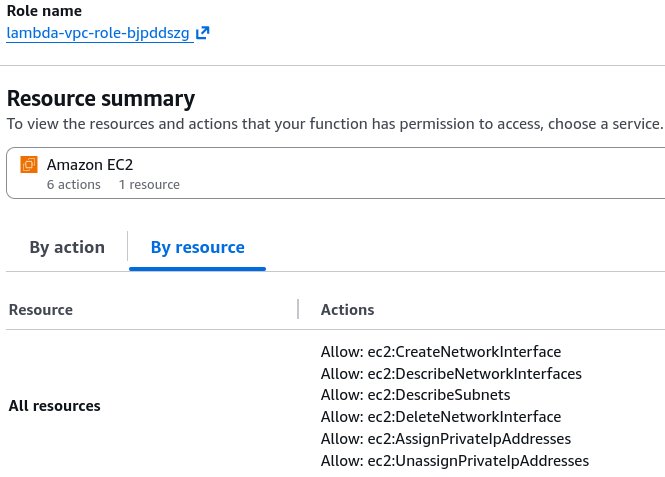
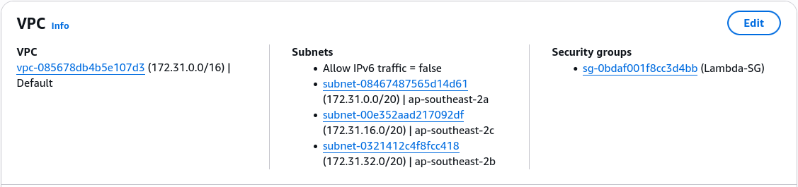

# Lambda in VPC - Hands On

Stephane’s hands-on lab clears up one of the absolute biggest points of confusion for developers working with serverless networking: **the platform permission model and the generation of physical interfaces**.

---

## 🛠️ Step-by-Step VPC Mapping Hands On

### 1. Provisioning the Security Enclosure (EC2 Console)

- **Step 1: Create the Isolated Security Group**
  - Head to the **EC2 Management Console** ──► click **Security Groups** ──► hit **Create security group**.
  - Name it **`Lambda-SG`** and assign it to your target target VPC.
  - Leave the Inbound rules blank (nothing needs to initialize an inbound socket straight to your function's isolated runtime). For Outbound rules, leave the default `All Traffic (0.0.0.0/0)` active so your code can push data downstream, chief!

---

### 2. ⚠️ The Ultimate Permission Fail: Bridging the ENI Interface

If you try to select your subnets and apply your new security group right out of the box in the Lambda Console, **the platform will throw an immediate red validation error error block**

- **Step 2: Attach the Managed Network Management Policy**
  - Go to your function’s **Configuration -> Permissions** tab and click the IAM execution role link.
  - Click **Add permissions** ──► **Attach policies**.
  - Search for the explicit managed policy named **`AWSLambdaVPCAccessExecutionRole`** (in older environments, this maps as `AWSLambdaENIManagementAccess`).
  - _Why?_ This grants your function the exact security clearance needed to talk to your network layer:
    - `ec2:CreateNetworkInterface`
    - `ec2:DescribeNetworkInterfaces`
    - `ec2:DeleteNetworkInterface`



---

### 3. Setting Up the Network Topology

- **Step 3: Bind the Subnets and Security Group**
  - Jump back to your Lambda configuration dashboard ──► click **VPC** on the sidebar ──► hit **Edit**.
  - Select your target **VPC ID**.
  - Choose **at least 2 or 3 distinct subnets** (ideally across different Availability Zones for high availability).
  - Attach your newly created **`Lambda-SG`** and hit **Save**.
  - _The Compilation Pause:_ As Stephane noted, the initial network tunnel creation can take up to a few minutes to bake inside the AWS control plane. The platform status banner will read `Updating` while AWS provisions the hyperplanes, chief.



---

### 4. 🔍 Verification and Forensic Interface Auditing

Once the configuration flips to a green `Active` state, trigger a manual test run using a dummy JSON mock array payload. The invocation returns a clean `200 OK` success block.

Now, jump out to the **EC2 Console -> Network Interfaces (ENIs)** dashboard. You will see an array of interfaces generated inside your account space, matching your subnets:

```text
Interface ID        | Subnet ID    | Security Group | Description
------------------------------------------------------------------------------------------------------------------
eni-0123456789abcdef0 | subnet-az1   | Lambda-SG      | AWS Lambda Predicate - Hyperplane ENI for function Lambda-VPC
eni-0abcdef1234567890 | subnet-az2   | Lambda-SG      | AWS Lambda Predicate - Hyperplane ENI for function Lambda-VPC
eni-07890abcdef123456 | subnet-az3   | Lambda-SG      | AWS Lambda Predicate - Hyperplane ENI for function Lambda-VPC

```

#### 🧠 Core Architectural Rules for the DVA-C02 Exam:

- **Hyperplane Scale Architecture:** Notice the description field says **`AWS Lambda Predicate - Hyperplane ENI`**, bro. This confirms that even if your function scales out horizontally to handle 5,000 parallel concurrent executions simultaneously, **it will only use these exact persistent ENI channels.** It does _not_ spawn a separate ENI for every microVM environment instance!
- **The Internet Denial Warning:** Even though Stephane bound the function to subnets that carry route table rules pointing to an Internet Gateway (Public Subnets), **this function has zero public internet access!** If your code executes a `requests.get('https://api.github.com')` API call right now, it will hang and throw a timeout error, chief. To give it public web access, you _must_ migrate the configuration to **Private Subnets routed directly through a NAT Gateway**.
