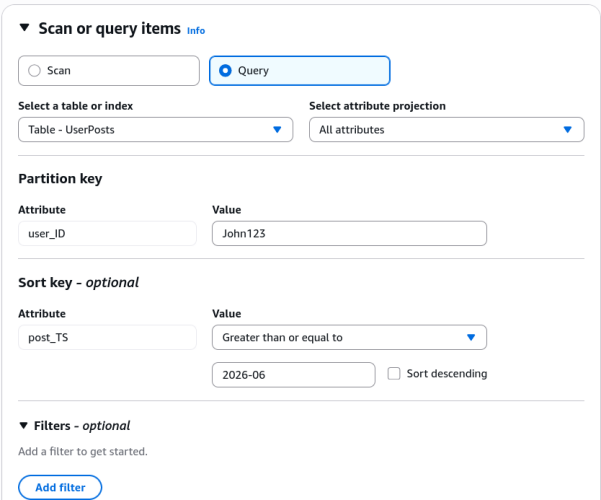

# DynamoDB Basic APIs - Hands On

Stephane’s terminal console hands-on perfectly validates the operational boundaries of the database plane. Clicking through the UI actually fires off the exact low-level network API methods we just analyzed on paper.

---

## 🛠️ Step-by-Step Data Plane Execution Hands On

### 1. Ingesting and Mutating Items (`PutItem` vs. `UpdateItem`)

- **Step 1: Execute a `PutItem` Payload Action**
  - Head to your `UserPosts` table items view ──► click **Create item**.
  - Input the composite parameters:
    - `user_ID` (PK): `Alice456`
    - `post_TS` (SK): `2026-07-01T09:00:00Z`
- Click **Add new attribute -> String** ──► Key: `content`, Value: `Alice blog`
- Hit Save. **Behind the scenes, the AWS SDK fires off a raw `PutItem` API request.** Since the `PK + SK` combination is unique, a fresh item block is committed to the disk partition.

- **Step 2: Execute an `UpdateItem` Mutation**
  - Select Alice's newly created row ──► click **Actions -> Edit item**.
  - Modify the `content` string value to: `Alice blog edited` and hit Save.
  - **The Internal Execution Delta:** This triggers an **`UpdateItem`** API call. The database plane doesn't overwrite the whole record; it updates _only_ the specific target attribute string while leaving the core key signatures completely frozen.

---

### 2. Point Lookups vs. Scoped Group Range Sorting

- **Step 3: Trigger a `GetItem` Point Lookup**
  - Click directly onto any individual item row listed inside the console data grid matrix. The console opens up the isolated JSON document viewer frame.
  - **The Platform Action:** This initiates a point **`GetItem`** API request targeting the exact `PK + SK` compound key. It reads from a single partition location with maximum RCU efficiency.

- **Step 4: Scoping with a `Query` Operation**
  - Toggle your search mode dropdown from Scan over to **Query**.
  - Input the exact match criteria for your Partition Key parameter: `user_ID = John123`. Click Run. The console instantly isolates John's entries out of the global pool.

- **Step 5: Slicing the Chronological Sort Key Timeline**
  - Let's take advantage of the physical range layout on disk. Under the **Sort Key** condition options parameters dropdown, pick **`Greater than or equal to (>=)`**.
  - Input the timestamp string query window: `2026-07-01`. Click Run.
  - **The Sorted Output:** If John has posts from June and July, the engine completely skips scanning the June records. It executes an optimized physical disk read _strictly_ on the sub-segment matching the July time range.

---

## 🚨 3. The Front-End Browser Filter Trap

Pay close attention to what happens if you try to search for words inside the raw `content` body text attribute using the console filtering box:

> ⛔ **THE CLIENT-SIDE FILTER EXHAUSTION LAW:** When you append a filter condition targeting non-key fields (like checking if the `content` string contains the word `"edited"`), **this filter does NOT execute deep inside the low-level database engine layout to save you money!** >
> The console still forces a full **`Scan`** or wide **`Query`** operation across the disk partitions, pays the full RCU bill for every single item pulled down, streams the entire 1 MB data block to your web browser, and then uses the browser's JavaScript engine to discard the rows that don't match. This is highly inefficient for large tables.

---

## 📊 Operational Telemetry Query Evaluation

The runtime item isolation pathways and RCU calculations executed during this dashboard session evaluate under these clear path workflows:

$$\text{Query Execution (Scoped)} \implies \text{Filter}(\text{PK } \equiv \text{"John123"}) \;\land\; \text{Range}(\text{SK } \ge \text{"2026-07-01"}) \implies \text{Highly Efficient Disk Sector Reads}$$

$$\text{Scan Execution (Monolithic)} \implies \text{Read Every Background Partition Drive Top-to-Bottom} \longrightarrow \text{Massive RCU Burn Rate}$$

---

## Exam Tips

- **The Index Query Constraint:** If an exam question presents a scenario where a frontend app needs to let users look up blog posts by typing keywords found inside the `content` body text, and asks if you should use the `Query` API on the base table—**the answer is no** You can _only_ query against your designated Partition Key and Sort Key attributes. To unlock optimized lookups on non-key columns without resorting to high-cost Scans, you must build a **Secondary Index**.
