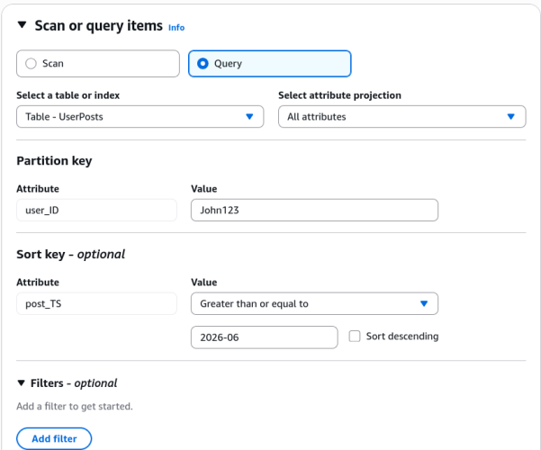

# DynamoDB Basic APIs - Hands On

Stephane’s terminal console hands-on perfectly validates the operational boundaries of the database plane. Clicking through the UI actually fires off the exact low-level network API methods we just analyzed on paper.

---

## 🛠️ Step-by-Step Data Plane Execution Hands On

### 1. Ingesting and Mutating Items (`PutItem` vs. `UpdateItem`)

- **Step 1: Execute a `PutItem` Payload Action**
  - Head to your `UserPosts` table items view ──► click **Create item**.
  - Input the composite parameters:
    - `user_ID` (PK): `Alice456`
    - `post_TS` (SK): `2026-07-01T09:00:00Z`
- Click **Add new attribute -> String** ──► Key: `content`, Value: `Alice blog`
- Hit Save. **Behind the scenes, the AWS SDK fires off a raw `PutItem` API request.** Since the `PK + SK` combination is unique, a fresh item block is committed to the disk partition.

- **Step 2: Execute an `UpdateItem` Mutation**
  - Select Alice's newly created row ──► click **Actions -> Edit item**.
  - Modify the `content` string value to: `Alice blog edited` and hit Save.
  - **The Internal Execution Delta:** This triggers an **`UpdateItem`** API call. The database plane doesn't overwrite the whole record; it updates _only_ the specific target attribute string while leaving the core key signatures completely frozen.

---

### 2. Point Lookups vs. Scoped Group Range Sorting

- **Step 3: Trigger a `GetItem` Point Lookup**
  - Click directly onto any individual item row listed inside the console data grid matrix. The console opens up the isolated JSON document viewer frame.
  - **The Platform Action:** This initiates a point **`GetItem`** API request targeting the exact `PK + SK` compound key. It reads from a single partition location with maximum RCU efficiency.

- **Step 4: Scoping with a `Query` Operation**
  - Toggle your search mode dropdown from Scan over to **Query**.
  - Input the exact match criteria for your Partition Key parameter: `user_ID = John123`. Click Run. The console instantly isolates John's entries out of the global pool.

- **Step 5: Slicing the Chronological Sort Key Timeline**
  - Let's take advantage of the physical range layout on disk. Under the **Sort Key** condition options parameters dropdown, pick **`Greater than or equal to (>=)`**.
  - Input the timestamp string query window: `2026-07-01`. Click Run.
  - **The Sorted Output:** If John has posts from June and July, the engine completely skips scanning the June records. It executes an optimized physical disk read _strictly_ on the sub-segment matching the July time range.

---

## 🚨 The Server-Side Filter Expression Trap

Pay close attention to what happens when you use a `FilterExpression` to search for words inside a non-key attribute (like checking if a `content` string contains the word `"edited"`) in the console or via the SDK:

> ⛔ **THE SERVER-SIDE FILTER EXHAUSTION LAW:** When you append a filter condition targeting non-key fields, **this filter does NOT execute deep inside the storage engine layout to save you money!**
> DynamoDB still forces a full **`Scan`** or wide **`Query`** operation across the disk partitions, consuming the full RCU bill for every single item read up to the 1 MB boundary.
> Once that 1 MB block is loaded, the **DynamoDB Service Layer (on the AWS side)** evaluates your filter and discards the non-matching rows _before_ sending the data over the network. While this saves you network bandwidth, it is highly inefficient for large tables because you are still billed for reading the discarded data from the disk.

---

## 📊 Operational Telemetry Query Evaluation

The runtime item isolation pathways and RCU calculations executed during this dashboard session evaluate under these clear path workflows:

$$\text{Query Execution (Scoped)} \implies \text{Filter}(\text{PK } \equiv \text{"John123"}) \;\land\; \text{Range}(\text{SK } \ge \text{"2026-07-01"}) \implies \text{Highly Efficient Disk Sector Reads}$$

$$\text{Scan Execution (Monolithic)} \implies \text{Read Every Background Partition Drive Top-to-Bottom} \longrightarrow \text{Massive RCU Burn Rate}$$

---

## Exam Tips

- **The Index Query Constraint:** If an exam question presents a scenario where a frontend app needs to let users look up blog posts by typing keywords found inside the `content` body text, and asks if you should use the `Query` API on the base table—**the answer is no** You can _only_ query against your designated Partition Key and Sort Key attributes. To unlock optimized lookups on non-key columns without resorting to high-cost Scans, you must build a **Secondary Index**.

### Practice Test

**Question**: A development team is working on an AWS Lambda function that accesses DynamoDB. The Lambda function must do an upsert, that is, it must retrieve an item and update some of its attributes or create the item if it does not exist. **Which of the following represents the solution with MINIMUM IAM permissions that can be used for the Lambda function to achieve this functionality?**

- [ ] `dynamodb:UpdateItem`, `dynamodb:GetItem`
- [ ] `dynamodb:AddItem`, `dynamodb:GetItem`
- [ ] `dynamodb:GetRecords`, `dynamodb:PutItem`, `dynamodb:UpdateTable`
- [ ] `dynamodb:UpdateItem`, `dynamodb:GetItem`, `dynamodb:PutItem`

Correct Answer

`dynamodb:UpdateItem`, `dynamodb:GetItem`.  
Why? Because `UpdateItem` can be used to update an existing item or create a new item if it does not exist (upsert). You can also perform a conditional update on an existing item (insert a new attribute name-value pair if it doesn't exist, or replace an existing name-value pair if it has certain expected attribute values).

