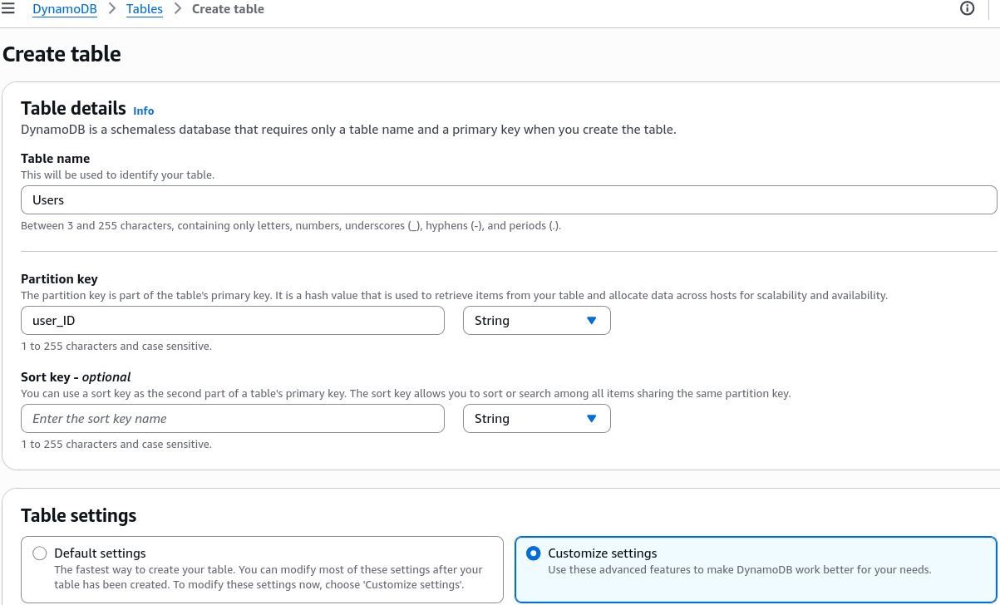
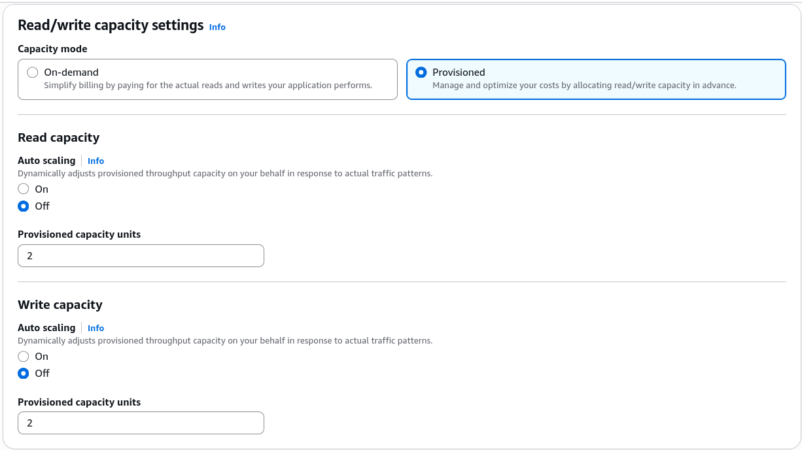
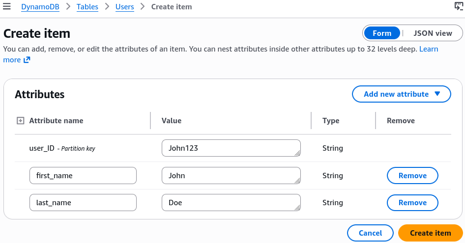
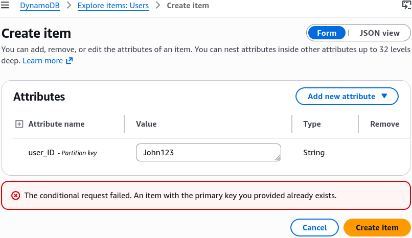
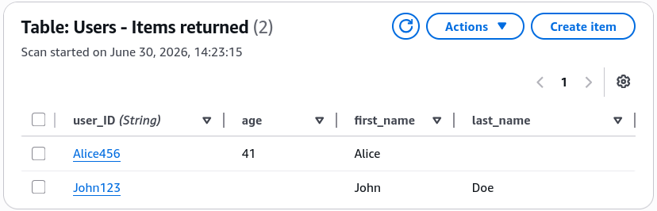
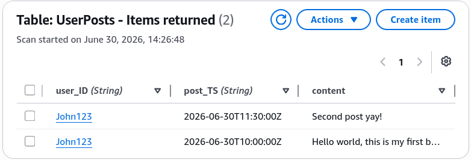

# DynamoDB Basics - Hands On

This hands-on lab exposes the absolute core reality of building serverless tables. You've probably had to run dangerous database migrations or `ALTER TABLE` scripts just to add a new column to a relational schema. With DynamoDB, your storage engine doesn't care. One item can have an `age` attribute, another can have a `last_name`, and the engine handles it natively without breaking a sweat.

---

## 🛠️ Step-by-Step DynamoDB Base Table Hand On

### 1. Provisioning Custom Throughput Parameters

- **Step 1: Declare the Namespace and Identity Key**
  - Jump into the **DynamoDB Console** ──► click **Create table**.
  - Table Name string: **`Users`**
  - Partition Key (PK) attribute: **`user_ID`** (Leave type as **String**).



- **Step 2: Strip Down Auto Scaling (Free Tier Optimization)**
  - Toggle the configuration settings button from Default settings over to **Customize settings**.
  - Maintain the **DynamoDB Standard** table storage class tier.
  - Under Capacity Mode, select **Provisioned** capacity.
  - Turn **Auto scaling** to **Off** for both Reads and Writes, and manually clamp the capacity knobs down to:

  $$\text{Provisioned Read Capacity Units (RCUs)} = 2 \quad\land\quad \text{Provisioned Write Capacity Units (WCUs)} = 2$$
  - _Note_: Keep defaults for "Warm throughput".
    

- **Step 3: Establish the Disk Layer Encryption**
  - Keep encryption at rest locked to the default **Owned by Amazon DynamoDB (DEFAULT)** key wrapper to save on AWS KMS invoice lines, chief. Click **Create table**.

---

### 2. The Schemaless Mutation Validation Lab

Once the table status switches to a green `Active` indicator block, open the table dashboard ──► select **Explore table items** ──► hit **Create item**.

#### Item Mutation A: The Complete Schema Model

- Input your `user_ID` value string as: `John123`
- Click **Add new attribute** ──► select **String** ──► Key: `first_name`, Value: `John`
- Click **Add new attribute** ──► select **String** ──► Key: `last_name`, Value: `Doe`
- Hit **Create item**. The item updates perfectly into the disk partition.
  

#### Item Mutation B: The Collision Crash

- Click **Create item** again ──► attempt to drop `John123` as the `user_ID` primary signature a second time.
- **The Collision Result:** Even if you change the attributes or provide a completely new name string, clicking save will overwrite your previous record! **Because you chose a simple Partition Key layout, the `user_ID` hash must remain 100% unique across the entire table!**
  

#### Item Mutation C: The Heterogeneous Data Model Injection

- Click **Create item** ──► Input a unique `user_ID` hash signature string: `Alice456`
- Click **Add new attribute** ──► select **String** ──► Key: `first_name`, Value: `Alice`
- Click **Add new attribute** ──► select **Number** ──► Key: `age`, Value: `41`
- **Notice the Delta:** We completely leave out the `last_name` string attribute! Click **Create item**.
- The engine commits the row flawlessly. In the UI data grid layout view, John carries a blank space marker placeholder string for `age`, and Alice carries a blank space marker string for `last_name`. This proves DynamoDB tables are natively schemaless, bro!
  

---

### 3. The Composite Secondary Table Setup (`PK + SK`)

Let's look at how adding a chronological timeline parameter transforms your data capabilities, chief. Jump right back to **Create table**:

- **Table Name:** `UserPosts`
- **Partition Key (Hash):** `user_ID` (String)
- **Sort Key (Range):** `post_TS` (String - for ISO 8601 string timestamp layouts like `2026-06-30T13:11:54Z`)
- Match the custom provisioned capacity configurations (`2 RCUs / 2 WCUs`) and click **Create table**.

#### The Composite Data Commit Loop:

Navigate to your new `UserPosts` table items view ──► click **Create item**. Now you are forced to supply _both_ target identity strings:

```text
Item Entry 1:
  - user_ID (PK) : John123
  - post_TS (SK) : 2026-06-30T10:00:00Z
  - content      : "Hello world, this is my first blog, bro!"

Item Entry 2:
  - user_ID (PK) : John123
  - post_TS (SK) : 2026-06-30T11:30:00Z
  - content      : "Second post yay!"

```

- **The Validation Success:** Both item blocks commit to the disk array successfully! Even though the Partition Key matches, **because the Sort Key strings are unique, the composite `PK + SK` primary key criteria is perfectly satisfied.**
  

---

## 📊 Operational Telemetry Partition Math

The underlying physical drive location mapping and composite storage distribution verified during this hands-on lab evaluate under these clear path expressions:

$$\text{Simple PK Allocation} \implies \text{Storage Partition Target Drive} = \text{InternalHash}(\text{user\_ID} \equiv \text{"John123"})$$

$$\text{Composite PK + SK Allocation} \implies \text{Physical Partition Drive Location} = \text{InternalHash}(\text{user\_ID}) \longrightarrow \text{Disk Sort Ordering By } (\text{post\_TS})$$

---

## Exam Tips

- **The Date/Time Partition Trap:** As Stephane warned at the end, if `John123` is a celebrity user who publishes 50,000 posts an hour, and 99% of your application's transaction activity centers entirely on him, your `UserPosts` table will experience severe **Hot Partitioning** issues. All of John's items will cluster onto the exact same physical background partition drive based on his `user_ID` hash value. To optimize for high-throughput scaling scenarios, you must choose high-cardinality keys or append synthetic random suffix values to balance your workloads evenly across the cloud architecture.
