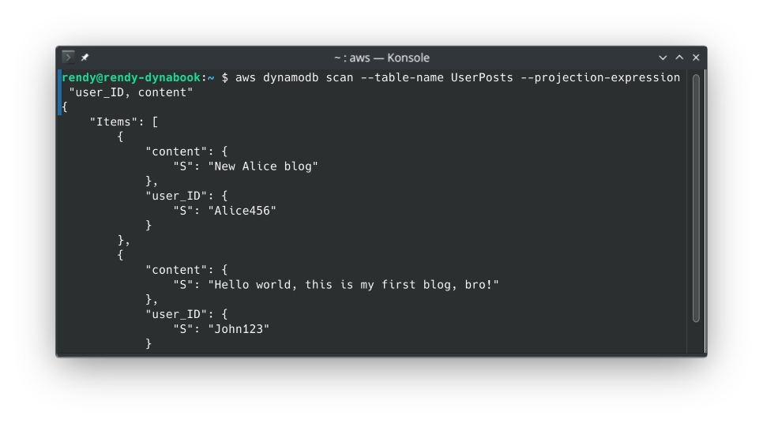
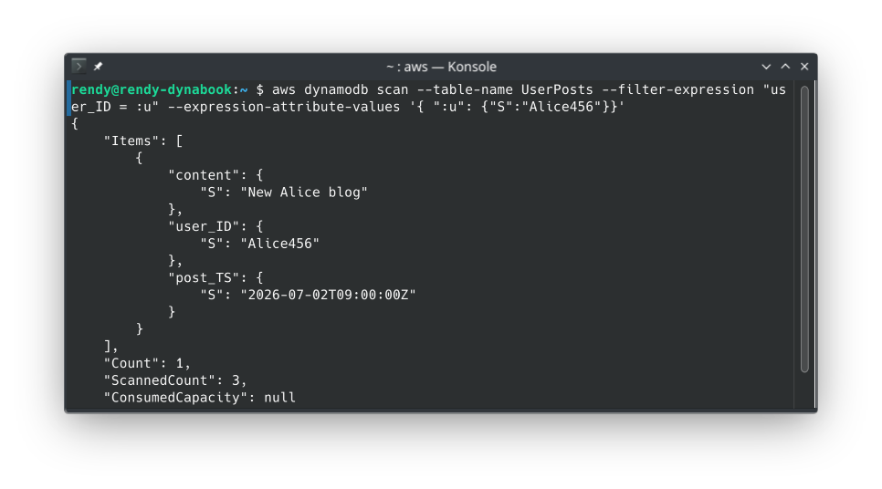
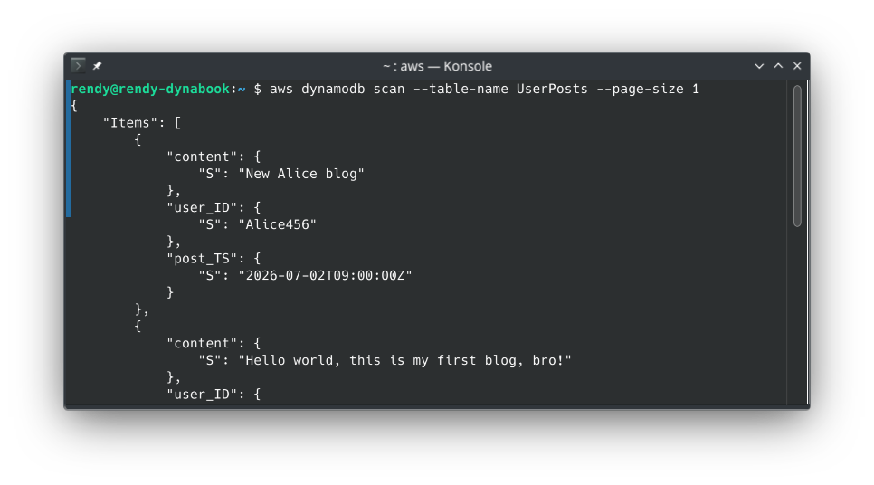
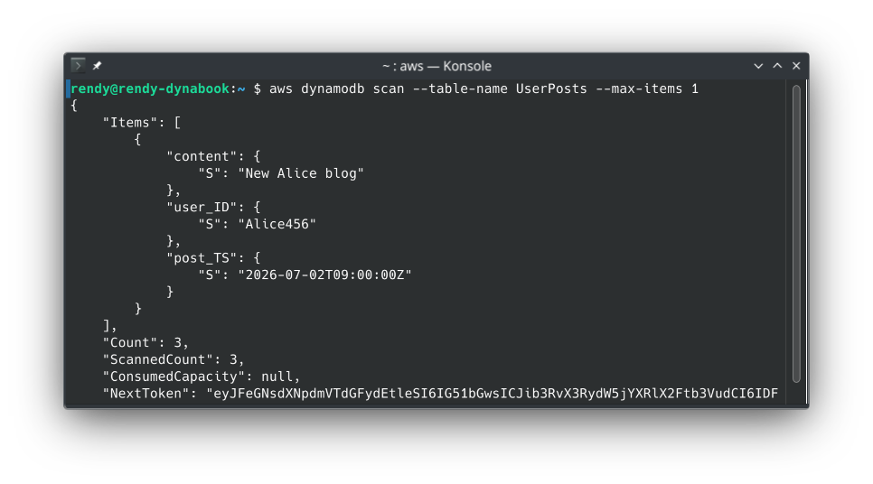
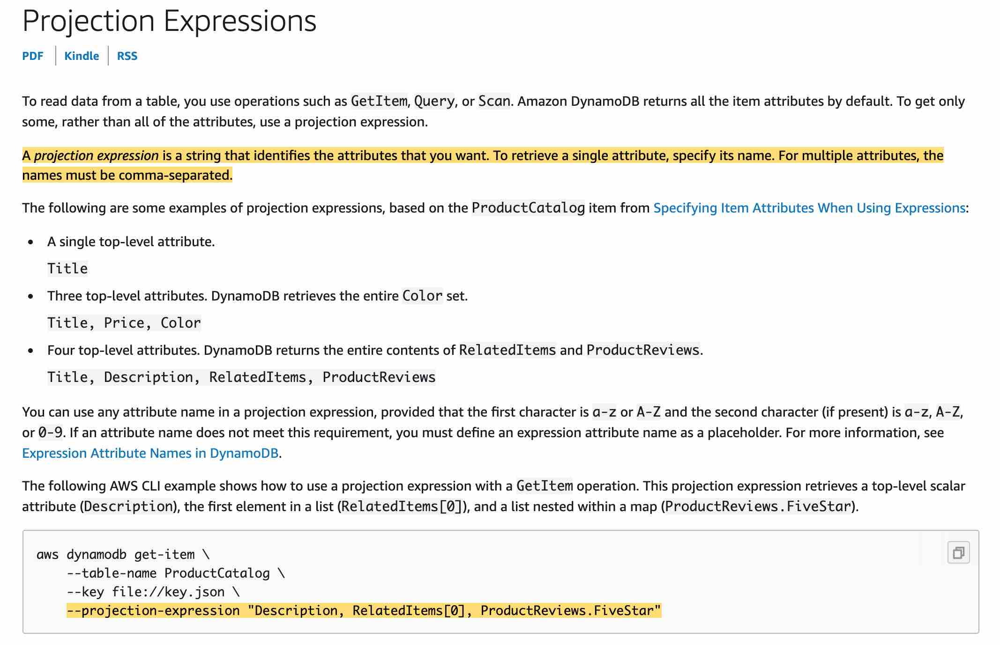

# DynamoDB CLI

Tapping directly into the AWS CLI plane to slice up your serverless data streams is where the real full-stack command execution efficiency locks in!

When you're dealing with massive corporate data volumes in production, you can't just rely on the AWS Management Console UI web forms. You need scripts that can scale. But if your CLI parameters are poorly structured, your terminal calls will either time out or bomb your regional RCU capacity pool instantly.

---

## Key Takeaways

UserPosts table example:

| user_ID  | post_TS              | content                                  |
| -------- | -------------------- | ---------------------------------------- |
| John123  | 2026-06-30T10:00:00Z | Hello world, this is my first blog, bro! |
| John123  | 2026-06-30T11:30:00Z | Second post yay! edit                    |
| Alice456 | 2026-07-02T09:00:00Z | New Alice blog                           |

### 🛠️ The Core CLI Multi-Parameter Strategy Matrix

When you run a standard `aws dynamodb scan` or `aws dynamodb query` statement down the command wire, you have to know exactly how your arguments impact network bandwidth and underlying partition read costs:

- **`--projection-expression` (Data Bandwidth Shaver) ✂️:** Used to specify a comma-separated list of the exact attribute names you want returned to your terminal output.
  - _The Visual Verification:_ As you saw in CloudShell, passing `--projection-expression "user_ID, content"` stripped the `post_TS` timestamp fields completely out of the JSON response payload.
  - ⚠️ _The Cost Law:_ This saves massive network traffic bytes over the internet wire, **but it does NOT save you money on your RCU bill.** DynamoDB still reads the whole 400 KB item footprint from disk before dropping the columns.
    
- **`--filter-expression` (Server-Side Drop Filter) 📊:** Allows you to declare criteria to thin out your output (e.g., matching text strings or filtering by a variable).
  - _The Process Sequence:_ Just like the API call, the data is pulled from disk _first_ (burning RCUs), processed by the DynamoDB compute engine server-side, and then only the rows matching your condition map down to your terminal output window.
    

---

### 🧮 The Great Pagination Face-off: `--page-size` vs. `--max-items`

This is a milestone favorite conceptual trap on the developer exam blueprint. You must distinguish how these two pagination levers handle background network requests, chief:

#### 🔄 A. The `--page-size` Parameter (Timeout Protection Optimizer)

- **What it does:** Instructs the AWS CLI wrapper to break a massive table extraction down into **smaller, sequential under-the-hood API requests**, bro.
- _The Production Use Case:_ If you run a scan on a table containing 20,000 deep records without this flag, your request might hit a hard network socket timeout limit and crash because the file payload is too heavy. By passing `--page-size 100`, the CLI will smoothly execute 200 tiny, consecutive API calls behind the scenes. **You will still get all 20,000 items dumped into your terminal in one giant final array**, but your connection will never drop or time out!
  

#### 🛑 B. The `--max-items` Parameter (Hard Output Ceiling Cap)

- **What it does:** Imposes a strict execution ceiling on the total number of items the CLI command will actually return to your screen in that specific flight, bro.
- _The Token Lifecycle:_ When you set `--max-items 1`, your terminal returns exactly _one_ JSON item node block. Along with that data, the CLI appends a specialized cryptographic string labeled **`NextToken`** inside the response footer.
  

---

### 🪝 The Three-Step Token Iteration Playbook

To crawl through your database table segments step-by-step using the CLI tool, your application scripts execute this exact handshaking loop:

- **Step A: The Initial Scoped Request**

  ```bash
  aws dynamodb scan --table-name UserPosts --max-items 1
  ```

  - _The Telemetry Output:_ The screen prints out John's first post, along with a massive string value labeled `"NextToken": "eyJleGNsdXAbcdVTdGFydEtlZSI6IHsi..."`

- **Step B: Passing the Resumption Hook**
  To fetch the next record on the disk layout, you must copy that exact string and pass it back into the system using the **`--starting-token`** parameter flag:

  ```bash
  aws dynamodb scan --table-name UserPosts --max-items 1 --starting-token "eyJleGNsdXNabVTdGFydEtlZSI6IHsi..."
  ```

  - _The Progress:_ The console slides down the partition data sector and outputs John's second post along with a brand-new updated `NextToken` pointer string.

- **Step C: Reaching the Absolute Boundary Target**
  You keep repeating this loop until your CLI command runs clean. The moment the JSON output payload returns your final target records **without a `NextToken` field block listed anywhere in the footer**, you know you've successfully traversed the entire table from top to bottom.

---

## Exam Tips

- **The Staging Network Timeout Scenario:** If an exam prompt introduces a script designed to back up a heavy DynamoDB table that continuously throws connection timeouts during large batches—even though your table has plenty of provisioned RCU headroom—look for the CLI fix: **Inject the `--page-size` parameter to split up the behind-the-scenes payload transactions into smaller, stable network blocks without reducing your final output data pool!**
- **The Token Naming Shift Trap ⚠️:** Pay close attention to this strict syntax naming delta. When you execute raw commands via the AWS CLI tool, the parameter you use to resume your position is called **`--starting-token`**, and it returns a **`NextToken`**. However, if you are writing low-level Node.js or Python application code targeting the core DynamoDB API directly using the SDK, those parameters map to **`ExclusiveStartKey`** and **`LastEvaluatedKey`**! Don't mix up your script names on the layout sheet!

### Practice Test

**Question 1**: Which of the following CLI options will allow you to retrieve a subset of the attributes coming from a DynamoDB scan?

- [ ] --page-size
- [ ] --max-items
- [ ] --filter-expression
- [ ] --projection-expression

<details>
<summary>Correct Answer</summary>

- [ ] --page-size
  - **Explanation**: You can use the `--page-size` option to specify that the AWS CLI requests a smaller number of items per API call to avoid timeouts. The CLI still retrieves the full result set by making multiple smaller calls behind the scenes.
- [ ] --max-items
  - **Explanation**: `--max-items` controls the total number of items returned in the AWS CLI output for pagination purposes. It limits the count of full items returned, not the specific attributes within those items.
- [ ] --filter-expression
  - **Explanation**: A `--filter-expression` determines which items within the scan/query results are returned to you (filtering whole records based on conditions). It does not select or exclude specific attributes from the returned items, and it still consumes read capacity for all scanned items.
- [x] --projection-expression
  - **Explanation**: A projection expression is a string that identifies the attributes you want. To retrieve a single attribute, specify its name. For multiple attributes, the names must be comma-separated.  
    

    To read data from a table, you use operations such as GetItem, Query, or Scan. DynamoDB returns all of the item attributes by default. To get just some, rather than all of the attributes, use a projection expression.

</details>
