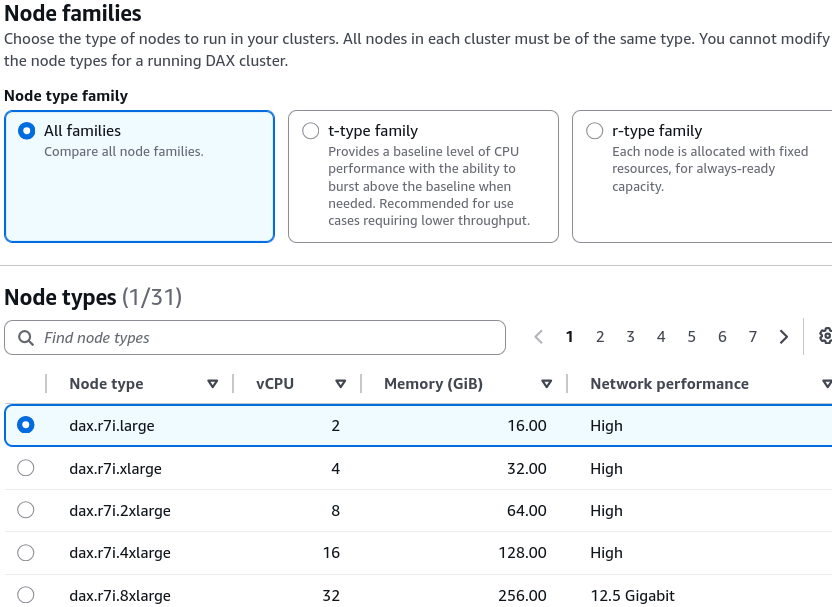
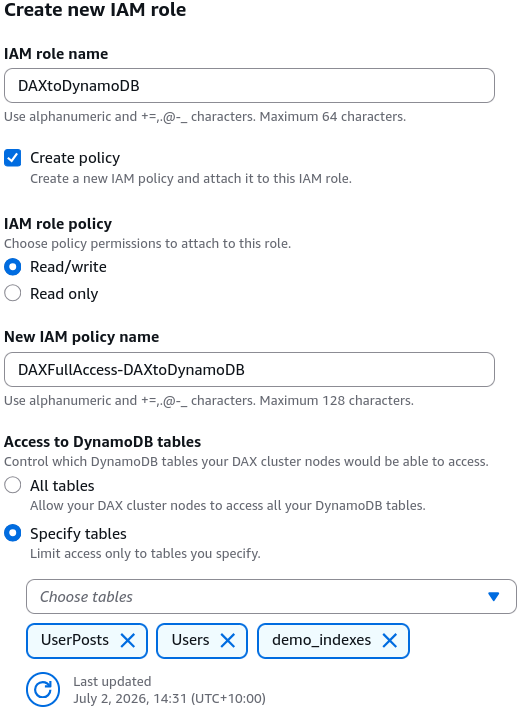
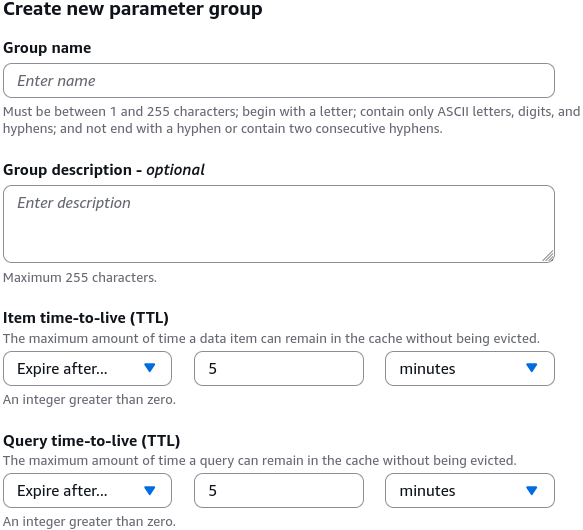
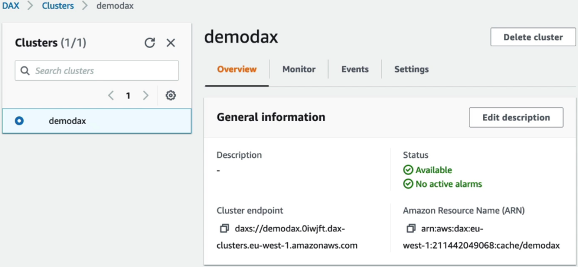

# DynamoDB DAX - Hands On

While DynamoDB itself is completely serverless and abstracts away hardware concepts, dropping a DAX Accelerator layer into your architecture forces you to provision actual **EC2-backed in-memory hardware node footprints** inside your secure VPC subnets.

---

## 🛠️ Step-by-Step DAX Cluster Provisioning Hands On

### 1. Hardening the Hardware Topology

- **Step 1: Cluster Identity & Instance Classification**
  - In the left-hand navigation pane of the DynamoDB console, click **DAX clusters** ──► hit **Create cluster**.
  - Cluster Name string: `DemoDAX`
  - **The Node Family Selection Strategy:** You choose your instance engine tier based on stability requirements:
    - **`t-types` (Burstable Capacity):** (e.g., `dax.t3.small`) Leverages a flexible credit-balance tracking metric. Perfect for development, staging stacks, or baseline architectures with short, variable traffic spikes, bro.
    - **`r-types` (Memory-Optimized Baseline):** (e.g., `dax.r5.large`) Delivers stable, unthrottled, always-ready RAM capacity. This is your default pick for high-volume, enterprise-grade production lines, chief.
      

- **Step 2: Define Cluster Size & High-Availability Bound**
  - **Cluster Size Scope:** Scales horizontally from **1 node up to a maximum of 11 nodes per cluster** (1 primary write-through coordinator + up to 10 read replicas).
  - **The Multi-AZ Principle 👑:** While a single-node setup is fine for a quick dev prototype, production clusters mandate a minimum of **3 nodes distributed across multiple Availability Zones (Multi-AZ)** to guard against regional downtime and prevent an unexpected drop in availability!

---

### 2. Network Layout & Port Signatures (VPC Isolation)

Because DAX sits directly inside a managed container farm, it operates strictly within your secure Amazon VPC boundaries:

- **Step 3: Lock Down Inbound Firewall Rules**
  - You must link an EC2 **Security Group** to your cluster wrapper to control incoming traffic. The DVA-C02 exam targets these strict network port requirements aggressively, bro:
  - **`TCP Port 8111`**: The default unencrypted entry pathway for standard raw SDK socket interactions.
  - **`TCP Port 9111`**: The mandatory entry pathway used when you toggle **Encryption in transit (TLS)** to `Enabled`!

---

### 3. Identity Handshakes & Cluster Auditing

- **Step 4: Inject the Service-Linked IAM Role**
  - Under **IAM permissions**, provision an explicit service role (e.g., `DAXtoDynamoDB`). This role grants the underlying DAX compute instances the cryptographically signed authorization strings needed to point outward, hit your DynamoDB tables, and pull missing object records into cache memory on your behalf, chief!
    

---

### 4. Advanced Settings

- **Step 5: Define Subnet and Parameter Profiles**
  - Bind the cluster to your custom VPC using a **DAX Subnet Group** (whitelisting private subnets spanning multiple distinct AZs).
  - Under **Parameter groups**, the system defaults to the `default.dax1.0` engine manifest file wrapper. This dictates your cache lifecycle windows:  
    $$\text{Default Record TTL} = 5\text{ Minutes } (300,000\text{ ms}) \quad\land\quad \text{Default Query TTL} = 5\text{ Minutes}$$
    
- **Step 6: Capture the Unified Connection String**
  - Once the cluster state changes to a green `AVAILABLE` indicator block, the dashboard generates your **Cluster Endpoint**, resembling:
    `daxs://demodax.l6abcd.dax-clusters.ap-southeast-2.amazonaws.com:9111`
  - You drop this single, permanent endpoint signature string straight into your application's SDK configuration code block to let your application transparently communicate with the cache.
    

---

### 📊 The Telemetry Dashboard Checklist

Once your system goes live, you track your optimization performance by auditing CloudWatch telemetry panels directly on the cluster profile tab:

```text
📊 CLOUDWATCH CACHE TELEMETRY EVALUATION MATRIX:
   ├── Metric A: ItemCacheHits & ItemCacheMisses ──► Tracks pinpoint GetItem efficiency metrics!
   ├── Metric B: QueryCacheHits & QueryCacheMisses ──► Audits wide Sort-Key range query efficiency.
   └── Metric C: CPUUtilization ──► Tells you if your Node Size needs a larger hardware upgrade tier.
```

If your `CacheMisses` metric line stays flat while your `CacheHits` curve spikes toward 95%, your DAX sidecar is working beautifully—intercepting traffic before it hits your disk layer, saving you money, and delivering blazing-fast microsecond responses!

---

## Exam Tips

- **The Node Modification Wall:** This is a key configuration constraint for the exam blueprint, chief. If your production traffic doubles and your DAX cluster nodes run completely out of memory, you can easily scale out horizontally by adding more read replica nodes (up to 11 nodes max) on the fly without causing any downtime. **However, you cannot change the underlying Node Type (e.g., changing a t3.small to an r5.large) on an active, running cluster!** To scale up vertically, you must provision a completely brand-new DAX cluster with the larger node footprint size, update your application's endpoint configuration variables, and tear down the old cluster once traffic safely routes over.
