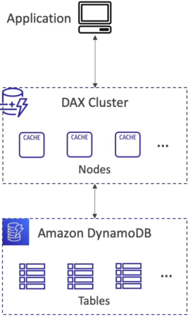
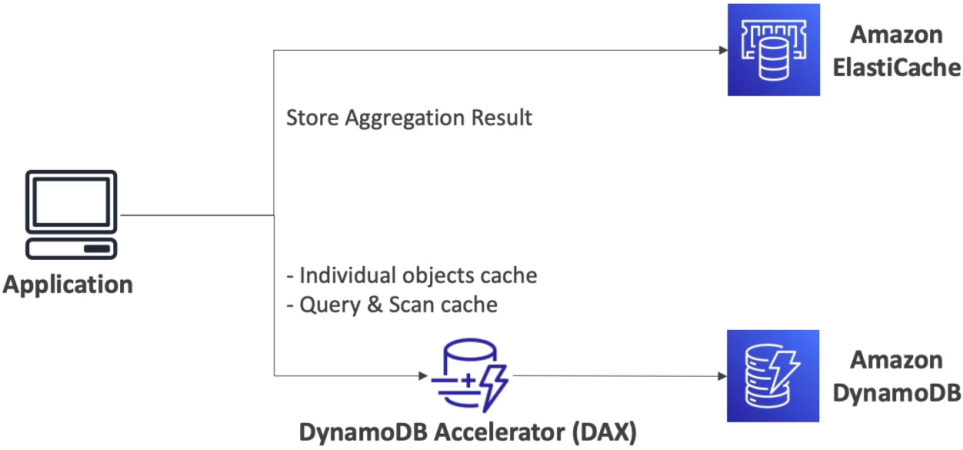

# DynamoDB Accelerator (DAX)

Implementing **DynamoDB Accelerator (DAX)** into your stack is the ultimate way to shatter the millisecond barrier and drop your read latencies straight into the **microsecond tier**, bro! 🏎️💨

When you are pushing high-velocity microservices, intense read surges on trending or celebrity items can completely exhaust an individual storage partition's RCU pool, dropping a hard `ProvisionedThroughputExceededException` backfire onto your users. DAX intercepts these bursts completely, acting as an elite, fully managed cache sidecar.

---

## key Takeaways

**Amazon DynamoDB Accelerator (DAX)** is a fully managed, highly available, write-through in-memory caching cluster purpose-built for Amazon DynamoDB. It delivers up to a $10\times$ performance increase—shifting read latencies from single-digit milliseconds to microseconds—without requiring application logic modifications. DAX natively resolves the "hot key" throttling problem by intercepting standard data plane operations (`GetItem`, `BatchGetItem`, `Query`, and `Scan`).

---

### 🏗️ The Transparent Proxy Layout

The absolute slickest engineering feat of DAX is its **seamless API transparency**.

In a traditional caching setup, your application code has to run a complex "Lazy Loading" pattern: check the cache, if it's a miss, write code to pull from the DB, then write more code to manually stuff that data back into the cache node.

With DAX, you completely rip that boilerplate out. You swap your standard DynamoDB client SDK wrapper for the **DAX Cluster Endpoint Client**. The application simply targets DAX directly using the _exact same_ standard API methods (`GetItem`, `Query`, etc.).

#### 🔄 The Write-Through Caching Loop:

1. **Cache Miss Reference:** Your app calls `GetItem` targeting DAX. DAX checks its internal memory, sees a miss, drops down to the underlying DynamoDB table to fetch the item, stores it in its cache pool, and streams it back to your app code.
2. **The Default Expiration Clock 🕒:** Once data sits in memory, it carries a default **Time-To-Live (TTL) lifespan of 5 minutes**.
3. **Write-Through Synchronization:** When your app fires a `PutItem` or `UpdateItem` mutation, it goes straight to the DAX cluster first. DAX instantly writes the payload to the DynamoDB base table, and the moment the database commit succeeds, **DAX automatically updates its own internal memory cache layer**. This ensures your active cache never drops stale data to subsequent reads.

---

### 📊 Cluster Hardening & Node Topology

Because DAX handles critical live production paths, its underlying infrastructure requires solid Multi-AZ design choices:

- **Node Capacity Constraints:** A single DAX cluster is composed of a specialized collection of pre-provisioned cache nodes, scaling up to a maximum ceiling limit of **10 nodes per cluster** (1 Primary Write Node + up to 9 Read Replicas).
- **Production Best Practice 👑:** For production workloads, always deploy a minimum of **3 nodes distributed evenly across separate Availability Zones (Multi-AZ)**. If the primary zone drops an outage, DAX executes a lightning-fast automatic failover to a healthy replica in a sibling zone, keeping your read paths completely live!

---

### ⚖️ The Architectural Faceoff: DAX vs. Amazon ElastiCache

This is a massive, high-priority scenario distinction on the DVA-C02 exam blueprint. You must know exactly when to pull each caching lever:

| Feature Dimension           | DynamoDB Accelerator (DAX)                                                                                       | Amazon ElastiCache (Redis / Memcached)                                                                                          |
| --------------------------- | ---------------------------------------------------------------------------------------------------------------- | ------------------------------------------------------------------------------------------------------------------------------- |
| **Integration Pattern**     | **Seamless Proxy Wrapper** (Transparent layer; zero changes to your baseline DynamoDB API coding lines, chief).  | **Explicit Application Logic** (Your code must manually manage cache hits, misses, evictions, and writes).                      |
| **Primary Caching Target**  | **Raw Database Objects & Queries** (Directly caches individual items, query result blocks, or wide table scans). | **Complex Computational Aggregations** (Caches processed application states, complex session stores, or heavy relational data). |
| **The Sweet-Spot Use Case** | Wiping out severe **Hot Key / Partition Throttling** issues caused by intense, repetitive raw object reads.      | Storing the pre-calculated result of a heavy client-side aggregation (e.g., storing the `SUM` or `AVERAGE` of a million rows).  |

---

## Exam Tips

- **The Code-Free Performance Lift:** If an exam prompt introduces an overloaded database architecture and states: _"A company wants to implement an in-memory cache to eliminate massive read latencies on a DynamoDB table, but the engineering team has zero available sprint cycles to refactor the application's source code logic or rewrite query scripts."_ Look straight for **DynamoDB Accelerator (DAX)**. Because it uses the exact same API signature hooks, you don't change a single line of business logic!
- **The Strongly Consistent Cache Pass-Through ⛔:** This is an absolute gold-star exam trap. If your application triggers a `GetItem` call with the parameter **`ConsistentRead = true`** (requesting a Strongly Consistent Read) down a DAX pipeline, **DAX will completely bypass its memory cache layer!** It routes the request straight down to the base DynamoDB partition drive to guarantee absolute data freshness. _The Strategy:_ If your workload is heavily dependent on strongly consistent reads, DAX will provide zero performance benefit, and you'll keep burning your standard base table RCUs.
