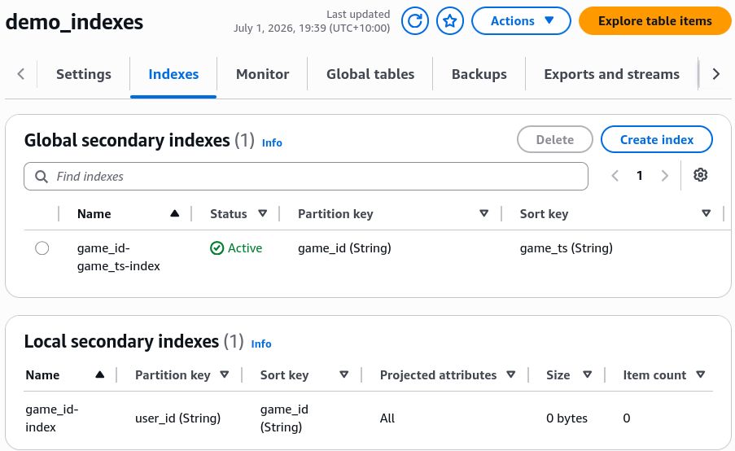
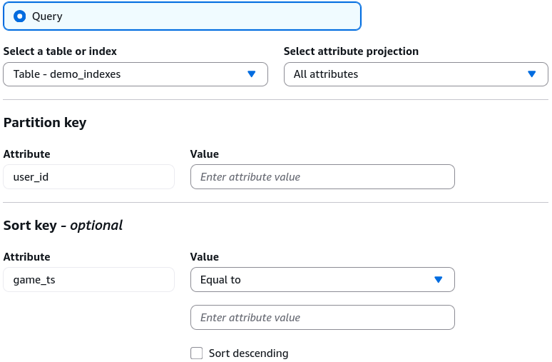

# DynamoDB Indexes (GSI + LSI) - Hands On

Stephane’s lab perfectly highlights the structural lifecycle split between your secondary indexes. Configuring an **LSI** forces you to commit to your schema design at the exact millisecond of table birth, while a **GSI** acts like a flexible cloud component that you can drop onto a multi-terabyte production table whenever your access patterns evolve down the road.

---

## 🛠️ Step-by-Step Index Orchestration Hands On

### 1. Provisioning the Immutable Baseline Structure (LSI)

- **Step 1: Declare the Root Schema**
  - Go to the **DynamoDB Console** ──► click **Create table**.
  - Table Name: **`demo_indexes`**
  - Partition Key (PK): `user_id` (String)
  - Sort Key (SK): `game_ts` (String)
  - Select **Customize settings** ──► Set Capacity mode to **Provisioned** (`1 RCU / 1 WCU` to optimize the free tier).

- **Step 2: Bind the Alternative Range Key**
  - Scroll to the **Secondary indexes** section ──► click **Create local index**, chief.
  - **The Structural Rule:** Notice that there's no option to add a new Partition Key. LSIs must share the exact same Partition Key as the base table.
  - Set the alternative Sort Key to **`game_id`** (String).
  - Index Name autofills to `game_id_index`. Leave Attribute projection set to **ALL**, and click Add index.

---

### 2. Attaching the Dynamic Cross-Partition Layer (GSI)

- **Step 3: Deploy the Base Layer**
  - Click **Create table** at the bottom of the page. Once the table switches to an active state, you can no longer add any more LSIs.

- **Step 4: Inject an Online Index Mutation**
  - Click into your active `demo_indexes` table profile ──► select the **Indexes** tab ──► click **Create global index**.
  - Name the new index: `game_id-game_ts-index`.
  - **The Free Key Setup:** Break away from the old boundaries. Input a totally fresh Partition Key parameter: **`game_id`** (String).
  - Add an optional Sort Key to enhance query slicing: **`game_ts`** (String).

- **Step 5: Allocate Isolated Compute and Project Attributes**
  - Scroll to the throughput allocation drawer.
  - **The Capacity Law:** Notice that unlike the LSI (which shares the base table's throughput pool for free), the GSI forces you to allocate its own explicit, independent **Read and Write Capacity Units**, bro!
  - Check **Copy from base table** (`1 RCU / 1 WCU`), leave projections at **ALL**, and click Create index. The GSI enters a `CREATING` state while DynamoDB automatically backfills the old items into the new partition drive index in the background!

---

## 🔍 3. Visualizing the Scoped Query Traversal Paths

Once the background index build drops into an `ACTIVE` status flag, head to **Explore table items** ──► toggle your operation filter to **Query**. Look at the three independent data routes you've unlocked, chief:

### 🟢 Route A: The Base Table Plane

- **Target Selector:** `demo_indexes` (Base Table)
- **Access Formula:** You enter a specific `user_id` and can filter chronologically by a range condition on `game_ts`.

### 🔵 Route B: The Local Secondary Index (LSI) Plane

- **Target Selector:** `game_id_index` (LSI)
- **Access Formula:** You enter a specific `user_id`, but now you filter by structural equality checks directly against **`game_id`**, bro!

### 🔀 Route C: The Global Secondary Index (GSI) Plane

- **Target Selector:** `game_id-game_ts-index` (GSI)
- **Access Formula:** The partition architecture is flipped. You query by an explicit **`game_id`** value to extract a cluster of items, sorted cleanly by their `game_ts` values across the entire table database!

---

## 📊 Operational Telemetry Capacity Mapping

The throughput sharing behaviors and the asynchronous backpressure vulnerabilities verified during this index lab evaluate under these clear path formulas:

$$\text{LSI Inbound Workload Cost} \longrightarrow \text{Consumes Throughput Pool from } [\text{Base Table: 1 RCU / 1 WCU}]$$

$$\text{GSI Overwrite Operation} \implies \text{Base Table Commit} \xrightarrow{\text{Async Sync Loop}} \text{Consumes Dedicated Pool } [\text{GSI: 1 WCU}]$$

$$\text{GSI WCU Allocation } \equiv 0 \implies \text{Asynchronous Replication Backlog} \longrightarrow \text{Forces Hard Sync 429 Throttle on Base Table!}$$

---

## Exam Tips

- **The CloudFormation/CDK Deployment Limit ⚠️:** This is an absolute top-tier production gotcha for infrastructure-as-code automation pipelines. If you try to add or delete **more than one GSI at the same time** inside a single CloudFormation stack update or `cdk deploy` execution run, your entire stack deployment will crash with a validation error! DynamoDB's underlying `UpdateTable` API **strictly restricts table modifications to one GSI creation or deletion per asynchronous backfill operation** to protect disk performance. You must deploy your new indexes sequentially, waiting for the first one to reach an `ACTIVE` status before pushing the next update down the pipe.
