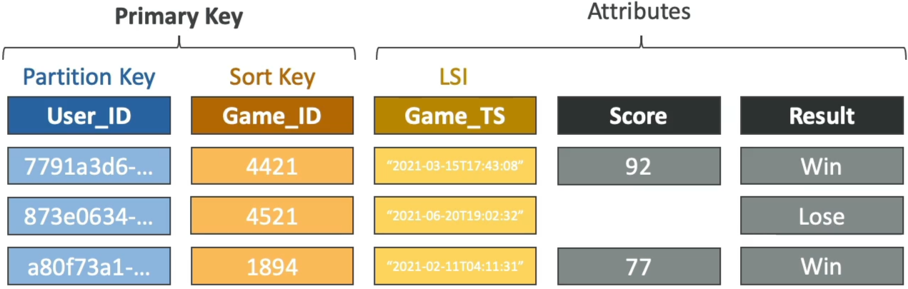
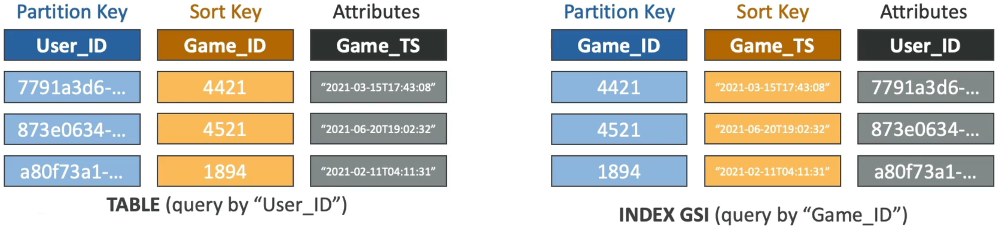

# DynamoDB Indexes (GSI + LSI)

Implementing **DynamoDB Secondary Indexes** into your architecture is exactly how you smash past the strict NoSQL query boundaries and unlock high-speed lookups across completely different data dimensions, bro! 👑 dynamic indexing strategy is a heavy favorite on the DVA-C02 exam blueprint.

---

## Key Takeaways

In your standard base table, you are completely locked down—you can _only_ query by your specific Partition Key and optional Sort Key. If you want to find records matching any other non-key attribute field, the platform forces a high-cost, high-latency `Scan`.

To bypass this wall, DynamoDB offers two weapons: **Local Secondary Indexes (LSIs)** and **Global Secondary Indexes (GSIs)**. Let's dissect their rules, structural differences, and the absolute #1 system failure trap for your master dev records.

### 🗺️ 1. The Core Split: LSI vs. GSI

#### 🟢 Local Secondary Index (LSI) – Alternative Sort Key

An LSI lets you create an **alternative Sort Key** for your data while keeping the exact same Partition Key as your main base table.

- **The Creation Law ⚠️:** **LSIs MUST be defined at the exact millisecond of table creation!** You cannot add, modify, or delete an LSI after the table is born. If you need a new one later, you have to spin up a completely brand-new table and migrate all your data.
- **Capacity Sharing:** LSIs share the exact same RCU and WCU throughput pool provisioned on the parent base table. There are no separate capacity settings to worry about.
- **The Ceiling Limit:** You are capped at a maximum of **5 LSIs per table**.



#### 🔀 Global Secondary Index (GSI) – Completely New Key Model

A GSI functions like a completely separate shadow table layout. It gives you a **brand-new Partition Key** AND an optional alternative Sort Key from the base table.

- **The Elasticity Advantage 🚀:** GSIs can be **added, updated, or deleted at any time**, even years after your table has been handling live production workloads!
- **Capacity Isolation:** Because a GSI operates like an independent storage index block, **you must provision its own separate RCUs and WCUs** (or let Auto Scaling track it natively).
- **The Scale:** You can provision up to **20 GSIs per table** by default.



---

### 📊 Deep-Dive Sizing & Feature Matrix

| Architectural Vectors    | Local Secondary Index (LSI)                                   | Global Secondary Index (GSI)                                |
| ------------------------ | ------------------------------------------------------------- | ----------------------------------------------------------- |
| **Partition Key (Hash)** | **Must match** the parent base table PK exactly.              | **Can be completely different** from the base table PK      |
| **Sort Key (Range)**     | Must be a totally different attribute than the base table SK. | Can be any scalar attribute (String, Number, Binary).       |
| **Lifecycle Window**     | **Table Creation Time Only** (Immutable baseline).            | **Anytime** (Dynamic post-creation attachment supported).   |
| **Throughput Cost Pool** | Inherits and uses the base table's RCUs / WCUs.               | **Requires dedicated, independent RCU / WCU provisioning.** |
| **Consistency Scope**    | Supports both Eventually & **Strongly Consistent Reads**.     | **Strictly supports Eventually Consistent Reads only!**     |

---

### 🚨 The Ultimate GSI Throttling Backpressure Trap

This is an absolute milestone favorite DVA-C02 architecture question. Pay very close attention to how data updates travel down the wire:

When your application fires a `PutItem` or `UpdateItem` mutation against your base table, DynamoDB commits that write to the main partition drive first. Then, in the background, it asynchronously streams that change over to update your GSIs.

```text
🚨 THE GSI BACKPRESSURE BACKFIRE:
[Client App] ──► Writes Item (Plenty of Base WCUs) ──► [Base Table Partition]
                                                               │
                                                 (Asynchronous Storage Sync)
                                                               ▼
[Client Request Dropped via 429 Throttle] ◄── Throttles ◄── [GSI Index Drive Pool (Exhausted WCUs!)]

```

> ⛔ **THE GSI THROTTLING LAW:** If your base table has a massive allocation of $1,000\text{ WCUs}$, but your attached GSI is under-provisioned and sitting at a tiny $5\text{ WCUs}$, **a high-volume write wave will exhaust the GSI's capacity instantly.**  
> The moment the GSI drive throttles, **it forces a hard synchronous backpressure block onto the main base table partition drive!** Even if your base table has 900 WCUs sitting perfectly idle, the entire system will start throwing hard **`ProvisionedThroughputExceededException`** faults to the client application.

#### 🛡️ The Remediation Strategy:

Always ensure your GSI write capacity limits match or exceed the write capacity parameters of the main parent table. Utilizing **DynamoDB Auto Scaling** or switching the architecture over to **On-Demand Capacity Mode** eliminates this risk gracefully!

---

### 💡 Attribute Projections

When you spin up an index, you don't have to copy every single column from the base table into the index storage pool. You define the **Projection**, chief:

- **`KEYS_ONLY`**: Only copies the base primary keys and the new index keys. Keeps the storage footprint tiny and cheap.
- **`INCLUDE`**: You pass an explicit string array of specific attributes your frontend app needs to fetch frequently.
- **`ALL`**: Copies the entire base table item block. Maximum flexibility, but consumes the most storage space and burns through extra throughput units.

---

## Exam Tips

- **The Unexpected Base Table Throttling Scenario:** If a scenario states: _"A developer notices that an application starts dropping `ProvisionedThroughputExceededException` errors when writing data, even though CloudWatch metrics show the base table's consumed WCUs are well below the provisioned thresholds."_ Look straight for the index gap: **An attached Global Secondary Index (GSI) is under-provisioned and throttling, causing backpressure on the main table updates**
- **The Post-Deployment Search Request:** If an executive team requests a new query path to look up old order history by a user's `Email_Address` instead of their `Order_ID` on an active, multi-terabyte production table—and you cannot afford any application downtime—**the answer is to provision a Global Secondary Index (GSI) using `Email_Address` as the new Partition Key, bro.** (Choosing an LSI here would fail because you can't create them after the table is live!)
