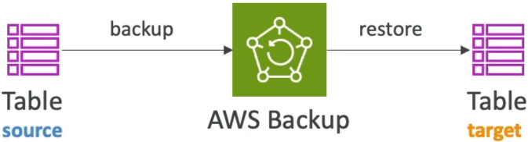
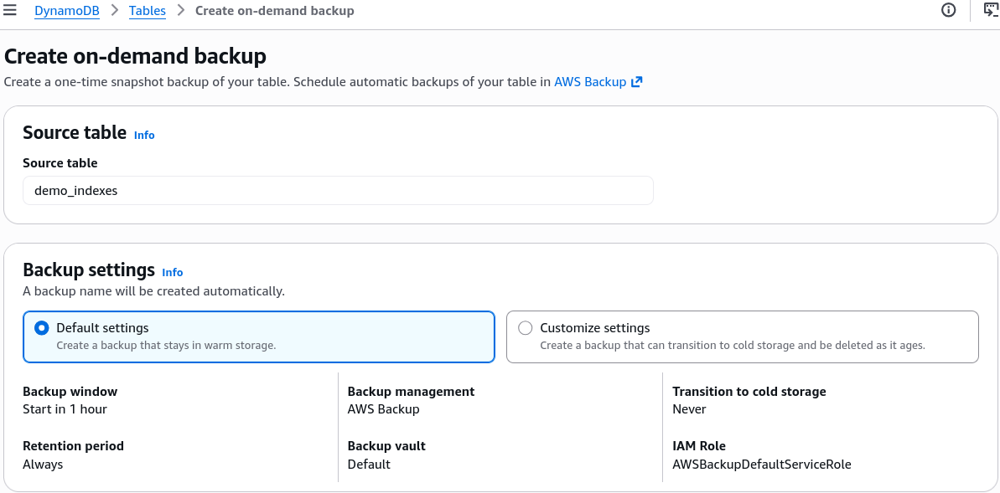
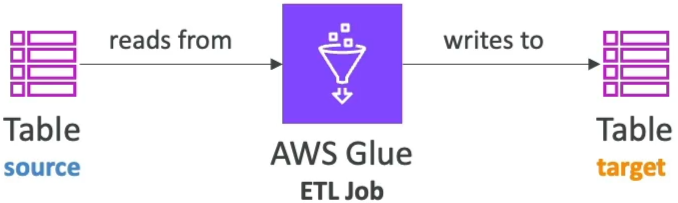

# DynamoDB Operations

Dropping the hammer on a table cleanup or staging copies of massive datasets requires sharp operational tactical choices. If you pick the wrong execution route, you’ll end up burning through your entire quarterly AWS budget or knocking your production apps completely offline. 💥📉

Stephane’s overview lays out the fundamental divide between manual programmatic loops and fully managed AWS infrastructure orchestration levers. Let’s clean-room compile these strategies into a razor-sharp developer playbook for your records.

---

## Key Takeaways

### 🧹 The Table Cleanup Triage: Wipeout Mechanics

When a development team needs to purge a table completely clean (e.g., clearing out an entire staging environment before a fresh build deployment), you are faced with a massive architectural decision node:

#### ❌ Option A: Programmatic Scan & Delete Loop (The Anti-Pattern)

- **The Workflow:** Your code fires a monolithic `Scan` to scrape the partition drives, extracts every item ID, and sequentially spams `DeleteItem` or `BatchWriteItem` requests down the wire.
- **The Penalty:** This is incredibly slow and expensive. You pay a heavy RCU bill for scanning the partitions _plus_ a massive WCU bill for every single item you evict. If you run this against a production-scale database, you will throttle your legitimate application traffic instantly.

#### 👑 Option B: The Drop and Recreate Pattern (The Elite Playbook)

- **The Workflow:** You invoke a single, lightning-fast **`DeleteTable`** API call. The database plane vaporizes the entire physical storage container and its indexes immediately. Once dropped, you fire a clean `CreateTable` request to spin up a completely empty shell with identical primary keys and capacity parameters.
- **The Payoff:** It takes seconds, costs zero WCUs/RCUs for item erasure, and keeps your operational costs completely flat. **This is the absolute #1 answer to look for on the DVA-C02 exam when tasked with clearing a table**

---

### 🖨️ Table Copying & Ingestion Vectors

If you need to duplicate a table footprint into a secondary environment or run deep analytical pipeline extractions, you have three primary cloud native tracks:

#### 🛡️ Vector A: AWS Backup (The Infrastructure Track)

- **The Play:** Fully managed, cross-account, and cross-region protection. You take a point-in-time snapshot or an on-demand snapshot of your source table, back it up to your secure Backup Vault, and restore it natively as a brand-new target table elsewhere, bro.

#### 🔀 Vector B: AWS Glue (The Heavy ETL Track)

- **The Play:** If you need to manipulate the data payload while it moves (e.g., dropping columns, changing formats, or masking user attributes), AWS Glue acts as your serverless Spark engine. A Glue ETL job can extract data directly from DynamoDB, execute custom python scripts to remodel the schema, and write it straight out to a target bucket or database.

#### ⚡ Vector C: The Modern Native S3 Engine (No-Code Scaling)

For massive, multi-terabyte datasets, you can leverage native serverless streaming switches directly on the dashboard:

- **`Export to S3`**: Backed by Point-in-Time Recovery (PITR), this dumps your table straight into an S3 bucket in DynamoDB JSON or Amazon Ion format. **Crucial Advantage:** It runs fully offline, meaning it **does not consume any table RCUs** and has zero impact on live application traffic!
- **`Import from S3`**: Takes CSV, Ion, or JSON data from S3 and automatically provisions a **brand-new DynamoDB table** populated with that data. **Crucial Advantage:** This native import bypasses the standard write plane completely, meaning **it consumes zero WCUs to populate the new table**, saving you an absolute fortune on bulk ingestion workloads.

---

## Exam Tips

- **The Staging Purge Speed Run:** If an exam prompt presents a test engineer who needs to rapidly wipe all data from a table containing 50 million records, and warns that the solution must not cause high costs or throttle live workloads—**never pick an option that mentions executing a Scan or looping through DeleteItem. The answer is explicitly to run `DeleteTable` followed by a fresh `CreateTable` layout, chief!**
- **The Free Bulk Migration:** If a question asks for the most cost-effective architecture to duplicate a production table into a totally separate AWS account for compliance analytics without impacting production performance or buying extra capacity headroom—look for the native combination: **Enable PITR, execute a native `Export to S3` from the source account, share the bucket, and run a native `Import from S3` in the target account to generate the fresh table for $0 RCU/WCU cost**
