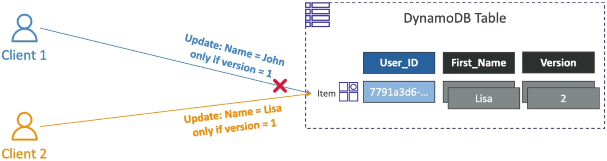

# DynamoDB Optimistic Locking

In traditional relational databases, if two threads want to update the exact same row, the database forces a **Pessimistic Lock** (`SELECT ... FOR UPDATE`). It literally freezes that row on disk, forcing all other incoming threads to wait in a slow line until the first transaction finishes.

DynamoDB drops that heavy overhead completely. It assumes collisions are rare (_optimistic_) and lets everyone read freely. But when it's time to write, it uses **Conditional Writes** to ensure nobody overwrites anyone else's data.

---

## Key Takeaways

### 🔁 The Anatomy of a Concurrent State Collision

To implement Optimistic Locking, you inject a dedicated numeric tracking attribute—typically named **`version`**—directly into your item schema.

Let's look at the exact operational sequence when two distributed API clients try to modify the exact same user profile at the exact same millisecond:

#### 🕒 The Baseline State:

A row sits inside your `Users` table partition drive:

```json
{
  "user_id": "User_XYZ",
  "first_name": "Johnny",
  "version": 1
}
```

#### ⚡ The Concurrent Race Condition Execution:

1. **The Shared Read:** Both **Client 1** and **Client 2** execute a standard `GetItem` point lookup at the exact same time. Both clients receive the exact same payload: `"first_name": "Johnny", "version": 1`.
2. **Client 1 Fire Loop:** Client 1 wants to patch the name to `John`. It fires an `UpdateItem` request backed by a strict **`ConditionExpression`**:

```bash
aws dynamodb update-item \
    --table-name Users \
    --key '{"user_id": {"S": "User_XYZ"}}' \
    --update-expression "SET first_name = :new_name, version = :new_version"
    --condition-expression "version = :current_version" \
    --expression-attribute-values '{":new_name": {"S": "John"}, ":new_version": {"N": "2"}, ":current_version": {"N": "1"}}'
```

3. **The First Commit Wins:** Client 1's network packet lands at the DynamoDB partition first. The database engine checks disk: `version` is indeed `1`. The condition passes! DynamoDB commits the write, flips the name to `John`, and **bumps the version integer token up to `2`**.
4. **Client 2 Collision Crash 💥:** A microsecond later, Client 2's network packet arrives. Client 2 wants to patch the name to `Lisa`:

```bash
aws dynamodb update-item \
    --table-name Users \
    --key '{"user_id": {"S": "User_XYZ"}}' \
    --update-expression "SET first_name = :new_name, version = :new_version"
    --condition-expression "version = :current_version" \
    --expression-attribute-values '{":new_name": {"S": "Lisa"}, ":new_version": {"N": "2"}, ":current_version": {"N": "1"}}'
```

5. **The Hard Rejection:** The DynamoDB engine checks the disk layer. The current database state shows `version = 2`. Client 2's validation clause fails instantly!
6. The engine cancels the write before altering a single file bit and drops a hard **`ConditionalCheckFailedException`** back to Client 2, bro!



---

### 🛠️ The Application-Side Remediation Loop

When Client 2 catches that `ConditionalCheckFailedException`, its workflow shouldn't crash. Your backend application code simply executes a clean **Three-Step Self-Healing Loop**:

```text
🚨 ConditionalCheckFailedException Intercepted!
   ├── Step A: Execute a fresh GetItem point lookup down the wire.
   ├── Step B: Inspect the new state ("first_name": "John", "version": 2).
   └── Step C: Re-apply business logic and re-fire the UpdateItem with version = 2.
```

---

## Exam Tips

- **The Overlapping Stock Update Scenario:** If an exam prompt presents a scenario where a high-volume e-commerce application is dropping item inventory quantities during peak sales because multiple shoppers are checking out at the exact same instant, look for the architecture remedy: **Implement Optimistic Locking using an `UpdateItem` API call combined with a `ConditionExpression` tracking a version number attribute**
- **The AWS SDK Automation Hack:** In real production environments, you don't even have to write this version matching logic manually inside your JSON payloads, If you use the higher-level object mappers provided inside official libraries (like the **DynamoDB Mapper** class inside the AWS SDK), you can simply tag your version attribute with a `@DynamoDBVersionAttribute` decorator. The SDK will automatically append the condition check expressions and handle the version bumping mechanics on every single mutation behind the scenes.
