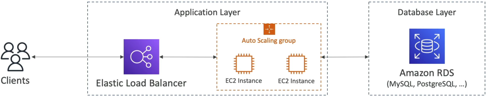
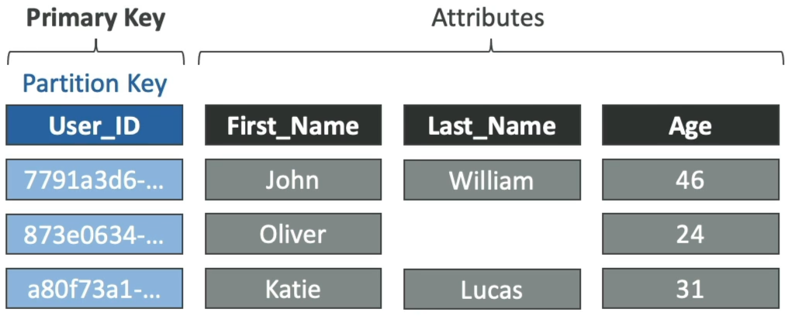
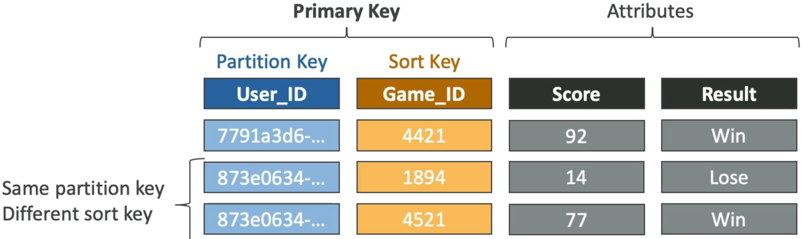

# DynamoDB Overview

You've probably built plenty of relational architectures (RDBMS). But scaling a traditional RDS instance out to handle intense traffic spikes means hitting immediate brick walls: vertical scaling hardware limits, multi-replica lag, and the absolute inability to execute horizontal _write_ scaling natively.

DynamoDB changes the whole game. It's a fully distributed, schemaless NoSQL engine that swaps out high-overhead relational tables for partitioned, horizontal key-value buckets designed to handle massive internet-scale workloads with steady single-digit millisecond latency!

---

## Key Takeaways

To pick the right database for a workload, you have to understand exactly what you are trading off:

| Feature Set             | Traditional RDBMS (Amazon RDS)                                                                                         | Distributed NoSQL (Amazon DynamoDB)                                                                                                  |
| ----------------------- | ---------------------------------------------------------------------------------------------------------------------- | ------------------------------------------------------------------------------------------------------------------------------------ |
| **Scaling Vector**      | **Vertical** 🏋️ (Scale up the CPU/RAM instance size; read replicas only handle read scaling, not writes).              | **Horizontal** 🚀 (Data shifts seamlessly across an array of partitioned physical storage drives automatically).                     |
| **Data Schema**         | **Strict and Rigid** (Fixed column layouts, foreign keys, mandatory data types).                                       | **Schemaless & Dynamic** (Items can hold totally different attributes on the fly; columns are dynamic).                              |
| **Complex Operations**  | **Highly Capable** (Supports deep relational `JOIN` operations and native server-side aggregations like `SUM`, `AVG`). | **Strictly Forbidden** (No native `JOIN` operations exist! All target matching attributes must live inside a single flat row).       |
| **Performance Profile** | Dependent on dataset sizes, active query complexity, and indexing metrics.                                             | **Consistent Low Latency** (Maintains single-digit millisecond response times whether your table has 100 rows or 100 billion rows.). |

---

### 📦 Core DynamoDB Structural Concepts & Limits

- **Tables**: The primary parent boundary container (similar to a database table).
- **Items (Rows)**: An individual item block asset inside your table.
  - ⚠️ **The Absolute Size Ceiling Limit:** A single individual item **cannot exceed 400 KB** of uncompressed space! This includes both the attribute key name strings and the value data payloads. If your data payload crosses 400 KB, you must store the heavy asset binary inside an **Amazon S3 Bucket** and drop the S3 URI string pointer directly into the DynamoDB item insteadW.W
- **Attributes (Columns)**: Key-value data values attached to an item. They don't need to be declared ahead of time and can support scalar data (strings, numbers, binary, booleans), complex documents (ordered lists, maps), or distinct sets.

---

### 🔑 The Holy Grail: Mastering Primary Keys

Before you click create on a DynamoDB table, you **must** select your Primary Key layout architecture. This setting cannot be altered later!

#### 🟢 Option A: The Simple Partition Key (Hash Only)

- Your table uses a single attribute designated as the **Partition Key (PK)**.
- Every single item's PK **must be completely unique** within that table.
- _Internal Execution:_ DynamoDB pipes the PK value string straight through an internal **cryptographic hash function** to determine the exact physical storage partition drive where that item will be written or read.

#### 🔀 Option B: The Composite Primary Key (Hash + Range)

- Your table uses a combination of two distinct attributes: a **Partition Key (PK)** AND a **Sort Key (SK)**.
- Under this strategy, the PK does _not_ have to be unique on its own, **but the unique combination of `PK + SK` must be one-of-a-kind** across the table!
- _Internal Execution:_ DynamoDB uses the PK hash to group related records onto the same physical partition drive, and then **physically sorts those items in ascending order** on the disk based on the Sort Key value string. This unlocks deep query range operators (like `begins_with`, `between`, `>`, `<`).

---

## Exam Tips

- **The Hot Partition Throttling Bug:** If an exam prompt states: _"A company is running a massive data ingestion table using DynamoDB, but even though the total provisioned read/write throughput capacity seems high enough on paper, the system keeps throwing `ProvisionedThroughputExceededException` errors during peak loads."_
  - **The Correct Answer:** The architecture is suffering from a **Hot Partition**. The chosen partition key has low cardinality (e.g., partitioning by `Order_Status` or `Created_Date`), causing traffic to bottleneck onto a single storage partition drive instead of distributing evenly!
- **The Infinite Table Class Cost Trick:** Remember that DynamoDB ships with two primary storage tiers:
  1. **Standard Table Class (Default):** Best for high-traffic, live production environments where read/write transaction costs are your dominant expense.
  2. **Standard-Infrequent Access (Standard-IA):** Slashes your flat data storage footprint costs by up to 60%, but charges higher fees for active reads and writes. Choose this for massive log archives or historical compliance tables that are rarely queried but must be retained indefinitely.
- **Cardinality Exercise:** If an exam scenario asks you to choose the best partition key for a high-volume media search catalog, evaluate your choices by **Cardinality (Diversity of potential distinct values)**:
  - ❌ `Movie_Language`: **Horrible choice, bro.** If 90% of your global movie catalog defaults to `English`, 90% of your data will stack onto one single physical storage drive. This creates a massive **Hot Partition**, overloading that partition's IOPS quota and throttling your app!
  - ❌ `Leader_Actor_Name` / `Producer_Name`: **Weak choice.** Many movies will share the exact same actor or studio groupings, leading to uneven data clustering.
  - 👑 `Movie_ID`: **The Absolute Winner!** Every single movie carries a unique UUID string signature. This gives you maximum cardinality, distributing your items evenly across the entire background partition array!
