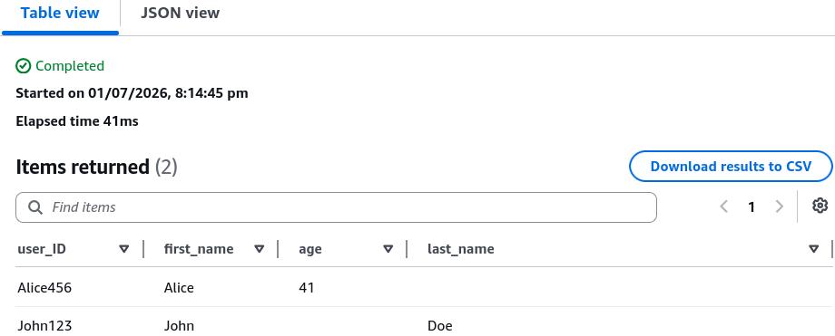

# DynamoDB PartiQL

Running standard relational queries against a distributed NoSQL engine is the ultimate paradox, bro! But Stephane Maarek's hands-on lab shows that **PartiQL** is the perfect bridge for engineers who spent years mastering traditional relational syntax, allowing them to write `SELECT`, `INSERT`, `UPDATE`, and `DELETE` commands directly inside the DynamoDB domain.

But don't let the SQL coat of paint fool you, chief. Beneath the syntax, **DynamoDB is still 100% NoSQL.** It doesn't change your partition constraints, it doesn't merge data across tables, and it still bills you for RCUs and WCUs exactly the same way!

---

## 🛠️ Step-by-Step PartiQL Operation Hands On

### 1. Simple Table Scans & Scoped Queries

- **The Monolithic Table Scan:** When you execute a broad `SELECT` without a primary key check, the background compiler translates it straight into a high-overhead native **`Scan`** operation, bro:

```sql
-- ⚠️ WARNING: This scans every partition drive, burning through RCUs!
SELECT * FROM "users";

```



- **The Scoped Index Query:** To ensure your statement compiles into an efficient low-level **`Query`** instead of a resource-draining scan, you must explicitly pass your Primary Key equality variables inside the `WHERE` clause, chief:

```sql
-- 🟢 EFFICIENT: Translates to a native targeted Query lookup
SELECT * FROM "demo_indexes"
WHERE "user_id" = '123' AND "game_timestamp" = '2026-07-01';

```

---

### 2. Targeting Secondary Indexes Natively

One of the slickest features Stephane spotlighted is using PartiQL to scan or query an index. The syntax requires dot-notation combined with individual double-quotes to clear special characters, bro:

```sql
-- 🔀 Querying a Global Secondary Index (GSI) via PartiQL
SELECT * FROM "demo_indexes"."game_id_index"
WHERE "game_id" = '456';

```

---

### 3. Mutating Items with SQL Syntax (`INSERT`, `UPDATE`, `DELETE`)

You can handle all your typical CRUD mutation actions using structured JSON style map block parameters directly inside your values block, chief:

- **The Data Injection Statement (`INSERT`):**

```sql
INSERT INTO "Users" VALUE { 'user_ID': 'rendy', 'first_name': 'Rendy' };
```

- **The Specific Field Modifier (`UPDATE`):**

```sql
UPDATE "Users" SET "last_name" = 'Saputra' WHERE "user_ID"='rendy';
```

- **The Target Record Eviction (`DELETE`):**

```sql
DELETE FROM "Users" WHERE "user_ID" = 'rendy';
```

---

## 🚨 The Absolute PartiQL Operational Laws

Make sure you lock these exact operational constraints down for the exam blueprint, bro:

> ⛔ **THE NO-JOIN LAW:** Even though you are writing SQL syntax, **you are strictly blocked from writing `JOIN` or native server-side aggregation clauses (like `GROUP BY`, `SUM`, `AVG`)!** If you try to run a multi-table join statement, the PartiQL parsing engine will throw an immediate `ValidationException / Statement wasn't well formed` error block.
> 📦 **THE BATCH INGESTION MATRIX:** Just like the native APIs, PartiQL supports grouped transactional batching via the `BatchExecuteStatement` API call (handling up to 25 statements in a single network pass). However, **you cannot mix reads and writes inside the same batch.** A single batch must be 100% data extractions (`SELECT`) or 100% data modifications (`INSERT`/`UPDATE`/`DELETE`).

---

## 📊 Operational Telemetry IAM Controls

When you move your application logic over to PartiQL statements, your calling microservice IAM roles require specialized, fine-grained permission tags to execute the queries:

```text
PartiQL Action ──► IAM Policy Evaluation ──► Underlying API Compilation
   SELECT    ──►  dynamodb:PartiQLSelect  ──► Compiles to native Query / Scan API
   INSERT    ──►  dynamodb:PartiQLInsert  ──► Compiles to native PutItem API
   UPDATE    ──►  dynamodb:PartiQLUpdate  ──► Compiles to native UpdateItem API
   DELETE    ──►  dynamodb:PartiQLDelete  ──► Compiles to native DeleteItem API

```

---

## Exam Tips

- **The SQL Translation Trap:** If an exam prompt introduces a team of relational database developers who want to migrate to a serverless architecture but are struggling to adapt to DynamoDB's expression-attribute JSON API syntax, look for **PartiQL** as the optimal transition bridge.
- **The Unwanted Scan Defense Guardrail:** If a question asks how a security administrator can prevent developers from accidentally running dangerous, high-cost full table scans using PartiQL `SELECT` statements, look for the IAM condition key check. You attach a hard `Deny` statement to the developer policy specifying **`dynamodb:FullTableScan = true`**, which forces the engine to block any statement that forgets to supply an indexed primary key inside its `WHERE` clause.
