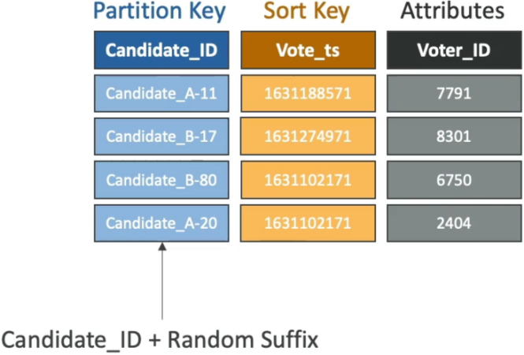

# DynamoDB Partitioning Strategies

**Write Sharding** (or adding a synthetic partition key suffix) is the ultimate black-belt data modeling move for handling massive, high-concurrency traffic bursts targeting a narrow set of keys, bro! 🗳️💥

When you're building a system with massive scale—like a real-time voting application for a global event or a flash sale with a couple of hot items—you run straight into a hard architectural limitation if you model your data traditionally.

If millions of concurrent users blast votes for just two candidates (`Candidate_A` and `Candidate_B`), you only have two unique partition key values. DynamoDB runs those strings through its internal hashing loop and dumps 100% of that traffic onto exactly **two physical storage partition drives**, chief. Even if you provision a massive $100,000\text{ WCUs}$ pool globally on the table, a single physical partition drive maxes out at **1,000 WCUs**. You will hit a brick wall of massive **Hot Partition Throttling** (`ProvisionedThroughputExceededException`), crashing the voting lines!

Let's clean-room dissect the mechanics of Synthetic Key Sharding to distribute your data uniformly across the distributed tier.

---

## Key Takeaways

### 🏗️ The Mechanics of Synthetic Sharding

To break the 1,000 WCU physical partition ceiling, your application code must inject a dynamic **suffix** (or prefix) right into the Partition Key attribute string _before_ shipping the payload down the wire. This forces DynamoDB to hash the data into totally separate physical disk sectors, bro!

#### 📊 The Data Transformation Mapping

Instead of writing a flat, bottlenecked key signature, look at how the data plane maps out across your partition array when you apply a sharding factor of $N = 20$:

| Native Logical Entity | Sharded Synthetic Partition Key (PK) | Internal Hashing Output Target | Target Partition Allocation |
| --------------------- | ------------------------------------ | ------------------------------ | --------------------------- |
| Candidate A           | `Candidate_A_1`                      | `Hash("Candidate_A_1")`        | **Partition Drive 1**       |
| Candidate A           | `Candidate_A_12`                     | `Hash("Candidate_A_12")`       | **Partition Drive 4**       |
| Candidate B           | `Candidate_B_7`                      | `Hash("Candidate_B_7")`        | **Partition Drive 2**       |
| Candidate A           | `Candidate_A_20`                     | `Hash("Candidate_A_20")`       | **Partition Drive 9**       |

By spreading the keys from `1` to `20`, you have effectively scaled your maximum write capacity ceiling for a single candidate from $1,000\text{ WCUs}$ straight up to **$20 \times 1,000 = 20,000\text{ WCUs}$**, bro!

---

### 🛠️ Strategies for Generating the Suffix

Your application backend can calculate the sharding value using two core patterns, chief:

- **The Random Suffix Vector 🎲:** Your code fires a random integer generator bounded by your sharding factor (e.g., `Math.floor(Math.random() * 20) + 1`). This guarantees an absolutely beautiful, uniform distribution of writes across all partitions during live ingestion waves.
- **The Deterministic Hashing Vector 🧮:** If you are sharding something like user orders, you can run a secondary attribute (like `Voter_ID` or `Timestamp`) through a quick modulo loop (`Voter_ID % 20`). This makes the suffix deterministic, meaning a specific voter's records will always route to the exact same shard key variant, simplifying point lookups later!

---

### 🔍 The Catch: The Scatter-Gather Read Penalty

Write Sharding makes writes blazing fast and unthrottled, chief. But in system design, you always pay a trade-off. **When it's time to read the total aggregated scores, your retrieval logic gets more complex**

> ⛔ **THE SCATTER-GATHER LAW:** If your frontend dashboard needs to display the final tally for `Candidate_A`, you can no longer execute a single point query targeting `"Candidate_A"`. >
> Your application layer must fire off **20 parallel Query API requests** in a concurrent async loop (fetching `Candidate_A_1` through `Candidate_A_20` simultaneously), gather the individual results back into your runtime code, and perform a client-side `SUM` aggregation to compute the final score.

---

## Exam Tips

- **The Live Election / Flash Sale Scenario:** If an exam prompt highlights an application that captures hundreds of thousands of transactions per second for a very small set of primary keys (e.g., a massive global poll or counting item stock on Black Friday), and states that the table keeps throwing throughput throttling exceptions despite having massive provisioned capacity headroom—look straight for **Write Sharding / Synthetic Keys by appending a random suffix**.
- **Eliminating the Read Aggregation Overhead:** If the scenario notes you want the write scaling of sharding but _cannot afford_ the high-latency scatter-gather read loops on the frontend, look for the ultimate combo: **Pipe your sharded DynamoDB Stream straight into an AWS Lambda function that maintains a single, global pre-aggregated counter row in a separate summary table**.
